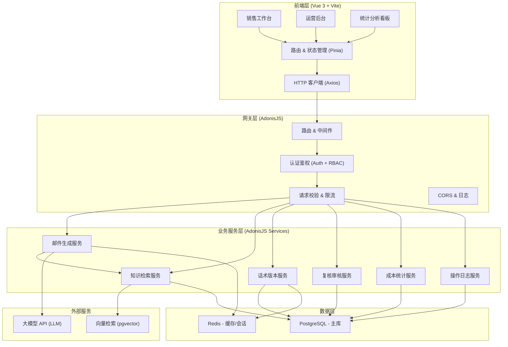
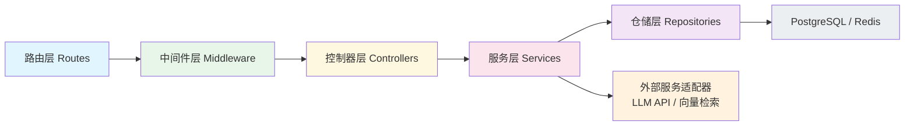
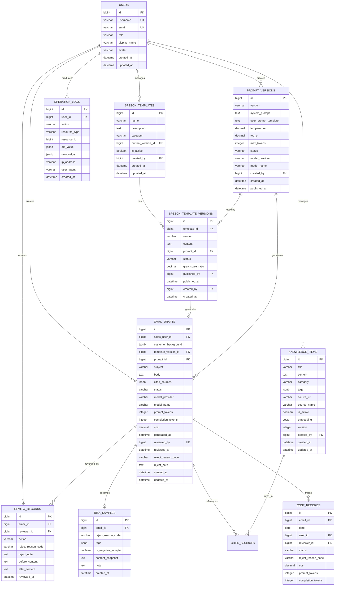

## 1. 架构设计



---

## 2. 技术选型说明

| 层级 | 技术栈 | 版本 | 说明 |
|------|--------|------|------|
| 前端 | Vue 3 | 3.4+ | Composition API + `<script setup>` |
| 前端构建 | Vite | 5.x | 热更新、按需编译 |
| 状态管理 | Pinia | 2.x | 模块化 Store |
| 路由 | Vue Router | 4.x | 嵌套路由 + 懒加载 |
| UI 组件 | Naive UI | 2.x | 企业级组件库 |
| 图表 | ECharts | 5.x | 丰富的图表类型 |
| HTTP | Axios | 1.x | 请求拦截、错误处理 |
| 后端 | AdonisJS | 6.x | 全栈 Node.js MVC 框架 |
| ORM | Lucid | 6.x | AdonisJS 内置 ORM |
| 数据库 | PostgreSQL | 15+ | 关系型存储 + pgvector 向量检索 |
| 缓存 | Redis | 7.x | 会话、热门话术、计数器 |
| 验证 | VineJS | AdonisJS 内置 | 运行时数据校验 |
| 认证 | Adonis Auth | 6.x | Session + Token 双模式 |

---

## 3. 路由定义

### 3.1 前端路由 (Vue Router)

| 路由路径 | 页面组件 | 角色权限 | 说明 |
|----------|----------|----------|------|
| `/` | 重定向至工作台 | - | 入口 |
| `/login` | LoginView | 公开 | 登录页 |
| `/workbench` | WorkbenchView | sales, ops, admin | 销售工作台：生成邮件 |
| `/knowledge` | KnowledgeListView | ops, admin | 知识库列表 |
| `/knowledge/:id` | KnowledgeEditView | ops, admin | 知识库条目编辑 |
| `/templates` | TemplateVersionView | ops, admin | 话术版本中心 |
| `/prompts` | PromptVersionView | ops, admin | 提示词版本中心 |
| `/review` | ReviewQueueView | ops, admin | 人工复核队列 |
| `/risks` | RiskSampleView | ops, admin | 风险样本库 |
| `/analytics` | AnalyticsDashboardView | admin, ops | 统计分析看板 |
| `/logs` | OperationLogView | admin, ops | 操作日志 |
| `/users` | UserManagementView | admin | 用户与权限管理 |

### 3.2 后端 API 路由 (AdonisJS)

| Method | 路径 | 控制器方法 | 权限 | 说明 |
|--------|------|------------|------|------|
| POST | `/api/v1/auth/login` | AuthController.login | 公开 | 登录 |
| POST | `/api/v1/auth/logout` | AuthController.logout | 已认证 | 登出 |
| GET | `/api/v1/auth/me` | AuthController.me | 已认证 | 当前用户信息 |
| POST | `/api/v1/emails/generate` | EmailsController.generate | sales, ops, admin | 生成邮件草稿 |
| GET | `/api/v1/emails` | EmailsController.index | sales, ops, admin | 草稿列表 |
| GET | `/api/v1/emails/:id` | EmailsController.show | sales, ops, admin | 草稿详情 |
| POST | `/api/v1/emails/:id/submit-review` | EmailsController.submitReview | sales, ops | 提交复核 |
| GET | `/api/v1/knowledge` | KnowledgeController.index | ops, admin | 知识条目列表 |
| POST | `/api/v1/knowledge` | KnowledgeController.store | ops, admin | 创建知识条目 |
| PUT | `/api/v1/knowledge/:id` | KnowledgeController.update | ops, admin | 更新知识条目 |
| DELETE | `/api/v1/knowledge/:id` | KnowledgeController.destroy | ops, admin | 删除知识条目 |
| POST | `/api/v1/knowledge/search` | KnowledgeController.search | 已认证 | 相似度检索 |
| GET | `/api/v1/templates` | TemplatesController.index | 已认证 | 话术模板列表 |
| POST | `/api/v1/templates` | TemplatesController.store | ops, admin | 创建话术模板 |
| POST | `/api/v1/templates/:id/versions` | TemplatesController.createVersion | ops, admin | 创建新版本 |
| PUT | `/api/v1/templates/:id/versions/:vid/publish` | TemplatesController.publishVersion | ops, admin | 发布版本 |
| GET | `/api/v1/prompts` | PromptsController.index | ops, admin | 提示词版本列表 |
| POST | `/api/v1/prompts` | PromptsController.store | ops, admin | 创建提示词版本 |
| PUT | `/api/v1/prompts/:id/publish` | PromptsController.publish | ops, admin | 发布提示词版本 |
| GET | `/api/v1/reviews` | ReviewsController.index | ops, admin | 复核队列 |
| PUT | `/api/v1/reviews/:id/approve` | ReviewsController.approve | ops, admin | 复核通过 |
| PUT | `/api/v1/reviews/:id/reject` | ReviewsController.reject | ops, admin | 复核驳回 |
| GET | `/api/v1/risks` | RisksController.index | ops, admin | 风险样本列表 |
| POST | `/api/v1/risks/:id/mark-negative` | RisksController.markNegative | ops, admin | 标记为训练负例 |
| GET | `/api/v1/analytics/summary` | AnalyticsController.summary | admin, ops | 核心指标汇总 |
| GET | `/api/v1/analytics/cost-breakdown` | AnalyticsController.costBreakdown | admin, ops | 成本拆解 |
| GET | `/api/v1/analytics/hit-rate` | AnalyticsController.hitRate | admin, ops | 命中率趋势 |
| GET | `/api/v1/analytics/reject-reasons` | AnalyticsController.rejectReasons | admin, ops | 驳回原因分布 |
| GET | `/api/v1/logs` | OperationLogsController.index | admin, ops | 操作日志列表 |

---

## 4. API 数据结构定义 (TypeScript)

```typescript
// 用户
interface User {
  id: number
  username: string
  email: string
  role: 'sales' | 'ops' | 'admin'
  displayName: string
  avatar?: string
  createdAt: string
  updatedAt: string
}

// 知识库条目
interface KnowledgeItem {
  id: number
  title: string
  content: string
  category: string
  tags: string[]
  sourceUrl?: string
  sourceName?: string
  isActive: boolean
  embedding?: number[]
  version: number
  createdBy: number
  createdAt: string
  updatedAt: string
}

// 话术模板
interface SpeechTemplate {
  id: number
  name: string
  description: string
  category: string
  currentVersionId: number
  isActive: boolean
  createdBy: number
  createdAt: string
  updatedAt: string
}

interface SpeechTemplateVersion {
  id: number
  templateId: number
  version: string
  content: string
  promptId: number
  status: 'draft' | 'published' | 'archived'
  grayScaleRatio: number
  publishedBy?: number
  publishedAt?: string
  createdBy: number
  createdAt: string
}

// 提示词版本
interface PromptVersion {
  id: number
  version: string
  systemPrompt: string
  userPromptTemplate: string
  temperature: number
  topP: number
  maxTokens: number
  status: 'draft' | 'published' | 'archived'
  modelProvider: string
  modelName: string
  createdBy: number
  createdAt: string
  publishedAt?: string
}

// 邮件草稿
interface EmailDraft {
  id: number
  salesUserId: number
  customerBackground: CustomerBackground
  templateVersionId: number
  promptId: number
  subject: string
  body: string
  citedSources: CitedSource[]
  status: 'draft' | 'submitted' | 'approved' | 'rejected' | 'used'
  modelProvider: string
  modelName: string
  promptTokens: number
  completionTokens: number
  cost: number
  generatedAt: string
  reviewedBy?: number
  reviewedAt?: string
  rejectReason?: string
  rejectNote?: string
  createdAt: string
  updatedAt: string
}

interface CustomerBackground {
  companyName: string
  industry: string
  companySize: string
  painPoints: string
  stage: 'initial' | 'follow-up' | 'negotiation' | 'closing'
  lastFollowUp?: string
  extra?: Record<string, string>
}

interface CitedSource {
  knowledgeId: number
  title: string
  similarity: number
  excerpt: string
}

// 复核记录
interface ReviewRecord {
  id: number
  emailId: number
  reviewerId: number
  action: 'approve' | 'reject'
  rejectReasonCode?: string
  rejectNote?: string
  beforeContent?: string
  afterContent?: string
  reviewedAt: string
}

// 风险样本
interface RiskSample {
  id: number
  emailId: number
  rejectReasonCode: string
  tags: string[]
  isNegativeSample: boolean
  contentSnapshot: string
  note?: string
  createdAt: string
}

// 操作日志
interface OperationLog {
  id: number
  userId: number
  action: string
  resourceType: string
  resourceId?: number
  oldValue?: Record<string, any>
  newValue?: Record<string, any>
  ipAddress?: string
  userAgent?: string
  createdAt: string
}

// 成本统计
interface CostRecord {
  id: number
  emailId: number
  date: string
  userId: number
  reviewerId?: number
  status: 'used' | 'approved' | 'rejected'
  rejectReasonCode?: string
  cost: number
  promptTokens: number
  completionTokens: number
}
```

---

## 5. 服务端分层架构



### 5.1 分层职责

| 层级 | 目录 | 职责 |
|------|------|------|
| 路由层 | `start/routes.ts` | URL 映射、HTTP 方法绑定 |
| 中间件层 | `app/middleware/` | 认证、鉴权、限流、请求日志、操作日志拦截 |
| 控制器层 | `app/controllers/` | HTTP 请求解析、响应组装、调用 Service |
| 服务层 | `app/services/` | 核心业务逻辑、事务编排、跨模型操作 |
| 仓储层 | `app/repositories/` | Lucid 查询封装、复杂 SQL、聚合统计 |
| 模型层 | `app/models/` | ORM 实体、关系定义、钩子、序列化器 |
| 适配器层 | `app/adapters/` | 外部 LLM API、pgvector 检索封装 |

---

## 6. 数据模型

### 6.1 ER 图



### 6.2 DDL 语句

```sql
-- 启用向量扩展
CREATE EXTENSION IF NOT EXISTS vector;

-- 用户表
CREATE TABLE users (
    id BIGSERIAL PRIMARY KEY,
    username VARCHAR(50) NOT NULL UNIQUE,
    email VARCHAR(255) NOT NULL UNIQUE,
    password_hash VARCHAR(255) NOT NULL,
    role VARCHAR(20) NOT NULL CHECK (role IN ('sales', 'ops', 'admin')),
    display_name VARCHAR(100) NOT NULL,
    avatar VARCHAR(500),
    created_at TIMESTAMPTZ NOT NULL DEFAULT CURRENT_TIMESTAMP,
    updated_at TIMESTAMPTZ NOT NULL DEFAULT CURRENT_TIMESTAMP
);

-- 知识库条目表
CREATE TABLE knowledge_items (
    id BIGSERIAL PRIMARY KEY,
    title VARCHAR(500) NOT NULL,
    content TEXT NOT NULL,
    category VARCHAR(100) NOT NULL,
    tags JSONB NOT NULL DEFAULT '[]'::jsonb,
    source_url VARCHAR(500),
    source_name VARCHAR(200),
    is_active BOOLEAN NOT NULL DEFAULT true,
    embedding vector(1536),
    version INTEGER NOT NULL DEFAULT 1,
    created_by BIGINT NOT NULL REFERENCES users(id),
    created_at TIMESTAMPTZ NOT NULL DEFAULT CURRENT_TIMESTAMP,
    updated_at TIMESTAMPTZ NOT NULL DEFAULT CURRENT_TIMESTAMP
);

CREATE INDEX idx_knowledge_category ON knowledge_items(category);
CREATE INDEX idx_knowledge_is_active ON knowledge_items(is_active);
CREATE INDEX idx_knowledge_embedding ON knowledge_items USING hnsw (embedding vector_cosine_ops);

-- 话术模板表
CREATE TABLE speech_templates (
    id BIGSERIAL PRIMARY KEY,
    name VARCHAR(200) NOT NULL,
    description TEXT,
    category VARCHAR(100) NOT NULL,
    current_version_id BIGINT,
    is_active BOOLEAN NOT NULL DEFAULT true,
    created_by BIGINT NOT NULL REFERENCES users(id),
    created_at TIMESTAMPTZ NOT NULL DEFAULT CURRENT_TIMESTAMP,
    updated_at TIMESTAMPTZ NOT NULL DEFAULT CURRENT_TIMESTAMP
);

-- 话术模板版本表
CREATE TABLE speech_template_versions (
    id BIGSERIAL PRIMARY KEY,
    template_id BIGINT NOT NULL REFERENCES speech_templates(id) ON DELETE CASCADE,
    version VARCHAR(50) NOT NULL,
    content TEXT NOT NULL,
    prompt_id BIGINT,
    status VARCHAR(20) NOT NULL CHECK (status IN ('draft', 'published', 'archived')) DEFAULT 'draft',
    gray_scale_ratio DECIMAL(5,4) NOT NULL DEFAULT 1.0,
    published_by BIGINT REFERENCES users(id),
    published_at TIMESTAMPTZ,
    created_by BIGINT NOT NULL REFERENCES users(id),
    created_at TIMESTAMPTZ NOT NULL DEFAULT CURRENT_TIMESTAMP,
    UNIQUE(template_id, version)
);

-- 提示词版本表
CREATE TABLE prompt_versions (
    id BIGSERIAL PRIMARY KEY,
    version VARCHAR(50) NOT NULL UNIQUE,
    system_prompt TEXT NOT NULL,
    user_prompt_template TEXT NOT NULL,
    temperature DECIMAL(3,2) NOT NULL DEFAULT 0.7,
    top_p DECIMAL(3,2) NOT NULL DEFAULT 1.0,
    max_tokens INTEGER NOT NULL DEFAULT 2048,
    status VARCHAR(20) NOT NULL CHECK (status IN ('draft', 'published', 'archived')) DEFAULT 'draft',
    model_provider VARCHAR(50) NOT NULL,
    model_name VARCHAR(100) NOT NULL,
    created_by BIGINT NOT NULL REFERENCES users(id),
    created_at TIMESTAMPTZ NOT NULL DEFAULT CURRENT_TIMESTAMP,
    published_at TIMESTAMPTZ
);

-- 邮件草稿表
CREATE TABLE email_drafts (
    id BIGSERIAL PRIMARY KEY,
    sales_user_id BIGINT NOT NULL REFERENCES users(id),
    customer_background JSONB NOT NULL,
    template_version_id BIGINT REFERENCES speech_template_versions(id),
    prompt_id BIGINT REFERENCES prompt_versions(id),
    subject VARCHAR(500),
    body TEXT NOT NULL,
    cited_sources JSONB NOT NULL DEFAULT '[]'::jsonb,
    status VARCHAR(20) NOT NULL CHECK (status IN ('draft', 'submitted', 'approved', 'rejected', 'used')) DEFAULT 'draft',
    model_provider VARCHAR(50),
    model_name VARCHAR(100),
    prompt_tokens INTEGER NOT NULL DEFAULT 0,
    completion_tokens INTEGER NOT NULL DEFAULT 0,
    cost DECIMAL(12,6) NOT NULL DEFAULT 0,
    generated_at TIMESTAMPTZ NOT NULL DEFAULT CURRENT_TIMESTAMP,
    reviewed_by BIGINT REFERENCES users(id),
    reviewed_at TIMESTAMPTZ,
    reject_reason_code VARCHAR(50),
    reject_note TEXT,
    created_at TIMESTAMPTZ NOT NULL DEFAULT CURRENT_TIMESTAMP,
    updated_at TIMESTAMPTZ NOT NULL DEFAULT CURRENT_TIMESTAMP
);

CREATE INDEX idx_email_status ON email_drafts(status);
CREATE INDEX idx_email_user ON email_drafts(sales_user_id);
CREATE INDEX idx_email_generated_date ON email_drafts(DATE(generated_at));
CREATE INDEX idx_email_reviewer ON email_drafts(reviewed_by);
CREATE INDEX idx_email_reject_reason ON email_drafts(reject_reason_code);

-- 引用来源表 (用于 JOIN 查询)
CREATE TABLE cited_sources (
    id BIGSERIAL PRIMARY KEY,
    email_id BIGINT NOT NULL REFERENCES email_drafts(id) ON DELETE CASCADE,
    knowledge_id BIGINT NOT NULL REFERENCES knowledge_items(id),
    similarity DECIMAL(5,4) NOT NULL,
    excerpt TEXT
);

-- 复核记录表
CREATE TABLE review_records (
    id BIGSERIAL PRIMARY KEY,
    email_id BIGINT NOT NULL REFERENCES email_drafts(id) ON DELETE CASCADE,
    reviewer_id BIGINT NOT NULL REFERENCES users(id),
    action VARCHAR(20) NOT NULL CHECK (action IN ('approve', 'reject')),
    reject_reason_code VARCHAR(50),
    reject_note TEXT,
    before_content TEXT,
    after_content TEXT,
    reviewed_at TIMESTAMPTZ NOT NULL DEFAULT CURRENT_TIMESTAMP
);

-- 风险样本表
CREATE TABLE risk_samples (
    id BIGSERIAL PRIMARY KEY,
    email_id BIGINT NOT NULL REFERENCES email_drafts(id),
    reject_reason_code VARCHAR(50) NOT NULL,
    tags JSONB NOT NULL DEFAULT '[]'::jsonb,
    is_negative_sample BOOLEAN NOT NULL DEFAULT false,
    content_snapshot TEXT NOT NULL,
    note TEXT,
    created_at TIMESTAMPTZ NOT NULL DEFAULT CURRENT_TIMESTAMP
);

-- 成本统计表 (物化/冗余优化查询)
CREATE TABLE cost_records (
    id BIGSERIAL PRIMARY KEY,
    email_id BIGINT NOT NULL REFERENCES email_drafts(id) UNIQUE,
    date DATE NOT NULL,
    user_id BIGINT NOT NULL REFERENCES users(id),
    reviewer_id BIGINT REFERENCES users(id),
    status VARCHAR(20) NOT NULL,
    reject_reason_code VARCHAR(50),
    cost DECIMAL(12,6) NOT NULL DEFAULT 0,
    prompt_tokens INTEGER NOT NULL DEFAULT 0,
    completion_tokens INTEGER NOT NULL DEFAULT 0
);

CREATE INDEX idx_cost_date ON cost_records(date);
CREATE INDEX idx_cost_user ON cost_records(user_id);
CREATE INDEX idx_cost_reviewer ON cost_records(reviewer_id);
CREATE INDEX idx_cost_status ON cost_records(status);
CREATE INDEX idx_cost_reject ON cost_records(reject_reason_code);

-- 操作日志表
CREATE TABLE operation_logs (
    id BIGSERIAL PRIMARY KEY,
    user_id BIGINT NOT NULL REFERENCES users(id),
    action VARCHAR(100) NOT NULL,
    resource_type VARCHAR(50) NOT NULL,
    resource_id BIGINT,
    old_value JSONB,
    new_value JSONB,
    ip_address VARCHAR(45),
    user_agent TEXT,
    created_at TIMESTAMPTZ NOT NULL DEFAULT CURRENT_TIMESTAMP
);

CREATE INDEX idx_logs_user ON operation_logs(user_id);
CREATE INDEX idx_logs_action ON operation_logs(action);
CREATE INDEX idx_logs_resource ON operation_logs(resource_type, resource_id);
CREATE INDEX idx_logs_created ON operation_logs(created_at);

-- 驳回原因字典表
CREATE TABLE reject_reasons (
    code VARCHAR(50) PRIMARY KEY,
    name VARCHAR(100) NOT NULL,
    description TEXT,
    sort_order INTEGER NOT NULL DEFAULT 0,
    is_active BOOLEAN NOT NULL DEFAULT true
);

-- 初始化种子数据
INSERT INTO reject_reasons (code, name, description, sort_order) VALUES
('CONTENT_INACCURATE', '内容不准确', '事实性错误或与知识库不符', 1),
('TONE_INAPPROPRIATE', '语气不当', '语气过于强硬/随意，不符合商务场景', 2),
('POOR_STRUCTURE', '结构混乱', '逻辑不清晰、段落组织混乱', 3),
('MISSING_INFO', '信息缺失', '缺少必要的产品信息或行动号召', 4),
('RISK_CONTENT', '风险内容', '包含敏感/合规风险表述', 5),
('OTHER', '其他', '其他原因（需备注）', 99);

INSERT INTO users (username, email, password_hash, role, display_name) VALUES
('admin', 'admin@example.com', '$scrypt$...', 'admin', '系统管理员'),
('ops01', 'ops01@example.com', '$scrypt$...', 'ops', '运营-李明'),
('sales01', 'sales01@example.com', '$scrypt$...', 'sales', '销售-张伟');
```
