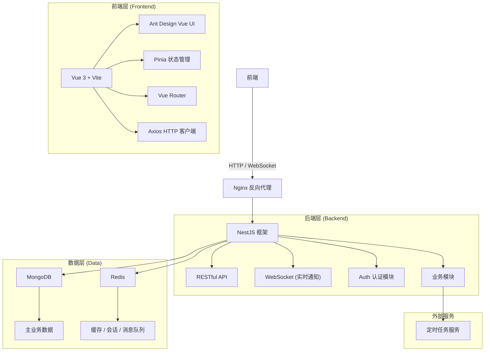
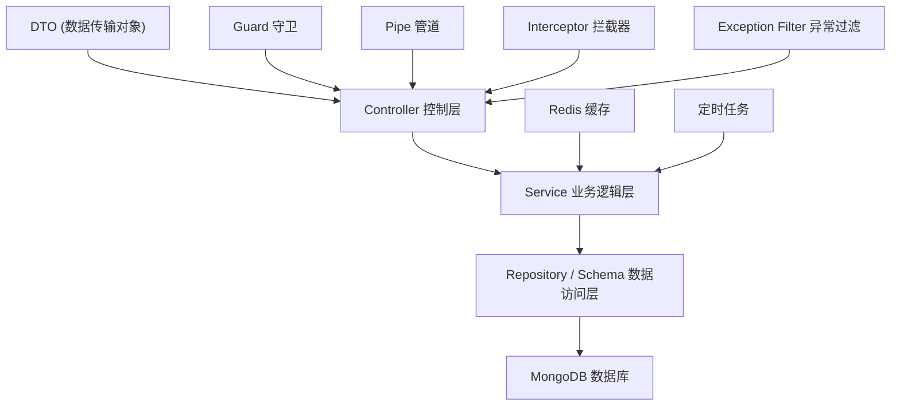
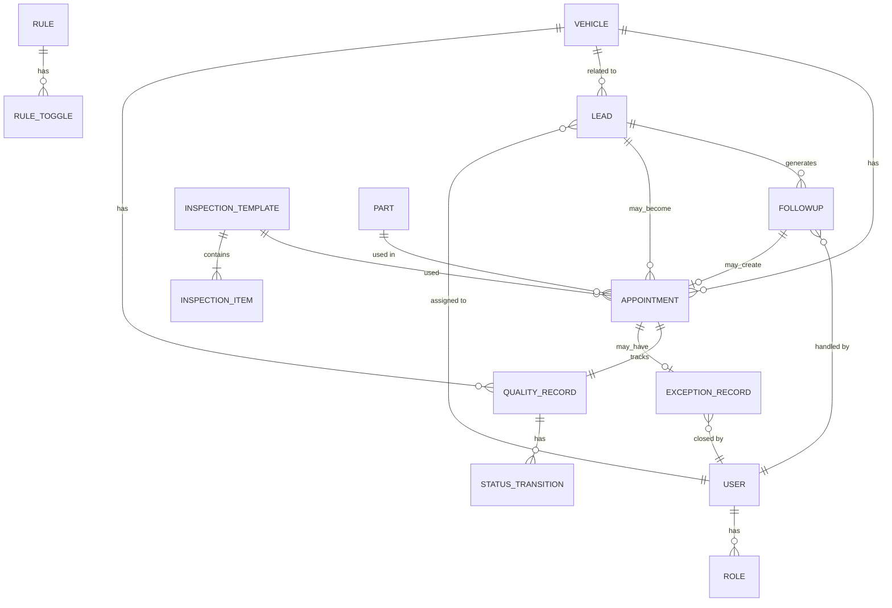

## 1. 架构设计



## 2. 技术选型说明

### 2.1 前端技术栈
- **框架**: Vue 3.4+ (Composition API) + TypeScript
- **构建工具**: Vite 5.0+
- **UI 组件库**: Ant Design Vue 4.1+
- **状态管理**: Pinia 2.1+
- **路由**: Vue Router 4.2+
- **HTTP 客户端**: Axios 1.6+
- **图表库**: ECharts 5.4+
- **日期处理**: Day.js 1.11+

### 2.2 后端技术栈
- **框架**: NestJS 10.0+ + TypeScript
- **数据库**: MongoDB 6.0+ (Mongoose 8.0+)
- **缓存/消息**: Redis 7.0+ (ioredis 5.3+)
- **认证**: JWT + Passport.js
- **API 文档**: Swagger / OpenAPI
- **定时任务**: @nestjs/schedule

### 2.3 项目初始化方式
- 前端: `npm create vite@latest client -- --template vue-ts`
- 后端: `nest new server`

## 3. 路由定义

### 3.1 前端路由
| 路由路径 | 页面名称 | 权限要求 |
|----------|----------|----------|
| / | 首页仪表盘 | 登录用户 |
| /reception | 前台工作台 | 前台/顾问 |
| /reception/inspection | 检测项目查看 | 前台/顾问 |
| /leads | 线索管理 | 顾问/主管 |
| /leads/assign | 线索分配 | 主管 |
| /followup | 回访管理 | 顾问 |
| /followup/tasks | 回访任务 | 顾问 |
| /quality | 维修质量 | 顾问/主管 |
| /quality/status | 按状态展示 | 顾问/主管 |
| /quality/report | 质量报表 | 主管 |
| /config | 基础配置 | 管理员 |
| /config/vehicles | 车辆档案 | 管理员 |
| /config/templates | 检测模板 | 管理员 |
| /config/parts | 配件报价 | 管理员 |
| /config/rules | 规则管理 | 管理员 |
| /login | 登录页 | 公开 |

### 3.2 后端 API 路由前缀
| 前缀 | 模块 |
|------|------|
| /api/auth | 认证模块 |
| /api/leads | 线索管理 |
| /api/followups | 回访管理 |
| /api/appointments | 预约管理 |
| /api/quality | 维修质量 |
| /api/vehicles | 车辆档案 |
| /api/templates | 检测模板 |
| /api/parts | 配件报价 |
| /api/rules | 规则管理 |
| /api/dashboard | 仪表盘数据 |
| /api/exceptions | 异常管理 |

## 4. API 定义 (TypeScript 类型)

```typescript
// 通用响应结构
interface ApiResponse<T> {
  code: number;
  message: string;
  data: T;
}

interface PagedResponse<T> {
  items: T[];
  total: number;
  page: number;
  pageSize: number;
}

// 车辆档案
interface Vehicle {
  id: string;
  plateNumber: string;
  brand: string;
  model: string;
  vin: string;
  ownerName: string;
  ownerPhone: string;
  mileage: number;
  lastMaintenanceDate: Date;
  createdAt: Date;
  updatedAt: Date;
}

// 检测模板
interface InspectionTemplate {
  id: string;
  name: string;
  category: string;
  items: InspectionItem[];
  isActive: boolean;
  createdAt: Date;
}

interface InspectionItem {
  name: string;
  standard: string;
  unit?: string;
  minValue?: number;
  maxValue?: number;
}

// 配件报价
interface Part {
  id: string;
  code: string;
  name: string;
  brand: string;
  model: string;
  price: number;
  stock: number;
  unit: string;
}

// 线索
interface Lead {
  id: string;
  customerName: string;
  phone: string;
  source: string;
  intention: string;
  status: 'UNASSIGNED' | 'ASSIGNED' | 'FOLLOWING' | 'CONVERTED' | 'LOST';
  assigneeId?: string;
  assigneeName?: string;
  vehicleId?: string;
  createdAt: Date;
  assignedAt?: Date;
}

// 回访记录
interface Followup {
  id: string;
  leadId: string;
  vehicleId?: string;
  contactName: string;
  contactPhone: string;
  type: 'MAINTENANCE_REMIND' | 'POST_SERVICE' | 'COMPLAINT';
  status: 'PENDING' | 'COMPLETED' | 'NO_ANSWER' | 'CANCELLED';
  result?: string;
  appointmentMade: boolean;
  appointmentId?: string;
  assigneeId: string;
  scheduledAt: Date;
  completedAt?: Date;
}

// 预约单
interface Appointment {
  id: string;
  leadId?: string;
  vehicleId: string;
  customerName: string;
  phone: string;
  type: 'MAINTENANCE' | 'REPAIR' | 'INSPECTION';
  status: 'PENDING' | 'CONFIRMED' | 'NO_SHOW' | 'IN_PROGRESS' | 'COMPLETED' | 'CANCELLED';
  scheduledDate: Date;
  templateId?: string;
  noShowReason?: string;
  createdAt: Date;
}

// 维修质量记录
interface QualityRecord {
  id: string;
  appointmentId: string;
  vehicleId: string;
  status: 'PENDING_INSPECTION' | 'INSPECTING' | 'IN_REPAIR' | 'COMPLETED' | 'EXCEPTION';
  statusHistory: StatusTransition[];
  inspectionResult?: InspectionResult;
  hasNoShow: boolean;
  noShowHandledBy?: string;
  noShowHandledAt?: Date;
  exceptionId?: string;
}

interface StatusTransition {
  fromStatus: string;
  toStatus: string;
  operatorId: string;
  operatorName: string;
  remark?: string;
  timestamp: Date;
}

// 异常记录
interface ExceptionRecord {
  id: string;
  sourceType: 'APPOINTMENT' | 'QUALITY' | 'FOLLOWUP';
  sourceId: string;
  sourceNo: string;
  type: string;
  description: string;
  level: 'LOW' | 'MEDIUM' | 'HIGH' | 'CRITICAL';
  status: 'OPEN' | 'PROCESSING' | 'CLOSED';
  assigneeId?: string;
  closeReason?: string;
  closedBy?: string;
  closedAt?: Date;
  createdAt: Date;
}

// 规则配置
interface Rule {
  id: string;
  code: string;
  name: string;
  description: string;
  category: string;
  isEnabled: boolean;
  effectiveTime?: Date;
  expiryTime?: Date;
  config: Record<string, any>;
  toggleHistory: RuleToggle[];
}

interface RuleToggle {
  isEnabled: boolean;
  operatorId: string;
  operatorName: string;
  effectiveTime: Date;
  timestamp: Date;
}
```

## 5. 后端分层架构



### 5.1 目录结构
```
server/
├── src/
│   ├── common/           # 公共模块
│   │   ├── decorators/   # 装饰器
│   │   ├── filters/      # 异常过滤器
│   │   ├── guards/       # 守卫
│   │   ├── interceptors/ # 拦截器
│   │   └── pipes/        # 管道
│   ├── config/           # 配置
│   ├── modules/
│   │   ├── auth/         # 认证模块
│   │   ├── vehicles/     # 车辆档案
│   │   ├── templates/    # 检测模板
│   │   ├── parts/        # 配件报价
│   │   ├── leads/        # 线索管理
│   │   ├── followups/    # 回访管理
│   │   ├── appointments/ # 预约管理
│   │   ├── quality/      # 维修质量
│   │   ├── rules/        # 规则管理
│   │   ├── exceptions/   # 异常管理
│   │   └── dashboard/    # 仪表盘
│   ├── schemas/          # Mongoose Schema
│   ├── shared/           # 共享服务
│   │   ├── redis/        # Redis 服务
│   │   └── notification/ # 通知服务
│   └── main.ts
└── test/
```

## 6. 数据模型

### 6.1 ER 图



### 6.2 核心集合索引说明

| 集合 | 索引字段 | 类型 | 说明 |
|------|----------|------|------|
| vehicles | plateNumber | unique | 车牌号唯一 |
| vehicles | ownerPhone | index | 车主手机号查询 |
| leads | status, assigneeId | compound | 按状态和负责人查询 |
| leads | createdAt | index | 按创建时间排序 |
| followups | status, assigneeId, scheduledAt | compound | 回访任务查询 |
| appointments | status, scheduledDate | compound | 预约状态和日期查询 |
| appointments | vehicleId | index | 按车辆查询 |
| quality_records | appointmentId | unique | 关联预约单 |
| quality_records | status | index | 按状态查询 |
| exception_records | status, level | compound | 异常状态和级别 |
| exception_records | sourceType, sourceId | compound | 追溯原单 |
| rules | code | unique | 规则编码唯一 |

### 6.3 Redis 键设计

| 键模式 | 用途 | 过期时间 |
|--------|------|----------|
| `session:{token}` | 用户会话 | 24h |
| `cache:dashboard:{userId}` | 仪表盘缓存 | 5min |
| `cache:today_tasks:{userId}` | 今日待办缓存 | 1min |
| `lock:lead_assign` | 线索分配分布式锁 | 30s |
| `queue:notification` | 通知队列 | - |
