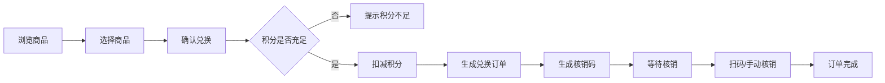
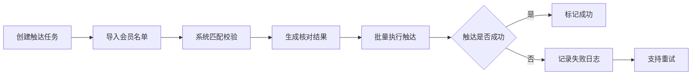

## 1. 产品概述

会员触达台是面向母婴品牌的会员积分运营平台，整合积分商城兑换、商品库存核销、会员等级管理与触达任务批量核对为一体。旨在提升会员活跃度、简化运营流程、降低积分成本统计的人工成本。

- 目标用户：母婴品牌会员、电商运营负责人、系统管理员
- 核心价值：一站式会员积分运营，减少重复下载汇总，提升触达效率

## 2. 核心功能

### 2.1 用户角色

| 角色 | 登录方式 | 核心权限 |
|------|---------|----------|
| 会员 | 手机号登录 | 浏览积分商城、兑换商品、查看兑换记录、查看会员等级 |
| 电商负责人 | 账号密码登录 | 商品管理、库存维护、核销操作、兑换记录查询、触达任务批量核对、积分成本统计 |
| 管理员 | 账号密码登录 | 全部电商负责人权限 + 用户管理、权限分配、操作日志查看、系统配置 |

### 2.2 功能模块

1. **前台积分商城**：商品列表、商品详情、积分兑换、兑换记录、会员等级概览
2. **后台商品管理**：商品 CRUD、库存管理、上下架、积分定价
3. **后台订单核销**：兑换订单列表、扫码/手动核销、核销记录
4. **后台会员管理**：会员列表、等级设置、积分调整
5. **后台触达任务**：触达任务创建、批量核对、失败重试、触达日志
6. **后台数据统计**：积分成本统计、兑换趋势、筛选导出
7. **系统管理**：用户权限、操作日志、系统配置

### 2.3 页面详情

| 页面名称 | 模块名称 | 功能描述 |
|---------|---------|----------|
| 前台-商城首页 | 顶部导航 | 会员信息、积分余额、会员等级标识 |
| 前台-商城首页 | 商品分类筛选 | 按品类、积分区间、会员等级筛选 |
| 前台-商城首页 | 商品卡片列表 | 商品图、名称、所需积分、库存状态 |
| 前台-商品详情 | 商品信息 | 大图、名称、描述、所需积分、库存 |
| 前台-商品详情 | 兑换操作 | 数量选择、确认兑换、积分扣除 |
| 前台-兑换记录 | 记录列表 | 订单号、商品、积分、状态、时间 |
| 前台-兑换记录 | 订单详情 | 收货信息、核销码、状态流转 |
| 前台-会员中心 | 等级概览 | 当前等级、成长值、下一等级进度 |
| 前台-会员中心 | 积分明细 | 积分获取/消耗流水 |
| 后台-商品管理 | 商品列表 | 搜索、筛选、分页、批量操作 |
| 后台-商品管理 | 商品编辑 | 基础信息、积分定价、库存设置、图片上传 |
| 后台-库存核销 | 订单列表 | 按状态筛选、搜索、导出 |
| 后台-库存核销 | 核销操作 | 扫码核销、手动输入核销码 |
| 后台-会员管理 | 会员列表 | 搜索、等级筛选、积分查看 |
| 后台-会员管理 | 等级配置 | 等级名称、成长值门槛、权益配置 |
| 后台-触达任务 | 任务列表 | 任务状态、进度、创建时间 |
| 后台-触达任务 | 批量核对 | 导入名单、匹配校验、结果导出 |
| 后台-触达任务 | 触达日志 | 失败记录、重试操作、日志详情 |
| 后台-成本统计 | 积分成本报表 | 按时间、商品、等级维度统计 |
| 后台-成本统计 | 趋势图表 | 兑换量、积分消耗趋势 |
| 后台-系统管理 | 用户管理 | 管理员账号、角色分配 |
| 后台-系统管理 | 操作日志 | 关键操作审计记录 |

## 3. 核心流程

### 3.1 积分兑换流程

会员浏览商品 → 选择商品 → 确认兑换 → 扣减积分 → 生成兑换订单 → 线下/线上核销 → 订单完成

### 3.2 触达任务核对流程

创建触达任务 → 导入会员名单 → 系统匹配校验 → 生成核对结果 → 批量执行触达 → 记录失败日志 → 失败重试

### 3.3 积分成本统计流程

选择统计维度 → 设置筛选条件 → 系统聚合计算 → 生成报表 → 支持导出（带筛选口径）

## 4. 用户界面设计

### 4.1 设计风格

- **主色调**：柔和薄荷绿 `#5EC4B3` 作为品牌色，搭配暖杏色 `#F5A962` 作为点缀
- **辅助色**：淡粉色 `#FFE8EC`、奶油白 `#FFF9F2` 营造母婴温馨感
- **中性色**：深灰 `#2D3436` 文字、浅灰 `#F5F6F8` 背景
- **按钮风格**：大圆角（12px）、柔和阴影、悬停微动效
- **字体**：标题使用圆润字体，正文使用清晰易读的无衬线字体
- **布局风格**：卡片式布局、大留白、柔和圆角、轻阴影
- **图标风格**：线性图标、柔和配色、母婴相关插画元素

### 4.2 页面设计概览

| 页面名称 | 模块名称 | UI 元素 |
|---------|---------|---------|
| 商城首页 | 顶部导航 | 渐变背景、会员头像、积分数字动效 |
| 商城首页 | 商品卡片 | 圆角卡片、hover 上浮、积分标签 |
| 商品详情 | 商品展示 | 大图轮播、积分价格突出显示 |
| 兑换记录 | 列表 | 时间轴式布局、状态标签色区分 |
| 会员中心 | 等级卡片 | 进度条动画、等级徽章 |
| 后台-商品管理 | 列表 | 搜索筛选栏、表格、分页 |
| 后台-触达任务 | 核对面板 | 上传区域、进度条、结果统计 |
| 后台-成本统计 | 报表 | 图表卡片、筛选器、导出按钮 |

### 4.3 响应式

- 前台：移动端优先设计，适配手机端浏览兑换
- 后台：桌面端优先，支持平板适配，数据表格支持横向滚动
- 触控优化：按钮最小尺寸 44px，表单元素间距充足

### 4.4 动效设计

- 页面切换：淡入淡出 + 轻微位移
- 卡片 hover：上浮 4px + 阴影加深
- 积分数字变化：数字滚动动画
- 加载状态：骨架屏 + 脉冲动画
- 按钮点击：缩放反馈
