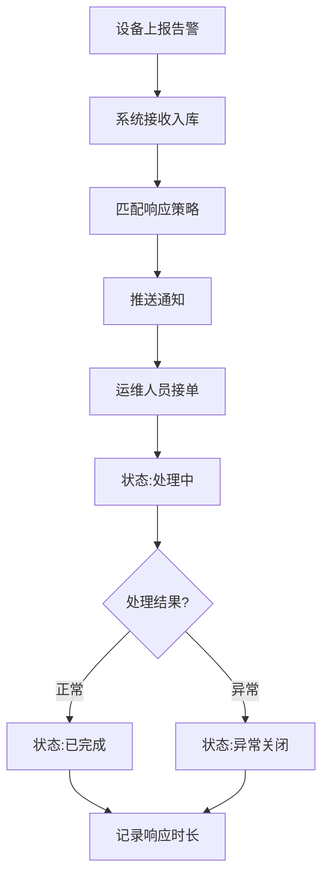

## 1. 产品概述

光伏电站策略配置后台管理系统，为电站负责人提供设备告警管理、运行策略配置、储能收益分析的一体化平台。解决电站运营中告警响应不及时、策略配置分散、收益数据不透明等问题，实现全流程数字化管理。

- 主要目的：统一管理光伏电站的设备告警、运行策略和收益数据
- 解决问题：告警漏处理、策略调整滞后、收益分析困难、责任追溯难
- 目标用户：电站负责人、运维工程师、数据分析人员
- 产品价值：提升运维效率、降低异常损失、优化收益结构、实现可追溯管理

## 2. 核心功能

### 2.1 用户角色

| 角色 | 注册方式 | 核心权限 |
|------|----------|----------|
| 电站负责人 | 系统分配账号 | 全部功能权限、策略审批、数据导出 |
| 运维工程师 | 系统分配账号 | 告警处理、策略配置、数据查看 |
| 数据分析师 | 系统分配账号 | 数据查看、报表导出、收益分析 |

### 2.2 功能模块

1. **首页仪表盘**：关键指标概览、告警统计、收益趋势、待办事项
2. **设备告警管理**：告警列表、筛选查询、状态流转、告警详情
3. **策略配置管理**：策略列表、创建/编辑策略、启停控制、版本管理
4. **储能收益分析**：收益总览、下钻明细、缺口分析、响应追踪
5. **补贴记录管理**：补贴列表、筛选查询、详情查看
6. **表计分区管理**：分区列表、设备关联、数据监控

### 2.3 页面详情

| 页面名称 | 模块名称 | 功能描述 |
|----------|----------|----------|
| 首页仪表盘 | 数据概览卡片 | 展示告警数量、处理率、收益总额、设备在线率等核心指标 |
| 首页仪表盘 | 告警趋势图 | 近7天/30天告警数量趋势折线图 |
| 首页仪表盘 | 收益趋势图 | 近7天/30天储能收益趋势柱状图 |
| 首页仪表盘 | 待办列表 | 待处理告警、待审批策略等紧急事项 |
| 设备告警列表 | 筛选区域 | 按设备、级别、状态、时间范围快速筛选 |
| 设备告警列表 | 数据表格 | 展示告警信息，支持列排序、分页 |
| 设备告警列表 | 状态操作 | 批量/单个状态流转（待处理→处理中→已完成/异常关闭） |
| 设备告警详情 | 告警信息 | 展示告警完整信息、设备参数、历史记录 |
| 设备告警详情 | 处理记录 | 响应时长、处理人员、处理备注 |
| 策略配置列表 | 策略列表 | 展示运行策略，支持按类型、状态筛选 |
| 策略配置表单 | 策略编辑 | 配置触发条件、执行动作、告警阈值 |
| 储能收益总览 | 收益概览 | 总收益、日收益、趋势分析 |
| 储能收益明细 | 明细下钻 | 按时间、分区、设备维度下钻查看 |
| 储能收益明细 | 缺口分析 | 数据缺口原因、响应时长、责任人 |
| 补贴记录列表 | 补贴列表 | 展示补贴记录，支持筛选和导出 |
| 表计分区列表 | 分区列表 | 展示表计分区信息、关联设备、数据状态 |

## 3. 核心流程

### 3.1 告警处理流程
设备上报告警信息 → 系统接收并入库 → 自动匹配响应策略 → 推送通知给责任人 → 运维人员接单处理 → 更新状态为处理中 → 处理完成/异常关闭 → 记录响应时长和处理详情

### 3.2 策略配置流程
创建新策略 → 配置触发条件和执行动作 → 保存并启用 → 系统实时加载策略 → 设备数据上报时匹配策略 → 触发告警或自动执行 → 记录策略执行日志

### 3.3 收益分析流程
采集表计数据 → 计算储能收益 → 检测数据完整性 → 标记数据缺口 → 分析缺口原因 → 关联责任人和响应时长 → 生成收益明细报表

## 4. 用户界面设计

### 4.1 设计风格
- **主色调**：科技蓝 #1890ff（Ant Design 主题色），代表专业和可信赖
- **辅助色**：成功绿 #52c41a（已完成）、警告橙 #faad14（处理中）、危险红 #f5222d（待处理/告警）、紫 #722ed1（异常关闭）
- **中性色**：深灰 #262626（标题）、中灰 #595959（正文）、浅灰 #bfbfbf（辅助文字）、背景 #f0f2f5
- **按钮风格**：Ant Design 标准圆角按钮，主要按钮蓝色填充，次要按钮描边
- **字体**：系统默认中文字体 + Ant Design 字体栈，标题 16-20px，正文 14px，辅助 12px
- **布局风格**：左侧导航 + 顶部面包屑 + 内容卡片式布局
- **图标**：Ant Design 图标库 + lucide-react 补充

### 4.2 页面设计概述

| 页面名称 | 模块名称 | UI 元素 |
|----------|----------|----------|
| 首页仪表盘 | 概览卡片 | 四色卡片布局，图标+数值+趋势箭头，悬停阴影效果 |
| 首页仪表盘 | 趋势图表 | ECharts 折线/柱状图，支持图例切换，平滑动画 |
| 首页仪表盘 | 待办列表 | 卡片式列表，状态标签，一键处理入口 |
| 设备告警列表 | 筛选区域 | 紧凑表单布局，多条件组合，重置/查询按钮 |
| 设备告警列表 | 数据表格 | 斑马纹行，状态标签彩色区分，行悬停高亮，操作列 |
| 设备告警详情 | 信息布局 | 左右两栏，左侧基本信息，右侧处理记录时间线 |
| 策略配置表单 | 表单布局 | 分组标签页，条件配置器，动作配置器，实时预览 |
| 储能收益明细 | 下钻表格 | 可展开行，多级表头，缺口行高亮标记 |
| 储能收益明细 | 时间线 | 处理时间线，责任人头像，响应时长计算 |

### 4.3 响应式设计
- 桌面端优先（≥1280px）：完整侧边栏 + 多列布局
- 平板端（768px-1280px）：折叠侧边栏 + 自适应列数
- 移动端（<768px）：底部导航 + 单列布局，筛选抽屉

### 4.4 状态设计
状态标签采用不同颜色和语义化设计：
- **待处理**：红色背景 #fff1f0，红色边框 #ffa39e，红色文字 #f5222d
- **处理中**：橙色背景 #fff7e6，橙色边框 #ffd591，橙色文字 #faad14
- **已完成**：绿色背景 #f6ffed，绿色边框 #b7eb8f，绿色文字 #52c41a
- **异常关闭**：紫色背景 #f9f0ff，紫色边框 #d3adf7，紫色文字 #722ed1
