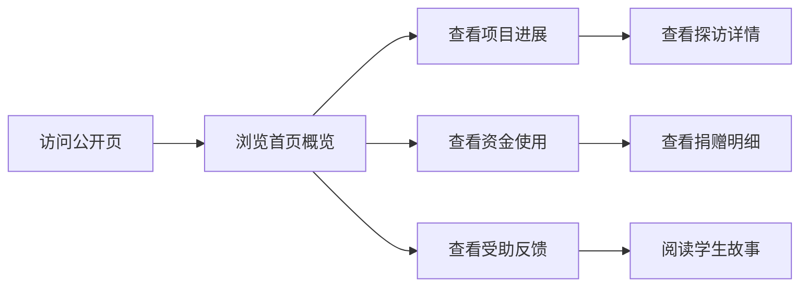
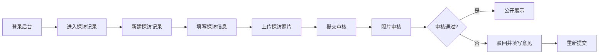

## 1. 产品概述

公益助学项目公开平台，面向社会公众展示助学项目的进展、资金使用和受助反馈，同时为项目官员提供后台管理能力，实现预算管理、探访记录、照片审核、捐赠明细追踪和异常处理全流程。

- 主要目的：提升公益项目透明度，建立公众信任，提升项目管理效率
- 目标用户：社会捐赠者、受助学生、公益项目官员、管理员
- 核心价值：阳光透明的公益展示 + 高效规范的项目管理

---

## 2. 核心功能

### 2.1 用户角色

| 角色 | 注册方式 | 核心权限 |
|------|---------|---------|
| 公众访客 | 无需注册 | 浏览公开页所有内容 |
| 项目官员 | 管理员创建账号 | 后台管理所有模块、提交探访记录、审核照片 |
| 管理员 | 系统内置 | 用户管理、系统设置、异常处理审批 |

### 2.2 功能模块

1. **公开首页**：项目概览、核心数据展示、成果照片轮播
2. **项目进展页**：时间线展示项目里程碑、探访记录、动态更新
3. **资金使用页**：预算明细、捐赠明细、支出追踪、财务报表
4. **受助反馈页**：学生故事、感谢信、学习成绩追踪
5. **后台仪表盘**：数据概览、异常提示、快捷入口
6. **预算管理**：预算编制、科目设置、执行追踪
7. **探访记录**：探访计划、记录提交、照片上传
8. **照片审核**：照片列表、审核流程、批量操作
9. **捐赠明细**：捐赠记录、匹配追踪、票据管理
10. **异常处理**：物资差异登记、处理流程、复盘记录、异常关闭
11. **系统设置**：成果照片管理、服务时长配置、项目预算设置

### 2.3 页面详情

| 页面名称 | 模块名称 | 功能描述 |
|---------|---------|----------|
| 公开首页 | 英雄区域 | 项目名称、口号、核心数据（累计筹款、受益人数、服务时长） |
| 公开首页 | 成果展示 | 照片轮播、成果数据统计 |
| 公开首页 | 快速导航 | 跳转至项目进展、资金使用、受助反馈 |
| 项目进展页 | 时间线 | 按时间倒序展示项目里程碑和探访记录 |
| 项目进展页 | 探访卡片 | 展示探访时间、地点、照片、记录摘要 |
| 资金使用页 | 预算概览 | 总预算、已支出、剩余、执行率图表 |
| 资金使用页 | 支出明细 | 分类展示支出记录，支持筛选和搜索 |
| 资金使用页 | 捐赠明细 | 展示捐赠人、金额、时间、用途 |
| 受助反馈页 | 学生故事 | 卡片式展示受助学生信息和反馈 |
| 受助反馈页 | 感谢信 | 展示学生感谢信和成绩反馈 |
| 后台仪表盘 | 数据概览 | 关键指标卡片、异常提醒、待办事项 |
| 预算管理页 | 预算列表 | 预算科目、分配金额、执行进度 |
| 预算管理页 | 预算编辑 | 新增/编辑预算科目、调整金额 |
| 探访记录页 | 记录列表 | 所有探访记录，支持筛选 |
| 探访记录页 | 记录表单 | 提交探访记录，上传照片 |
| 照片审核页 | 待审列表 | 待审核照片，支持批量通过/驳回 |
| 照片审核页 | 审核详情 | 大图预览、审核意见填写 |
| 捐赠明细页 | 捐赠列表 | 捐赠记录查询、导出 |
| 异常处理页 | 异常列表 | 物资差异记录、状态追踪 |
| 异常处理页 | 异常详情 | 影响范围、处理路径、复盘备注填写 |
| 异常处理页 | 异常关闭 | 填写关闭原因，关联原单追溯 |
| 系统设置页 | 成果照片 | 上传/排序首页展示的成果照片 |
| 系统设置页 | 基础配置 | 服务时长、项目预算等全局设置 |

---

## 3. 核心流程

### 3.1 公众浏览流程

### 3.2 项目官员探访提交流程

### 3.3 物资差异异常处理流程

---

## 4. 用户界面设计

### 4.1 设计风格

**设计理念：温暖、信任、透明**

- **主色调**：温暖橙色系 `#F97316`，代表希望与温暖
- **辅助色**：沉稳绿色 `#10B981`，代表成长与信任
- **中性色**：柔和米白 `#FFFAF5`、深灰 `#1F2937`，营造温暖专业感
- **按钮风格**：圆角 12px，悬停微放大 + 阴影加深，温暖有质感
- **字体**：标题使用 `Noto Serif SC` 衬线字体传递人文关怀，正文使用 `Inter` 保证可读性
- **布局风格**：卡片式布局，柔和阴影，充足留白，大尺寸高质量图片展示
- **图标风格**：线性图标，统一 24px 尺寸，温暖色调

### 4.2 页面设计概述

| 页面名称 | 模块名称 | UI 元素 |
|---------|---------|---------|
| 公开首页 | 英雄区域 | 全屏大图背景，渐变遮罩，大标题动画入场，数据数字滚动效果 |
| 公开首页 | 成果展示 | 横向滚动照片墙，悬停放大，图文卡片错落布局 |
| 项目进展页 | 时间线 | 左侧垂直时间线，右侧卡片交错布局，连接线动画 |
| 资金使用页 | 数据图表 | 环形进度图、柱状图，数字动画，渐变色填充 |
| 受助反馈页 | 学生卡片 | 圆角大图卡片，悬停显示更多信息，网格瀑布流布局 |
| 后台仪表盘 | 概览卡片 | 渐变背景卡片，图标+数字，异常卡片红色高亮闪烁 |
| 表单页面 | 表单组件 | 标签左对齐，输入框圆角 8px，错误提示红色边框 |
| 列表页面 | 数据表格 | 斑马纹，悬停高亮，操作按钮固定右侧 |

### 4.3 响应式

- 桌面优先设计，断点 1280px / 1024px / 768px / 640px
- 移动端：导航折叠为汉堡菜单，卡片单列布局，表格横向滚动
- 触摸优化：按钮最小 44px，点击反馈涟漪效果

---

## 5. 非功能性需求

1. **性能**：首屏加载 < 2s，图片懒加载，SSG 静态生成公开页
2. **安全**：后台路由鉴权，敏感数据加密，SQL 注入防护
3. **可追溯**：所有操作留痕，异常记录完整保留处理过程
4. **可维护性**：组件模块化，TypeScript 类型完整，注释清晰
