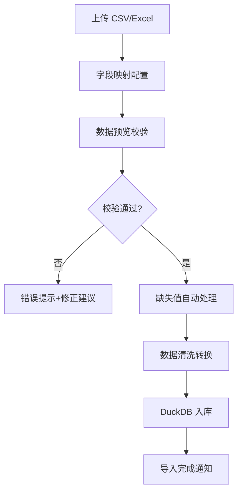

## 1. 产品概述

冷链物流温控追踪分析系统是面向冷链物流企业运营团队的专业数据分析工具，通过整合车辆定位、箱内温度、开门记录、到货时间等多维度数据，实现全链路温控可视化与异常智能诊断，帮助运营团队快速定位问题、明确责任、优化配送质量。

- **核心价值**：解决冷链运输中温度异常溯源难、责任界定模糊、运营决策缺乏数据支撑的痛点
- **目标用户**：冷链物流运营经理、质量管控人员、调度人员、客户服务团队
- **应用场景**：每日运营晨会、异常事件复盘、客户质量报告、线路优化分析

## 2. 核心功能

### 2.1 用户角色

| 角色 | 登录方式 | 核心权限 |
|------|----------|----------|
| 运营管理员 | 账号密码登录 | 全部功能权限、用户管理、系统配置 |
| 运营分析员 | 账号密码登录 | 数据分析、视图保存、导出报表 |
| 质量管控 | 账号密码登录 | 异常标注、质量报告、探头校准管理 |
| 客户视图 | 账号密码/链接访问 | 仅查看自有客户数据、限定范围导出 |

### 2.2 功能模块

1. **数据接入中心**：批量导入、API 接入、数据字典配置、缺失值处理规则
2. **驾驶舱总览**：关键指标卡片、异常概览、在途监控、温控合规率
3. **运输分析**：路线回放、温度曲线、开门事件、多批次对比
4. **异常中心**：异常时长统计、责任段定位、探头校准状态、异常标注处理
5. **多维分析**：按车辆/路线/批次/温控箱/客户维度下钻分析
6. **报表中心**：CSV/PDF 导出、自定义报表模板、定时推送

### 2.3 页面详情

| 页面名称 | 模块名称 | 功能描述 |
|-----------|-------------|---------------------|
| 登录页 | 身份认证 | 账号密码登录、记住登录态、权限路由拦截 |
| 数据导入页 | 文件上传 | 支持 CSV/Excel 批量导入、导入进度、字段映射、数据预览 |
| 数据管理页 | 数据字典 | 字段定义、枚举值配置、校准参数设置、缺失值规则 |
| 驾驶舱 | 总览看板 | KPI 指标卡片、在途车辆列表、今日异常概览、合规率趋势 |
| 运输详情页 | 单运单分析 | 路线轨迹回放、温度时间曲线、开门事件标记、探头状态指示 |
| 异常分析页 | 异常诊断 | 异常时长分布饼图、责任段甘特图、异常列表、批量标注处理 |
| 多维分析页 | OLAP 分析 | 维度选择器、交叉透视表、图表联动下钻、视图保存/加载 |
| 报表中心 | 导出管理 | 导出任务列表、CSV/PDF 下载、导出历史、报表模板配置 |

## 3. 核心流程

### 3.1 数据分析主流程

运营人员登录系统后，首先查看驾驶舱总览了解整体运营状况；发现异常指标后，点击下钻到异常分析页，筛选具体异常类型和时间范围；通过温度曲线和路线回放定位具体运单，查看责任段定位和探头校准状态；确认异常原因后进行标注处理，最后导出分析报告用于晨会讨论。

### 3.2 数据导入流程

## 4. 用户界面设计

### 4.1 设计风格

- **主色调**：专业冷静的深海蓝 (#0F4C81)，体现冷链物流的专业感和温控特性
- **辅助色**：温度指示渐变色带（蓝色-绿色-黄色-红色），异常警示红 (#E53935)，校准状态青 (#00ACC1)
- **中性色**：深灰 (#263238)、中灰 (#546E7A)、浅灰 (#ECEFF1)、纯白背景
- **按钮风格**：圆角 6px，悬停微浮起效果，主按钮蓝底白字，次按钮描边
- **字体**：标题使用 Inter SemiBold，正文使用 Inter Regular，数据数字使用等宽字体 JetBrains Mono
- **布局风格**：卡片式布局，清晰的视觉分层，数据密集型表格使用斑马纹和悬停高亮
- **图标风格**：线性简洁图标，使用 Lucide 图标库，状态图标使用填充色区分

### 4.2 页面设计概述

| 页面名称 | 模块名称 | UI 元素 |
|-----------|-------------|-------------|
| 驾驶舱 | KPI 指标区 | 4 个大指标卡片带趋势小图，数据变化箭头指示 |
| 驾驶舱 | 在途监控 | 地图概览 + 车辆列表，车辆状态用颜色标记 |
| 运输详情 | 路线回放 | 可拖拽时间轴，地图轨迹动态播放，播放控制条 |
| 运输详情 | 温度曲线 | 双 Y 轴图表，温度+门状态，探头校准状态悬浮提示 |
| 异常分析 | 责任段定位 | 水平甘特图，分段着色标注责任方，点击下钻 |
| 多维分析 | 筛选器栏 | 多条件级联筛选，筛选标签可删除，保存筛选条件 |
| 数据导入 | 字段映射 | 左右两列拖拽映射，字段类型图标标识，必填字段校验 |
| 全局 | 空状态 | 自定义插画 + 明确引导文案 + 操作按钮 |
| 全局 | 悬浮提示 | 富文本 Tooltip，显示多维度关联数据，探头校准状态标识 |

### 4.3 响应式

- Desktop-first 设计，主内容区最小宽度 1280px
- 侧边栏可折叠，适配 1366px 以上屏幕
- 表格区域支持横向滚动，适配数据密集场景
- 触控优化：按钮最小点击区域 44x44px，重要操作二次确认

### 4.4 数据可视化规范

- **温度曲线**：平滑折线，温度阈值区间用半透明色带标注，异常点用红色圆点标记
- **路线回放**：Mapbox 底图，轨迹线按温度分段着色，播放速度可调节
- **异常时长**：旭日图 + 饼图联动，异常类型分层展示
- **责任段定位**：时间轴甘特图，不同责任方用不同颜色，悬浮显示详细信息
- **校准状态**：温度曲线上用特殊标记点显示校准时间点，悬浮显示校准偏差值
