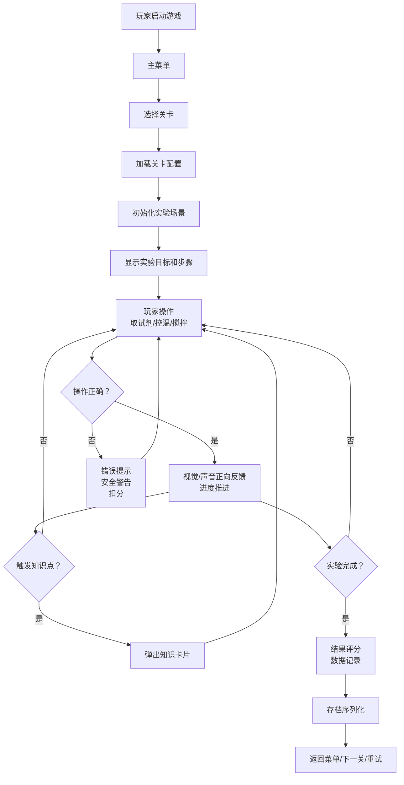

## 1. 产品概述

化学实验室教学游戏是一款基于HTML5 Canvas的互动教育游戏，旨在通过模拟化学实验过程，让玩家在安全的虚拟环境中学习化学知识，体验实验操作的乐趣。

- 核心目标：让化学教育模拟的核心乐趣成立——配置溶液、控制温度、观察反应，获得即时视觉与听觉反馈
- 目标用户：中学生、化学学习者、对化学实验感兴趣的大众
- 价值：零危险、零耗材的沉浸式化学实验学习体验

---

## 2. 核心功能

### 2.1 用户角色
| 角色 | 注册方式 | 核心权限 |
|------|----------|----------|
| 玩家 | 无需注册，本地存档 | 进行实验、保存进度、调整设置、查看数据记录 |

### 2.2 功能模块
1. **主菜单页**：开始游戏、关卡选择、设置、继续游戏
2. **关卡选择页**：解锁进度展示、关卡难度筛选、关卡预览
3. **实验游戏页**：Canvas实验场景、器材操作台、试剂架、步骤提示、知识卡片、数据面板
4. **设置页**：音量控制、画质选项、输入方式切换、按键重映射、数据管理
5. **结果页**：实验评分、知识回顾、重试/返回选择、数据记录

### 2.3 页面详情
| 页面名称 | 模块名称 | 功能描述 |
|----------|----------|----------|
| 主菜单页 | 标题动画区 | 动态实验器材背景、渐入式标题 |
| 主菜单页 | 功能按钮区 | 开始/继续/关卡/设置四大按钮，悬浮发光效果 |
| 关卡选择页 | 关卡网格 | 卡片式关卡展示，星级评价，锁定/解锁状态 |
| 关卡选择页 | 进度条 | 总完成度百分比，已解锁关卡数 |
| 实验游戏页 | Canvas主场景 | 实验台俯视视角，器材拖拽放置，液体动画 |
| 实验游戏页 | 试剂面板 | 试剂列表，点击/拖拽取用，浓度/体积显示 |
| 实验游戏页 | 温度控制 | 加热/冷却滑块，实时温度显示，温度阈值警告 |
| 实验游戏页 | 步骤指引 | 当前步骤高亮，已完成步骤标记，下一步提示 |
| 实验游戏页 | 知识卡片 | 触发式弹出，知识点讲解，安全提示 |
| 实验游戏页 | 错误提示 | 操作错误警告，正确操作引导，扣分提示 |
| 实验游戏页 | 性能面板 | FPS显示、帧时间、内存占用(可选) |
| 设置页 | 音频设置 | 主音量/BGM/音效滑块，静音开关 |
| 设置页 | 画质设置 | 粒子开关、液体精度、后处理开关 |
| 设置页 | 输入设置 | 键盘/鼠标/手柄/触摸切换，按键重映射 |
| 设置页 | 数据管理 | 导出存档、导入存档、清除数据按钮 |
| 结果页 | 评分面板 | 星级评价、准确度得分、时间得分、安全得分 |
| 结果页 | 知识回顾 | 本关知识点列表、错题回顾 |
| 结果页 | 操作按钮 | 重试本关、返回菜单、下一关 |

---

## 3. 核心流程

---

## 4. 用户界面设计

### 4.1 设计风格
- **主色调**：深邃实验室蓝 `#0a1628` 为背景，科技青 `#00d4ff` 为强调色，安全绿 `#00ff88` 和警告橙 `#ff6b35` 用于反馈
- **辅助色**：玻璃器皿反光白 `#e8f4ff`，试剂架金属灰 `#3a4a5c`
- **按钮风格**：圆角玻璃拟态按钮，带内发光和边框光晕，按下时凹陷效果
- **字体**：标题使用 `Orbitron` 科技感字体，正文使用 `Noto Sans SC` 清晰可读
- **布局风格**：居中实验主场景 + 两侧功能面板的不对称布局，面板带毛玻璃背景
- **图标风格**：线性描边图标，统一圆角风格，带发光效果

### 4.2 页面设计概述
| 页面名称 | 模块名称 | UI元素 |
|----------|----------|--------|
| 主菜单页 | 标题区 | 大字号Orbitron标题，副标题渐变，背景为缓慢旋转的分子结构动画 |
| 主菜单页 | 按钮区 | 垂直排列四大按钮，每个带悬浮光晕和渐入动画延迟 |
| 关卡选择页 | 关卡网格 | 3列自适应网格，卡片含关卡编号/名称/难度/星级，锁定卡片带锁图标和灰色蒙版 |
| 实验游戏页 | 主场景 | 深色实验台纹理，器材有投影和反光，液体有波动和折射效果 |
| 实验游戏页 | 侧边面板 | 毛玻璃效果 `backdrop-filter: blur(12px)`，半透明背景，边框发光 |
| 设置页 | 设置项 | 分组卡片，滑块带渐变填充，开关带平滑过渡动画 |
| 结果页 | 评分区 | 大号星级动画，数字滚动计数，环形进度条展示各项得分 |

### 4.3 响应式
- 桌面端优先设计（1280px+），Canvas自适应容器尺寸
- 平板端（768px+）：侧边面板改为底部抽屉式
- 移动端（<768px）：简化面板布局，增大触控区域，支持触摸手势操作
- 触控优化：所有按钮最小触控区48x48px，拖拽操作支持触摸事件

### 4.4 视觉效果指引
- **环境氛围**：深色实验室背景，微弱顶光照明，器材下方柔和投影
- **光照设置**：主光源左上方45度，副光源补光，液体有内部发光效果
- **粒子系统**：反应产生气泡、烟雾、闪光粒子，温度升高时热扭曲效果
- **动画细节**：试剂倒入时液体波动，搅拌时漩涡效果，温度变化时颜色渐变
- **后处理**：泛光(Bloom)增强发光效果，轻微暗角聚焦中心区域
