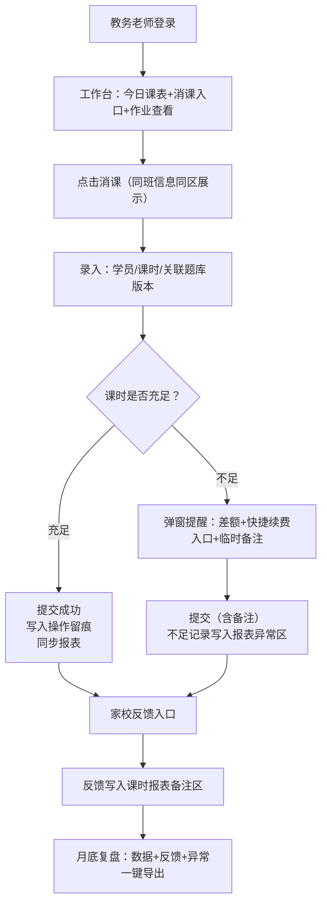

## 1. 产品概述

北桥排课消课台是面向少儿编程教育机构教务老师的一站式家校沟通与教务管理系统，解决排课消课、课时管理、通知回执、数据统计等核心痛点。

- 核心目标：让一线教务人员在单一工作台完成消课录入、课表查看、题库版本管理，减少页面跳转；课时统计与操作留痕、报表完全联动，不出现数据脱节
- 目标用户：教务老师（核心）、运营人员、机构管理者
- 产品价值：提升教务效率30%+，消除课时统计误差，实现家校沟通闭环与月度复盘数据化

## 2. 核心功能

### 2.1 用户角色

| 角色 | 登录方式 | 核心权限 |
|------|----------|----------|
| 教务老师 | 账号密码登录 | 消课录入、课表查看、题库管理、作业查看、课时不足处理、回执审核 |
| 运营人员 | 账号密码登录 | 发布通知、收集回执、查看反馈数据、生成运营报表 |
| 机构管理员 | 账号密码登录 | 全部权限、角色管理、月度复盘报表导出 |

### 2.2 功能模块

1. **教务工作台（首页入口）**：今日课表卡片、消课录入区（同班课表+题库版本联动）、作业提交查看、课时不足实时提醒
2. **课时统计与报表中心**：按学员/班级/时间段多维统计、操作留痕时间线、家校反馈嵌入报表、月底一键复盘导出
3. **运营通知后台**：通知编辑发布（支持模板）、回执收集看板、未回执催发、反馈汇总
4. **班级课表管理**：周视图课表、调课代课、题库版本绑定
5. **题库与作业中心**：题目版本管理、作业布置、提交情况查看

### 2.3 页面详情

| 页面名称 | 模块名称 | 功能描述 |
|-----------|-------------|---------------------|
| 登录页 | 登录表单 | 账号密码登录、记住登录、会话管理 |
| 教务工作台 | 顶部概览条 | 今日待消课数、课时预警数、待审核回执数 |
| 教务工作台 | 今日课表+消课录入区 | 同班课表列表、消课弹窗（选择学员/扣课时/关联题库版本）、课时不足弹层提醒 |
| 教务工作台 | 作业与反馈卡片 | 本班最近作业提交情况、家长快捷反馈入口 |
| 课时统计报表 | 多维筛选栏 | 学员/班级/时间范围筛选、导出按钮 |
| 课时统计报表 | 数据表格+操作留痕 | 每课时消耗记录可展开查看操作人、时间、备注、关联回执 |
| 课时统计报表 | 家校反馈区块 | 关联时间段内家长反馈摘要，支持钻取详情 |
| 月度复盘 | 复盘总览 | 消耗对比TOP榜、异常课时标记、反馈关键词云 |
| 运营通知后台 | 通知列表+编辑 | 富文本编辑、模板选择、定向发送（班级/学员） |
| 运营通知后台 | 回执收集看板 | 已读/已回执/未读统计、一键催发、导出回执表 |
| 班级课表 | 周视图 | 拖拽调课、批量消课、题库版本快速切换 |
| 题库中心 | 版本列表 | 每套题的版本历史、绑定班级、启用状态 |

## 3. 核心流程

### 3.1 教务老师消课流程（核心）

教务老师登录 → 进入工作台看到今日课表 → 点击"消课"按钮（同班所有信息在同一处理区）→ 弹出消课录入面板 → 选择学员、勾选本次课时、自动关联当前课次绑定的题库版本 → 系统检测剩余课时 → 课时充足则提交成功/不足则弹出提醒框（显示差额、快捷续费跳转、可临时备注）→ 操作写入留痕日志并同步更新统计报表 → 返回工作台提示成功

### 3.2 运营发布通知与回执流程

运营登录 → 通知后台 → 新建通知（选择模板或编辑）→ 选择发送对象（班级/全机构）→ 发布 → 回执看板实时更新 → 未回执学员24小时自动催发 → 回执数据与学员课时报表关联 → 月底复盘时可见通知触达效果

### 3.3 Mermaid 流程图

## 4. 用户界面设计

### 4.1 设计风格

**视觉方向：专业理性·高效仪表盘风（Brutalist Utility）**

- **主色**：深邃石板蓝 `#1F3A5F`（专业、稳定、教务场景的信任感）
- **辅助色**：琥珀警示橙 `#E8871E`（课时不足预警、待办高亮）+ 薄荷确认绿 `#2EA885`（成功、已消课）
- **中性色**：冷灰阶（`#F4F6F8 背景` / `#6B7785 次级文字` / `#1A2028 主文字`），数据表格用斑马纹强化可读性
- **按钮风格**：方正切角（2px圆角），主按钮实心深蓝色+1px边框，次按钮描边+悬停填充，危险按钮琥珀色实底+白字
- **字体**：标题用「思源黑体 Heavy」强对比粗体，正文用「思源黑体 Regular」，数据数字用等宽字体「JetBrains Mono」以表格对齐
- **布局**：三栏固定式布局（左导航/中工作台主处理区/右辅助栏：课时预警+反馈快览），核心消课区采用「同卡片内完成录入」，禁止弹窗跳页
- **图标风格**：Lucide React 线性图标，1.5px 描边，与主色同系
- **动效**：状态变更微动画（消课成功时记录行向右滑入绿底 200ms），数据刷新脉冲闪烁（1次），预警图标缓慢呼吸

### 4.2 页面设计概述

| 页面名称 | 模块名称 | UI元素设计说明 |
|-----------|-------------|-------------|
| 教务工作台 | 顶部概览条 | 三卡片横排：待消课(蓝底白数大字)/课时预警(琥珀底+惊叹号)/待审核回执(灰底+链接)，卡片间用1px竖线分隔 |
| 教务工作台 | 消课核心处理区 | 左侧本班课表时间轴（班级卡片+时间+教师+题库版本徽标），右侧展开面板：学员勾选列表+课时扣减滑块+备注输入框，底部「确认消课」大按钮 |
| 教务工作台 | 课时不足提醒弹层 | 非阻断式右上角抽屉滑出：琥珀色渐变背景+剩余/缺口课时对比条形图+「联系家长」快捷拨号+「临时记录」按钮，不影响继续消课 |
| 课时统计报表 | 数据表格+留痕行 | 每行主数据（学员/班级/消耗课时/日期），点击展开内嵌操作留痕（时间轴样式：操作人头像+动作+时间+IP+关联回执气泡），斑马纹 |
| 课时统计报表 | 家校反馈嵌入区 | 报表底部横向卡片：学员头像+反馈文字片段tag+时间，点击展开完整反馈内容，与对应课时消耗行高亮联动 |
| 月度复盘 | 顶部指标区 | 四块大数字卡：总消耗课时/环比/异常课时数/家长反馈数，下方柱状图+异常标记点 |
| 运营通知后台 | 回执看板 | 九宫格状态卡（已发送/已读/已回执/未读/超时），下方学员明细列表带催发按钮 |
| 班级课表 | 周视图 | 7列时间网格，每格含：课程名+教师+题库版本标签+「消课」快捷按钮，支持拖拽调课 |
| 登录页 | 品牌区+表单 | 左半屏品牌插画（编程儿童+黑板线条风），右半屏登录表单+石板蓝主色调 |

### 4.3 响应式设计

**移动端（< 768px）优先保证：录入可用 + 审核可用**

- 断点：`>= 1280px 桌面三栏` / `768px-1279px 双栏折叠右辅助` / `< 768px 单栏堆叠`
- **移动端适配策略**：
  1. 顶部概览条折叠为两行滚动卡片，优先展示「待消课」和「课时预警」
  2. 消课处理区：课表时间轴改为横向滑动卡片，点击展开底部抽屉式录入面板（占屏70%高），所有表单控件放大至 44px+ 触控区
  3. 课时报表：表格改为卡片列表，每条数据一整张卡片，操作留痕用箭头折叠展开
  4. 审核/回执操作：底部固定浮动操作栏（FAB），批量审核按钮常驻
  5. 禁用横向滚动，所有表单 label 上移至输入框内（MD 风格）
  6. 移动端跳过复杂图表，改为关键数字 + 颜色色块对比

### 4.4 无障碍与操作效率

- 键盘快捷键：`N` 新建消课 / `Enter` 提交 / `Esc` 取消 / `Tab` 在学员列表间跳转
- 消课录入区支持「批量勾选 + 回车提交」两步完成
- 操作留痕不可删除、不可修改（只读时间线）
- 课时不足提醒：全局右上角 + 页面内对应学员行双处高亮
