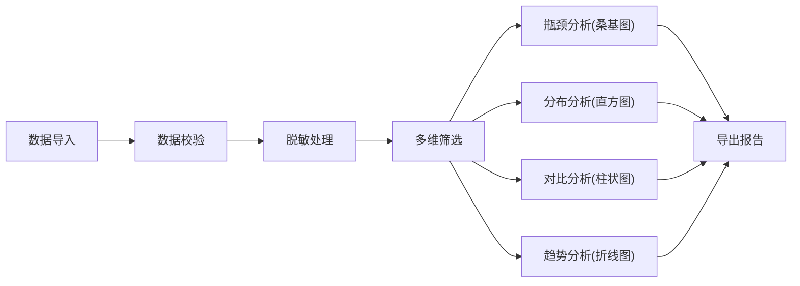

## 1. 产品概述

医院门诊等待时间分析系统，用于帮助运营改善小组分析门诊全流程等待时间，识别瓶颈环节，优化患者就医体验。系统面向医院管理者、运营分析人员和对外公开场景，提供多维度筛选、可视化分析和数据导出功能。

- 解决问题：从 Excel 总数统计升级为可解释的流程分析，支持下钻和多维度对比
- 目标用户：运营改善小组、医院管理层、对外公开访问者
- 核心价值：数据驱动的流程优化决策支持，脱敏安全的公开信息发布

## 2. 核心功能

### 2.1 用户角色

| 角色 | 访问方式 | 核心权限 |
|------|----------|----------|
| 运营分析师 | 内部账号登录 | 数据导入、完整分析、异常标注、权限管理 |
| 医院管理者 | 内部账号登录 | 查看分析报告、导出数据 |
| 公开访问者 | 公开链接 | 查看脱敏后的聚合数据、基础筛选、公开报告 |

### 2.2 功能模块

1. **仪表盘主页**：全局概览指标、快速筛选器、核心图表展示
2. **流程分析**：瓶颈桑基图、节点等待时间分布、流程路径分析
3. **多维对比**：科室对比、医生对比、时段对比、患者类型对比
4. **趋势分析**：日内趋势、日周月趋势、同比环比分析
5. **数据管理**：批量导入、数据字典、缺失值处理、异常点标注
6. **导出中心**：CSV 导出、PDF 报告导出、口径说明文档

### 2.3 页面详情

| 页面名称 | 模块名称 | 功能描述 |
|----------|----------|----------|
| 仪表盘 | 全局指标卡 | 展示平均等待时长、各环节中位数、患者吞吐量等 KPI |
| 仪表盘 | 快速筛选面板 | 按科室、医生、时段、患者类型、日期范围筛选 |
| 流程分析 | 瓶颈桑基图 | 展示患者在各流程节点的流转和等待时间分布 |
| 流程分析 | 等待时间分布 | 直方图展示各环节等待时间的概率分布 |
| 多维对比 | 科室对比图 | 柱状图对比各科室的平均等待时间 |
| 趋势分析 | 日内趋势图 | 折线图展示一天内不同时段的等待时间变化 |
| 数据管理 | 批量导入 | 支持 CSV/Excel 批量导入挂号、签到、分诊、叫号、缴费、取药数据 |
| 数据管理 | 数据字典 | 字段说明、取值范围、计算口径定义 |
| 数据管理 | 异常标注 | 标记和说明异常数据点（如系统故障、节假日等） |
| 导出中心 | 数据导出 | 筛选后的原始数据 CSV 导出 |
| 导出中心 | 报告导出 | 含图表和口径说明的 PDF 分析报告导出 |
| 公开页面 | 脱敏展示 | 对外公开的聚合数据展示，不含个人信息和敏感维度 |

## 3. 核心流程

### 3.1 数据分析主流程

运营分析师登录系统后，导入门诊流程时间戳数据，系统自动进行数据校验和脱敏处理。分析师通过多维度筛选器选择分析范围，查看桑基图识别瓶颈环节，对比不同科室的表现，观察日内趋势发现高峰时段，最后导出分析报告供决策使用。

### 3.2 公开访问流程

公开访问者通过公开链接访问系统，系统自动应用权限过滤，仅展示脱敏后的聚合数据和图表，访问者可使用基础筛选功能查看不同维度的统计结果，并可下载公开版本的分析报告。

## 4. 用户界面设计

### 4.1 设计风格

- **主色调**：医疗蓝 (#165DFF) 作为主色，搭配浅灰背景，体现专业、可信的医疗数据氛围
- **辅助色**：绿色 (#00B42A) 表示正常，橙色 (#FF7D00) 表示预警，红色 (#F53F3F) 表示瓶颈
- **按钮风格**：圆角 8px，主按钮实色填充，次按钮描边样式
- **字体**：使用系统无衬线字体，标题字重 600，正文字重 400，数字等宽显示
- **布局风格**：卡片式布局，顶部导航 + 左侧筛选 + 右侧图表区，信息层次清晰
- **图标风格**：线性简洁图标，与医疗行业特征契合

### 4.2 页面设计概述

| 页面名称 | 模块名称 | UI 元素 |
|----------|----------|----------|
| 仪表盘 | 指标卡区域 | 4-6 个指标卡横向排列，带趋势箭头和同比变化 |
| 仪表盘 | 筛选面板 | 折叠式筛选器，支持多选和日期范围选择 |
| 流程分析 | 桑基图区域 | 大尺寸图表，节点悬停显示详情，支持点击下钻 |
| 流程分析 | 口径说明 | 图表右下角小字号说明，带问号图标展开详情 |
| 多维对比 | 对比图表 | 可切换柱状图/表格视图，支持排序 |
| 数据管理 | 导入界面 | 拖拽上传区域，进度条，字段映射配置 |
| 导出中心 | 导出面板 | 格式选择，维度勾选，预览功能 |

### 4.3 响应式

- 桌面端优先设计，优化 1280px 以上宽度显示
- 平板端自适应，筛选面板可收起为抽屉
- 移动端保留核心图表查看功能，简化操作
- 触摸屏优化：增大点击区域，支持双指缩放图表

### 4.4 公开页面特殊设计

- 公开页面添加醒目的"公开数据"标识
- 敏感维度自动隐藏或聚合
- 所有图表添加数据截止时间和口径说明水印
- 不显示个体数据，仅展示聚合统计结果
