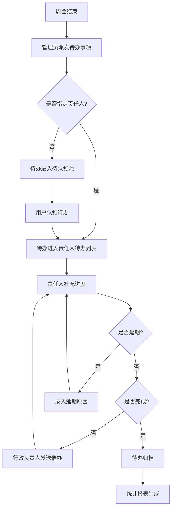
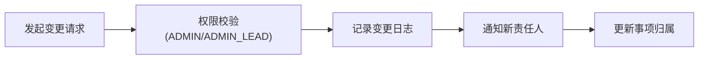

## 1. 产品概述

周会事项提醒中心是一款将线下周会跟踪流程数字化的管理系统，面向企业内部周会待办事项的全生命周期管理。通过系统化的流程节点跟踪、进度补充、催办提醒和责任归属统计，解决线下流程信息分散、追责困难、进度不透明的问题。

- 主要目标：实现周会待办事项从派发、认领、进度跟踪、催办到归档的全流程线上化
- 核心价值：减少信息跳转、显性化高频字段、完整审计追踪、责任归属可追溯
- 目标用户：行政负责人、系统管理员、事项责任人

---

## 2. 核心功能

### 2.1 用户角色

| 角色 | 注册方式 | 核心权限 |
|------|----------|----------|
| 普通用户 (USER) | 管理员创建 | 认领待办、补充进度、查看自己负责的事项、录入延期原因 |
| 行政负责人 (ADMIN_LEAD) | 管理员升级 | 催办发送、日程提醒设置、责任归属统计、记录导出、变更责任人 |
| 系统管理员 (ADMIN) | 系统初始化 | 全部权限 + 用户管理、系统配置、全量日志查看 |

### 2.2 功能模块

1. **登录页**：用户认证入口
2. **前台工作台**：我的待办、进度补充、延期原因录入、会议纪要查看、流程节点跟踪
3. **后台管理 - 事项管理**：待办派发、催办发送、日程提醒配置
4. **后台管理 - 统计中心**：责任归属统计、状态趋势、完成率分析
5. **后台管理 - 日志审计**：操作日志查看、责任人变更记录、导出功能
6. **后台管理 - 用户管理**：用户增删改查、角色权限配置

### 2.3 页面详情

| 页面名称 | 模块名称 | 功能描述 |
|----------|----------|----------|
| 登录页 | 登录表单 | 账号密码登录，基于 Session 的 Redis 会话管理 |
| 我的待办 | 待办列表卡片 | 按状态分类（待认领/进行中/已延期/已完成），高频字段置顶显示 |
| 我的待办 | 进度快速补充面板 | 同页面内联编辑，减少跳转；支持进度百分比、备注、附件上传 |
| 我的待办 | 延期原因录入 | 内联弹窗快速录入延期原因，关联当前事项节点 |
| 我的待办 | 流程节点时间轴 | 同页面右侧展示当前事项所有流程节点流转记录 |
| 我的待办 | 会议纪要查看 | 同页面底部 Tab 切换查看关联的会议纪要 |
| 后台-事项管理 | 待办派发表单 | 创建周会待办，指定/不指定责任人，设置截止日期、优先级 |
| 后台-事项管理 | 催办发送 | 批量/单条发送催办通知，记录催办次数和时间 |
| 后台-事项管理 | 日程提醒配置 | 按日/周/自定义周期设置自动提醒规则 |
| 后台-统计中心 | 责任归属统计表 | 按人员/部门维度统计待办数量、完成率、延期率、平均处理时长 |
| 后台-统计中心 | 状态趋势图 | 周/月维度的状态流转趋势可视化 |
| 后台-统计中心 | 记录导出 | CSV/Excel 导出，支持按时间范围、人员、状态筛选 |
| 后台-日志审计 | 操作日志列表 | 全量操作记录，重点标记责任人变更、状态变更、催办操作 |
| 后台-用户管理 | 用户列表 | 用户 CRUD、角色分配、启用/禁用 |

---

## 3. 核心流程

### 主流程描述
管理员在周会后通过后台派发待办事项，系统支持自动或手动指定责任人。责任人登录前台工作台认领待办（未指定责任人时），在处理过程中可随时补充进度（内联编辑，无需跳转），如遇延期需在同页面内录入延期原因。行政负责人可通过后台发送催办通知，并查看责任归属统计报表。所有涉及责任人变更的操作均会记录审计日志。

### 责任人变更流程

---

## 4. 用户界面设计

### 4.1 设计风格

- **主色调**：深蓝 `#1e3a5f`（专业、稳重），辅以琥珀橙 `#f59e0b`（催办/延期警示）
- **辅助色**：翠绿 `#10b981`（完成/正常）、赤红 `#ef4444`（异常/警告）、石板灰 `#64748b`（次要信息）
- **按钮风格**：圆润胶囊形（radius 9999px），主按钮带细微渐变和悬浮阴影
- **字体方案**：标题使用「思源黑体 Bold」，正文使用「Inter Regular」，数字使用「JetBrains Mono」
- **布局风格**：左右分栏 + 顶部导航；工作台采用卡片瀑布流，高频操作区固定悬浮
- **图标风格**：统一使用 Lucide 线性图标，尺寸 18px，与文字基线对齐
- **细节质感**：玻璃拟态导航栏、卡片 8px 圆角 + 软阴影、数据表格斑马纹

### 4.2 页面设计概览

| 页面名称 | 模块名称 | UI 元素 |
|----------|----------|---------|
| 登录页 | 品牌区 + 表单 | 左侧品牌渐变背景 + 装饰图形，右侧白色卡片表单，输入框 focus 态蓝色发光边框 |
| 我的待办 | 顶部筛选栏 | 状态 Tab 胶囊切换 + 搜索框 + 优先级筛选，固定在视口顶部 |
| 我的待办 | 待办卡片列表 | 卡片左侧 4px 色条标识状态/优先级，顶部一行展示：标题 + 截止日期倒计时 + 状态 Badge；中部高频区：进度滑块 + 快速补充按钮；底部：责任人 + 附件数 + 操作按钮 |
| 我的待办 | 右侧详情抽屉 | 点击卡片滑出右侧抽屉：顶部事项信息、中部流程节点垂直时间轴、底部 Tab 切换（进度记录 / 会议纪要 / 延期原因） |
| 我的待办 | 进度内联编辑 | 点击「补充进度」后卡片原地展开：百分比输入、备注文本域、附件上传区、提交/取消按钮 |
| 后台-统计中心 | 顶部指标卡 | 四个统计卡片：总待办、进行中、已完成、延期率；带趋势小箭头和环比数字 |
| 后台-统计中心 | 图表区 | 左：责任归属横向柱状图（按人员排名）；右：状态趋势折线图（近 8 周） |
| 后台-日志审计 | 日志表格 | 左侧时间列，操作类型彩色标签，变更字段高亮 diff 展示 |

### 4.3 响应式

- 采用 Desktop-first 设计，基准宽度 1440px
- 1024px 以下：右侧抽屉改为底部弹窗，筛选栏改为可横向滚动
- 768px 以下：卡片改为单列堆叠，导航栏折叠为汉堡菜单
- 移动端优化：所有交互区域高度 ≥ 44px，关键按钮固定在底部操作栏

---
