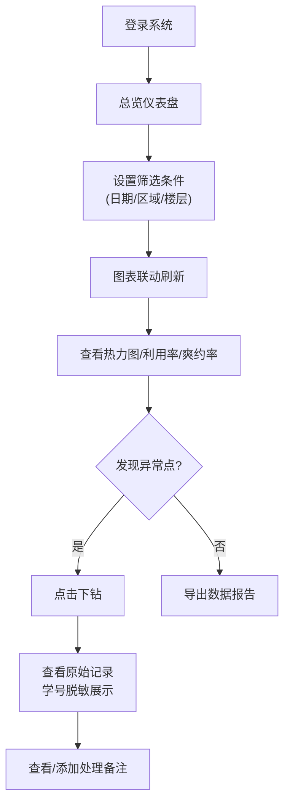
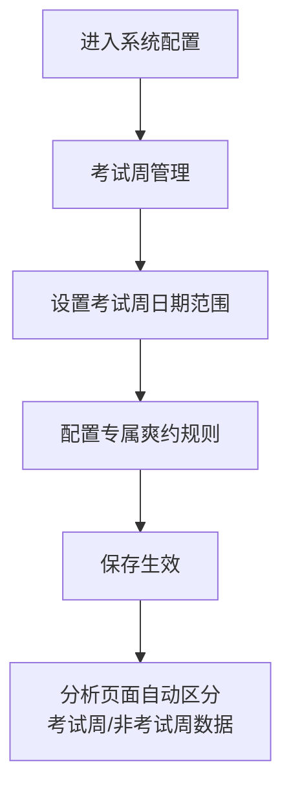

## 1. 产品概述

学校图书馆座位使用分析系统，帮助图书馆馆员通过多维度数据分析优化开放区域安排。系统整合预约、入馆闸机、座位签到、取消和违规记录等多源数据，提供时段热力分布、区域利用率、爽约率分析及考试周变化对比，支持数据导出和深度下钻。

- 核心目标：数据驱动的座位资源优化配置，提升图书馆空间利用效率
- 目标用户：图书馆管理员、馆长及相关管理人员
- 核心价值：可视化展示座位使用规律，识别异常情况，辅助管理决策

## 2. 核心功能

### 2.1 用户角色与权限

| 角色 | 权限说明 | 核心操作 |
|------|----------|----------|
| 超级管理员 | 全部数据访问权限 | 查看所有数据、配置规则、导出数据、查看完整学生信息 |
| 普通馆员 | 聚合数据访问权限 | 查看聚合图表、导出统计数据、查看脱敏后的违规记录 |
| 学生用户 | 仅查看个人记录 | 查看本人预约历史、签到记录 |

### 2.2 功能模块清单

1. **总览仪表盘**：核心指标概览、快捷筛选、关键数据卡片
2. **时段热力分析**：按日期/时段展示座位使用热度热力图
3. **区域利用率分析**：各区域座位利用率对比、趋势变化
4. **爽约与违规分析**：爽约率统计、违规类型分布、趋势变化
5. **考试周专项分析**：考试周与平日对比、特殊规则配置
6. **异常记录下钻**：异常点点击查看原始记录、处理备注
7. **数据导出**：支持多格式导出筛选后的数据
8. **系统配置**：临时闭馆日管理、考试周爽约规则配置

### 2.3 页面详情

| 页面名称 | 模块名称 | 功能描述 |
|----------|----------|----------|
| 总览仪表盘 | 数据概览卡片 | 展示今日/本周/本月核心指标：入馆人次、预约量、签到率、爽约率 |
| 总览仪表盘 | 快捷筛选区 | 日期范围、区域、楼层、学生类型筛选，支持上下文保留 |
| 总览仪表盘 | 趋势图表 | 近7天/30天使用趋势折线图 |
| 时段热力分析 | 热力图主视图 | 横轴为时段、纵轴为日期，颜色深浅表示使用强度 |
| 时段热力分析 | 临时闭馆标记 | 特殊日期高亮标记，悬浮显示闭馆原因 |
| 时段热力分析 | 样本量提示 | 鼠标悬浮显示具体数据量、样本基数 |
| 区域利用率 | 区域对比柱状图 | 各区域利用率并排对比，支持排序切换 |
| 区域利用率 | 趋势分析 | 选中区域的历史利用率趋势线 |
| 区域利用率 | 楼层筛选 | 按楼层快速切换查看 |
| 爽约与违规分析 | 爽约率趋势 | 按时间维度展示爽约率变化 |
| 爽约与违规分析 | 违规类型分布 | 饼图/环形图展示各类违规占比 |
| 爽约与违规分析 | 违规记录列表 | 学号脱敏展示，支持下钻查看详情 |
| 考试周分析 | 对比视图 | 考试周与非考试周数据并列对比 |
| 考试周分析 | 规则配置 | 考试周专属爽约阈值、提醒规则设置 |
| 异常下钻面板 | 原始记录 | 点击异常点显示关联的原始预约/签到/违规记录 |
| 异常下钻面板 | 处理备注 | 显示历史处理记录，支持添加新备注 |
| 系统配置 | 闭馆日历 | 标记和管理临时闭馆日期及原因 |
| 系统配置 | 规则管理 | 爽约判定规则、考试周时段配置 |

## 3. 核心流程

### 3.1 数据分析主流程

馆员进入系统后，首先看到总览仪表盘，通过筛选器选择关注的时间范围和区域，系统自动联动刷新所有图表。点击图表中的异常点可下钻查看原始记录，需要时可导出数据。

### 3.2 考试周配置流程

## 4. 用户界面设计

### 4.1 设计风格

- **主色调**：学术蓝（#1E3A8A）作为主色，搭配沉稳的深灰和温暖的数据橙
- **辅助色**：绿色表示正常、黄色表示警告、红色表示异常
- **字体**：标题使用 Lora（学术衬线），正文使用 Noto Sans SC
- **布局风格**：侧边栏导航 + 内容区卡片式布局，疏密适中
- **图表风格**：D3 自定义图表，渐变填充，精致的动画过渡
- **动效**：数据加载时的渐进式动画，筛选切换时的平滑过渡

### 4.2 页面设计概览

| 页面名称 | 模块名称 | UI 元素特征 |
|----------|----------|-------------|
| 总览仪表盘 | 数据卡片 | 大数字 + 趋势小箭头，悬浮阴影效果 |
| 热力图页面 | 热力矩阵 | 蓝绿黄红渐变色阶，单元格圆角，hover 高亮 |
| 区域分析 | 对比图表 | 分组柱状图，支持点击选中，选中态高亮 |
| 违规记录 | 数据表格 | 斑马纹，学号脱敏（202****1234），行悬停下划线 |
| 配置页面 | 表单控件 | 日历选择器，开关组件，标签式分组 |

### 4.3 响应式设计

- 桌面端优先（1280px+），支持平板适配
- 侧边栏在小屏幕可折叠
- 图表自适应容器宽度，保持比例
- 表格在小屏幕支持横向滚动

### 4.4 交互细节

- 筛选器切换时，图表使用过渡动画平滑更新
- 热力图单元格悬浮时显示详细数据 tooltip
- 点击下钻时右侧滑出详情面板
- 样本量不足时数据点显示虚线边框并标注"样本量小"
