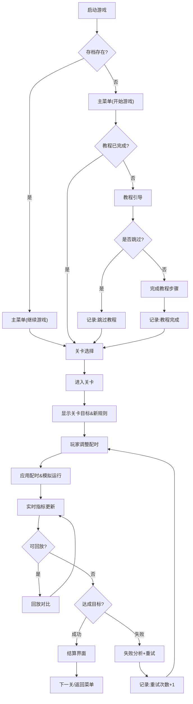

## 1. 产品概述

城市路口信号灯模拟是一款基于WebGL的策略模拟游戏，玩家通过调整红绿灯周期与公交优先规则，优化城市早晚高峰交通。游戏采用渐进式难度曲线，结合教程引导、关卡进阶、沙盒自由模式三大玩法，以直观的3D可视化呈现车流变化与拥堵评分。

- **核心玩法**：调整信号灯配时 → 观察车流运行 → 对比拥堵指标 → 重试优化策略
- **目标用户**：休闲策略玩家、交通爱好者、喜欢模拟经营类的用户
- **产品价值**：提供高参与度的策略体验，帮助玩家理解交通信号配时的复杂性

## 2. 核心功能

### 2.1 用户角色

| 角色 | 进入方式 | 核心权限 |
|------|----------|----------|
| 玩家 | 本地存档自动识别 | 进行游戏、调整配时、查看统计、管理存档 |

### 2.2 功能模块

1. **主界面**：游戏启动页、模式选择、统计概览、存档管理
2. **教程系统**：分步引导核心操作（信号灯调节、公交优先）、可跳过、完成状态追踪
3. **关卡系统**：渐进难度关卡、每关引入新规则、目标条件解锁
4. **沙盒模式**：自由配置地图、配时规则、车流参数、无限时长调试
5. **信号灯调节**：周期时长、相位分配、公交优先触发条件
6. **3D 模拟引擎**：道路网渲染、车辆 AI、公交路线、信号灯状态、拥堵可视化
7. **回放系统**：调整前后对比回放、时间轴拖动、关键指标对比
8. **评分与结算**：拥堵指数、平均等待时间、公交准点率、综合评分
9. **存档与统计**：关卡进度、失败/重试记录、教程跳过记录、最佳成绩

### 2.3 页面详情

| 页面名称 | 模块名称 | 功能描述 |
|----------|----------|----------|
| 主菜单 | 启动动画 | 品牌 Logo 渐显 + 城市天际线动画背景 |
| 主菜单 | 模式选择 | 开始游戏 / 继续游戏 / 沙盒模式 / 统计中心 |
| 主菜单 | 存档卡片 | 展示最近进度、最佳成绩、失败重试统计 |
| 关卡选择 | 关卡地图 | 线性关卡布局 + 难度标识 + 锁定状态 |
| 关卡选择 | 关卡详情 | 目标说明、新规则介绍、最佳成绩 |
| 游戏主界面 | 3D 场景 | Three.js 渲染道路、车辆、信号灯、公交 |
| 游戏主界面 | 控制面板 | 周期滑块、相位滑块、公交优先开关、应用按钮 |
| 游戏主界面 | 实时 HUD | 拥堵评分、车流密度、公交准点率、时间进度 |
| 游戏主界面 | 教程提示 | 分步引导气泡、跳过按钮、进度指示 |
| 游戏主界面 | 回放控件 | 时间轴、播放/暂停、速度调节、前后对比切换 |
| 结算界面 | 成绩展示 | 综合评分、分项指标、与最佳对比 |
| 结算界面 | 操作建议 | 重试 / 下一关 / 返回菜单 |
| 失败界面 | 失败分析 | 失败原因、重试建议、已重试次数 |
| 统计中心 | 数据概览 | 总游玩时长、通关数、平均重试、教程跳过状态 |
| 统计中心 | 详细记录 | 各关卡失败次数、重试次数、完成时间 |

## 3. 核心流程

玩家启动游戏 → 主菜单选择模式（首次强制教程） → 进入关卡 → 教程引导核心操作 → 调整信号灯配时 → 点击应用触发模拟 → 观察车流并查看实时指标 → 可回放对比 → 达成目标/失败判定 → 结算展示 → 下一关或重试

## 4. 用户界面设计

### 4.1 设计风格

- **主色调**：深蓝渐变 (#0a1628 → #1e3a5f) 城市夜景基调，配琥珀黄 (#ffb347) 信号灯高亮，信号灯红绿黄严格遵循交通标准色
- **辅助色**：青色 (#4ecdc4) 公交标识，红 (#ff6b6b) 拥堵高亮，绿 (#7bed9f) 通畅标识
- **按钮风格**：圆角矩形 8px，霓虹边框发光效果，按下有微缩回弹
- **字体**：标题用 Rajdhani（工业科技感无衬线），正文用 Space Mono（等宽数据感），数字指标用 Orbitron（科技感字体）
- **布局风格**：左置控制面板 + 中央 3D 场景 + 底部 HUD 指标条 + 右上小地图，面板采用毛玻璃半透明效果
- **图标风格**：线性描边图标 + 霓虹发光，车辆/信号灯用几何化低多边形风格
- **动效风格**：信号灯切换有渐隐过渡，车辆行驶带轻微残影，拥堵区域有脉冲红光

### 4.2 页面设计概览

| 页面名称 | 模块名称 | UI 元素 |
|----------|----------|----------|
| 主菜单 | 启动动画 | 粒子城市天际线 / Logo 发光动画 / 信号灯闪烁加载 |
| 主菜单 | 模式卡片 | 玻璃拟态卡片 / hover 上浮发光 / 进度条微交互 |
| 游戏主界面 | 3D 场景 | 俯视 45° 摄像机 / 可拖拽旋转 / 低多边形建筑 / 标线发光 |
| 游戏主界面 | 控制面板 | 垂直滑块组 / 实时数值显示 / 公交优先切换开关 |
| 游戏主界面 | HUD 指标条 | 横向数据格 / 实时柱状图 / 颜色随数值渐变 |
| 游戏主界面 | 教程气泡 | 带箭头浮动卡片 / 进度圆点 / 高亮遮罩 |
| 结算界面 | 成绩卡片 | 中心大评分 / 环形进度对比 / 分项指标雷达图 |
| 统计中心 | 时间线 | 关卡完成时间轴 / 失败重试标记点 / 悬停详情 |

### 4.3 响应性

- **设计原则**：桌面优先（≥1280px），平板适配（≥768px），手机端降级为 2D 概览
- **桌面端**：完整 3D 场景 + 全功能控制面板
- **平板端**：控制面板折叠为抽屉式，3D 场景占满
- **手机端**：禁用 WebGL，切换为 SVG 2D 示意图，保留核心配时调节

### 4.4 3D 场景指引

- **环境氛围**：城市夜景风格，深蓝色天空渐变 + 远距离雾化，建筑窗户随机暖光点亮，路面带湿润反光效果
- **光照设置**：DirectionalLight 模拟月光（冷色调低强度），路口信号灯作为 PointLight 实时光源，建筑窗户用自发光材质
- **摄像机设置**：初始 45° 俯视透视相机，目标点锁定路口中心，支持鼠标拖拽旋转、滚轮缩放、右键平移
- **构图与焦点**：路口作为视觉中心，四周建筑高低错落营造层次，路面标线发光引导视线，远处有简化城市天际线剪影
- **交互与动画**：车辆沿路径样条移动，信号灯切换有 0.3s 渐隐过渡，拥堵时车辆顶部出现红色脉冲指示，公交有青色发光轮廓
- **后处理效果**：Bloom 泛光（信号灯发光效果），Vignette 暗角，轻微色差，ToneMapping 电影级调色
- **美术占位资源**：车辆用低多边形长方体 + 颜色区分（私家车灰色/白色、公交车青色、出租车黄色），建筑用堆叠立方体，树木用圆锥+圆柱组合
