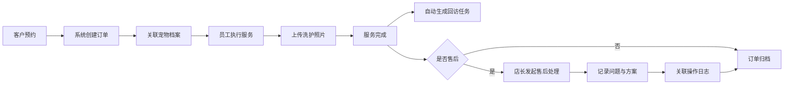
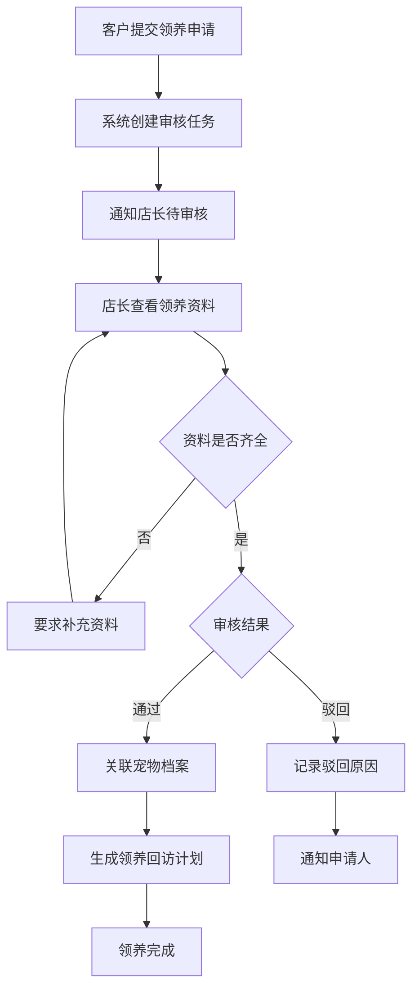
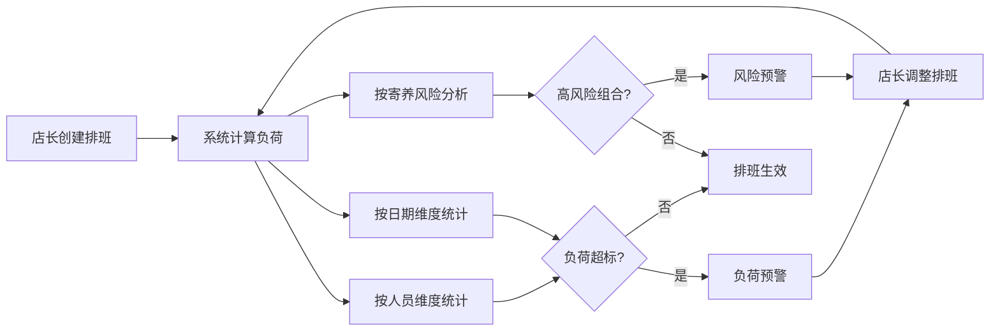

## 1. 产品概述

面向宠物门店店长的一站式订单售后管理平台，整合预约服务、洗护套餐、领养审核、回访提醒等核心业务流程，通过关联宠物档案、洗护照片和操作记录，实现全流程可追溯的精细化运营管理。

- 核心目标：提升宠物店长日常运营效率，降低管理复杂度，通过数据驱动优化排班与服务质量
- 目标用户：宠物门店店长及门店管理人员
- 市场价值：解决宠物行业售后管理分散、数据断层、排班混乱等痛点，实现门店数字化运营

## 2. 核心功能

### 2.1 用户角色

| 角色 | 登录方式 | 核心权限 |
|------|----------|----------|
| 宠物店长 | 账号密码登录 | 全功能权限，包含数据查看、订单处理、领养审核、排班管理、系统配置等 |
| 门店员工 | 账号密码登录 | 预约处理、服务执行、宠物档案查看、回访记录等操作权限 |

### 2.2 功能模块

1. **仪表板首页**：待处理事项、异常告警、关键数据指标趋势、今日排班概览
2. **预约与订单管理**：服务预约、套餐管理、订单状态流转、售后处理
3. **宠物档案中心**：宠物基础信息、健康记录、洗护照片库、历史服务记录
4. **领养审核系统**：领养申请管理、资料审核、领养记录、领养后回访
5. **回访与复购提醒**：自动回访任务、服务复购提醒、客户沟通记录
6. **排班负荷管理**：员工排班、负荷分析（按人员/日期/寄养风险维度）、风险预警
7. **操作历史审计**：全流程操作日志、人员追溯、时间轴记录

### 2.3 页面详情

| 页面名称 | 模块名称 | 功能描述 |
|----------|----------|----------|
| 仪表板首页 | 待办事项卡片 | 展示待审核领养、待处理售后、今日预约、回访任务等待处理事项，支持快捷跳转 |
| 仪表板首页 | 异常告警区 | 高亮显示超期订单、寄养风险、客户投诉等异常情况，按优先级排序 |
| 仪表板首页 | 数据趋势图 | 展示订单量、复购率、领养数等核心指标的日/周/月变化趋势 |
| 仪表板首页 | 今日排班概览 | 展示当日员工排班、负荷状态、风险预警 |
| 预约与订单管理 | 预约列表 | 支持按日期、状态、服务类型筛选，展示预约详情与关联宠物档案 |
| 预约与订单管理 | 套餐配置 | 洗护套餐定义、价格设置、服务内容配置、有效期管理 |
| 预约与订单管理 | 订单详情 | 订单全生命周期展示，关联服务记录、洗护照片、售后处理记录 |
| 宠物档案中心 | 宠物列表 | 宠物信息检索、分类筛选、快速查看档案 |
| 宠物档案中心 | 档案详情 | 宠物基础信息、健康档案、洗护照片时间线、历史服务记录关联 |
| 宠物档案中心 | 照片上传 | 洗护过程照片批量上传、标注、与订单关联 |
| 领养审核系统 | 申请列表 | 领养申请待审/已审列表，支持按申请人、宠物筛选 |
| 领养审核系统 | 审核流程 | 资料查看、审核批注、通过/驳回操作、自动通知 |
| 领养审核系统 | 领养记录 | 已完成领养记录、关联宠物档案与回访计划 |
| 回访与复购提醒 | 任务中心 | 自动生成的回访任务、复购提醒列表，支持状态标记 |
| 回访与复购提醒 | 回访记录 | 客户沟通记录、服务评价、下次回访计划 |
| 排班负荷管理 | 排班日历 | 按周/月视图展示员工排班，支持拖拽调整 |
| 排班负荷管理 | 负荷分析 | 多维度负荷统计：按人员、按日期、按寄养风险原因拆解 |
| 排班负荷管理 | 风险预警 | 负荷超标、寄养高风险组合自动预警 |
| 操作历史审计 | 操作日志 | 全系统操作记录，按人员、时间、操作类型筛选 |
| 操作历史审计 | 详情追溯 | 操作前后数据对比、变更原因记录 |

## 3. 核心流程

### 3.1 订单售后处理流程

客户预约洗护服务后，系统自动创建订单并关联宠物档案。服务执行过程中上传洗护照片，完成后自动生成回访任务。如产生售后问题，店长可在订单详情中发起售后处理流程，记录问题原因、解决方案并关联操作日志。

### 3.2 领养审核流程

客户提交领养申请后，系统自动创建审核任务并通知店长。店长审核领养资料（身份证明、居住环境、养宠经验等），通过后关联宠物档案并生成领养后回访计划。

### 3.3 排班负荷分析流程

店长创建员工排班后，系统自动计算各维度负荷数据，包括人员日负荷、寄养风险组合分析等。当负荷超标或存在高风险组合时，系统自动发出预警。

## 4. 用户界面设计

### 4.1 设计风格

- **主色调**：深青色 #1A8A7D（专业、信赖感），辅助色：暖橙色 #FF8C42（活力、行动召唤）
- **中性色**：采用暖灰系背景 #F7F5F2，文字使用深灰 #2D3436，营造温馨专业的宠物服务氛围
- **按钮风格**：圆角 8px，主按钮采用实色填充，次要按钮采用描边样式，悬停有微浮起效果
- **字体方案**：标题使用「思源黑体 CN」Bold，正文使用「思源黑体 CN」Regular，数字使用等宽字体增强可读性
- **布局风格**：卡片式布局，左侧导航 + 顶部数据条 + 主内容区的经典后台布局
- **图标风格**：线性图标，统一 2px 线条粗细，颜色与主色调一致

### 4.2 页面设计概览

| 页面名称 | 模块名称 | UI 元素 |
|----------|----------|---------|
| 仪表板首页 | 待办事项卡片 | 数字徽章 + 彩色图标 + 快捷操作按钮，卡片悬停微上浮 |
| 仪表板首页 | 异常告警区 | 顶部醒目标题栏，红色/橙色标签区分严重程度，闪烁微动效 |
| 仪表板首页 | 数据趋势图 | 面积图展示趋势，渐变填充，悬停显示数据详情，支持周期切换 |
| 仪表板首页 | 今日排班概览 | 时间轴布局，员工头像 + 状态色块，风险项红色标记 |
| 预约与订单管理 | 预约列表 | 表格视图，状态标签彩色区分，行悬停高亮，支持批量操作 |
| 宠物档案中心 | 档案详情 | 左侧宠物头像卡片 + 右侧标签页（基本信息/健康记录/照片墙/服务历史） |
| 宠物档案中心 | 照片墙 | 瀑布流布局，悬停显示拍摄时间与关联订单，点击放大查看 |
| 领养审核系统 | 审核详情 | 左右分栏：左侧资料列表 + 右侧预览区，底部审核操作栏 |
| 排班负荷管理 | 负荷分析 | 多维筛选器 + 热力图展示人员负荷，风险原因使用堆叠柱状图 |
| 操作历史审计 | 操作日志 | 时间轴布局，人员头像 + 操作类型标签 + 变更对比抽屉 |

### 4.3 响应式

- 采用桌面优先设计，主适配分辨率 1440×900 及以上
- 侧边栏在平板分辨率（<1024px）可折叠收起
- 表格在移动端（<768px）转为卡片列表视图
- 所有操作按钮支持触控操作，最小点击区域 44×44px
