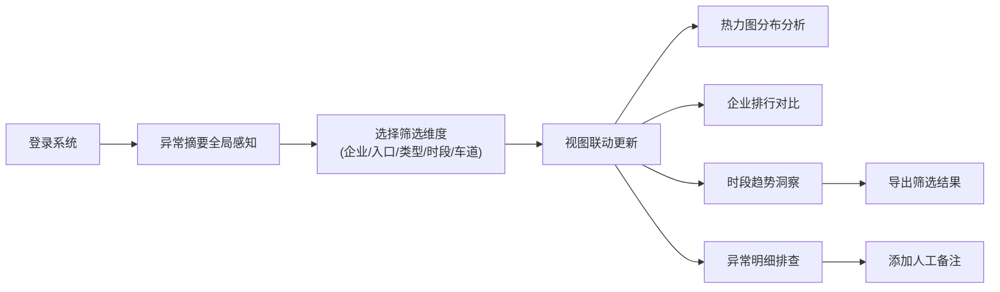

# 工业园区访客流量分析系统 - 产品需求文档

## 1. 产品概述

面向园区安保经理的访客流量分析平台，整合预约、闸机、车牌、被访企业等多源数据，揭示访客行为规律与异常模式。通过灵活的多维视角切换和交互式可视化，赋能安保决策与风险预警。

- **核心价值**：从固定报表转向探索式分析，让安保经理主动发现问题而非被动接收告警
- **目标用户**：工业园区安保经理、安保主管、物业运营人员
- **业务场景**：日常流量监控、异常事件回溯、企业访客管理、安保资源调度

## 2. 核心功能

### 2.1 用户角色

| 角色 | 登录方式 | 核心权限 |
|------|---------|----------|
| 安保经理 | 账号密码登录 | 全量数据查看、异常处理、导出报表、备注管理 |
| 安保主管 | 账号密码登录 | 权限内数据查看、异常上报、查看备注 |

### 2.2 功能模块

1. **异常摘要仪表盘**：关键指标卡片、异常告警列表、实时流量概览
2. **多维分析视图**：入口热力图、企业排行、时段趋势、异常放行明细
3. **筛选切换器**：企业、入口、访客类型、时段、车道五个维度自由组合
4. **数据导出中心**：支持按筛选条件导出 Excel/CSV，后台任务异步处理
5. **备注系统**：针对异常事件添加人工备注，保留分析上下文

### 2.3 页面详情

| 页面名称 | 模块名称 | 功能描述 |
|---------|---------|---------|
| 分析主页面 | 异常摘要区 | 顶部展示当日/本周异常放行次数、访客总量、高峰时段预警等关键KPI，异常事件按严重程度排序展示 |
| 分析主页面 | 维度筛选栏 | 企业下拉多选、入口复选框、访客类型标签、时间范围选择器、车道切换器，所有筛选条件联动更新 |
| 分析主页面 | 入口热力图 | D3 实现的园区入口热力分布，颜色深浅表示流量密度，hover 显示详情，点击下钻到该入口 |
| 分析主页面 | 企业排行 | 柱状图展示被访企业访客量 Top10，可切换按总量/异常量排序，支持降序/升序 |
| 分析主页面 | 异常放行明细 | 表格展示异常放行记录，车牌/证件号脱敏显示，支持备注编辑，包含人工备注列 |
| 分析主页面 | 时段趋势图 | 折线图展示24小时/7天访客趋势，标注缺失数据区间、异常峰值，hover 显示数值与备注 |
| 导出中心 | 任务列表 | 展示历史导出任务状态、下载链接、创建时间，支持重新生成 |

## 3. 核心流程

### 3.1 分析主流程

安保经理登录系统 → 查看异常摘要获取全局感知 → 通过筛选器切换分析维度 → 联动查看热力图/排行/趋势/明细 → 对异常事件添加人工备注 → 导出当前筛选条件下的报表

### 3.2 数据处理流程

原始数据接入 → 数据清洗（去重/补全/脱敏）→ 指标聚合计算 → 缓存层预热 → API 服务 → 前端可视化渲染

## 4. 用户界面设计

### 4.1 设计风格

- **设计方向**：工业科技风，沉稳专业，强调数据的可信度和操作的效率感
- **主色调**：深海军蓝 (#0A2540) 作为主色，搭配科技蓝 (#3B82F6) 强调交互元素
- **辅助色**：橙色 (#F59E0B) 表示警告，红色 (#EF4444) 表示严重异常，绿色 (#10B981) 表示正常
- **背景**：深灰色渐变背景 (#0F172A → #1E293B)，营造沉浸式数据分析环境
- **字体**：标题使用 Space Grotesk，正文使用 JetBrains Mono，数字使用等宽字体
- **按钮风格**：直角微圆角 (4px)，固态填充，hover 时有微妙的亮度提升
- **卡片风格**：半透明玻璃态卡片，边框 1px 浅色描边，投影柔和分层
- **数据脱敏**：车牌显示为 "粤B·12***"，证件号显示为 "440***********1234"

### 4.2 页面设计概览

| 页面名称 | 模块名称 | UI 元素 |
|---------|---------|---------|
| 分析主页面 | 异常摘要区 | 大号数字指标卡片，异常事件时间线，微图表辅助趋势指示 |
| 分析主页面 | 维度筛选栏 | 固定在顶部的横向筛选条，标签式多选，应用后即时生效 |
| 分析主页面 | 热力图区 | 2x3 网格布局的入口热力矩阵，颜色从浅蓝到深红渐变，tooltip 浮层 |
| 分析主页面 | 企业排行 | 横向条形图，企业名称左对齐，数值右对齐，异常企业标记橙色点 |
| 分析主页面 | 异常明细 | 斑马纹表格，可排序列，备注气泡，行 hover 高亮 |
| 分析主页面 | 时段趋势 | 面积折线图，缺失数据用虚线连接，异常峰值用红色圆点标记，备注图标悬浮显示 |

### 4.3 响应式

- **Desktop-first**：1920px 基准设计，针对 1080p 及以上分辨率优化
- **平板适配**：筛选栏折叠为下拉面板，热力图改为 3x2 布局
- **不强制移动端**：数据分析场景以桌面端为主，移动端仅保证基础可读性

### 4.4 动效与交互

- 页面加载：指标数字滚动动画，图表元素依次淡入
- 筛选切换：图表平滑过渡动画，数据点 morphing 效果
- 异常提醒：严重异常项有呼吸灯效果
- 表格行：hover 时背景色轻微提亮，备注编辑时行展开
- 热力图：hover 时单元格放大 5%，阴影增强
