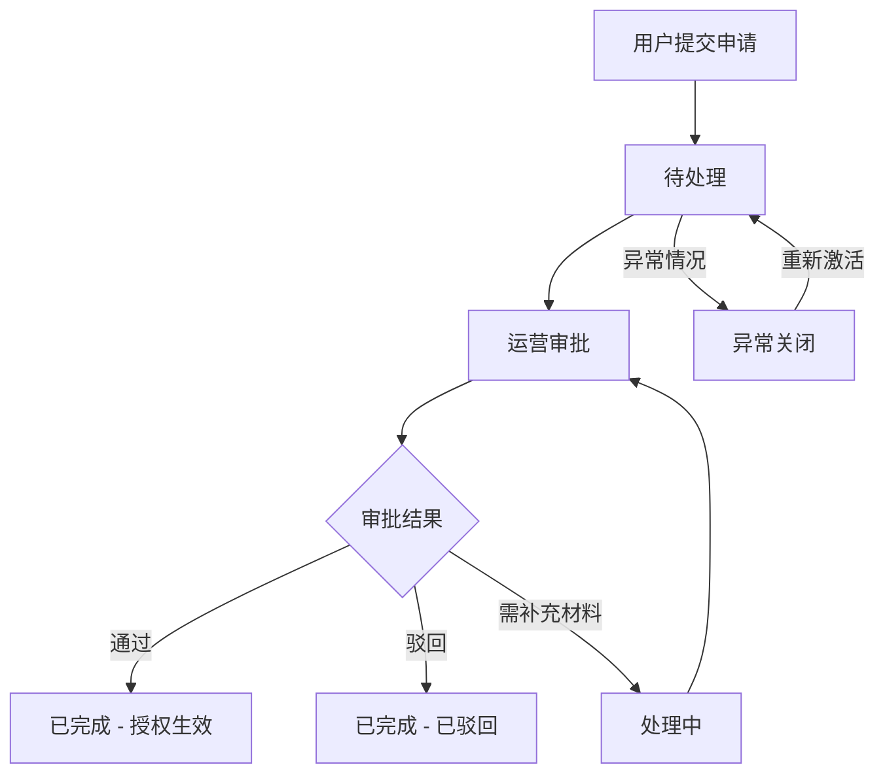
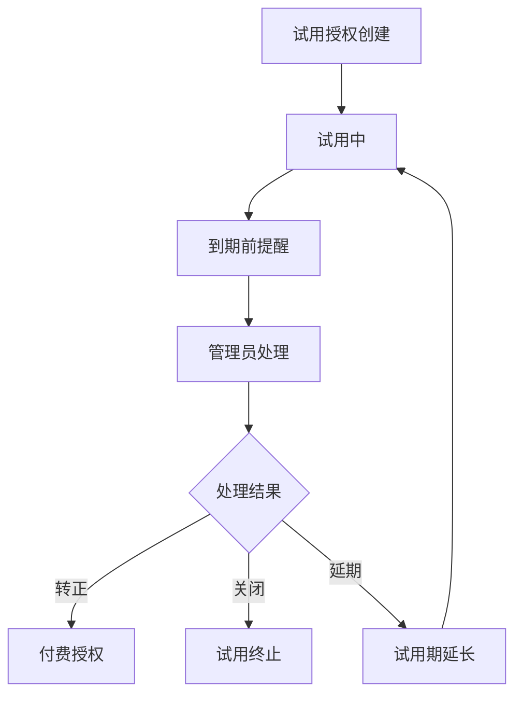

## 1. 产品概述

插件授权计费台是一款面向企业内部运营和财务团队的 SaaS 管理系统，用于管理插件授权申请、计费配置、试用管理及跨部门对账。系统覆盖从申请到续费的全生命周期，通过自动化状态流转和数据可视化，提升运营效率，降低人工失误风险。

- **目标用户**：运营同事、财务人员、部门管理员、系统管理员
- **核心价值**：规范化插件授权流程、自动化试用到期提醒、可视化使用趋势、可追溯对账材料

## 2. 核心功能

### 2.1 用户角色

| 角色 | 登录方式 | 核心权限 |
|------|----------|----------|
| 普通用户 | 账号登录 | 申请插件权限、查看我的授权、查看试用状态 |
| 运营管理员 | 账号登录 | 审批授权申请、配置价格套餐、管理试用、查看使用趋势 |
| 财务管理员 | 账号登录 | 跨部门对账、续费名单管理、账单明细导出 |
| 系统管理员 | 账号登录 | 用户管理、系统配置、全功能权限 |

### 2.2 功能模块

1. **用户前台**：插件市场、我的授权、申请记录、个人中心
2. **管理后台 - 授权管理**：授权申请审批、授权列表、试用管理
3. **管理后台 - 计费配置**：价格管理、账期设置、套餐规则
4. **管理后台 - 数据报表**：插件使用趋势、席位利用率、明细筛选
5. **管理后台 - 对账中心**：续费名单、跨部门对账、原始材料追溯

### 2.3 页面详情

| 页面名称 | 模块名称 | 功能描述 |
|----------|----------|----------|
| 登录页 | 登录表单 | 账号密码登录、角色选择 |
| 前台 - 插件市场 | 插件列表 | 展示所有可申请插件、筛选搜索、查看详情 |
| 前台 - 插件市场 | 申请弹窗 | 选择套餐、填写申请理由、提交申请 |
| 前台 - 我的授权 | 授权列表 | 查看已授权插件、状态、到期时间、席位信息 |
| 前台 - 我的授权 | 试用管理 | 查看试用状态、到期提醒、转正申请 |
| 前台 - 申请记录 | 记录列表 | 查看历史申请、审批状态、处理说明 |
| 管理端 - 授权审批 | 待处理列表 | 待处理申请、审批操作（通过/驳回）、填写处理说明 |
| 管理端 - 授权审批 | 处理中列表 | 处理中申请、进度跟踪 |
| 管理端 - 授权审批 | 已完成列表 | 历史审批记录、查看详情 |
| 管理端 - 授权审批 | 异常关闭 | 异常申请、异常原因、重新激活 |
| 管理端 - 计费配置 | 价格管理 | 插件定价、阶梯价格、增删改查 |
| 管理端 - 计费配置 | 账期设置 | 月付/季付/年付、账期日设置 |
| 管理端 - 计费配置 | 套餐规则 | 基础版/专业版/企业版配置、席位数量、功能权限 |
| 管理端 - 数据报表 | 使用趋势 | 插件使用量趋势图、多插件对比 |
| 管理端 - 数据报表 | 席位利用率 | 部门/团队维度席位使用统计、利用率计算 |
| 管理端 - 数据报表 | 明细筛选 | 多维度筛选、导出、通知发送 |
| 管理端 - 对账中心 | 续费名单 | 即将到期授权、续费提醒、续费状态 |
| 管理端 - 对账中心 | 跨部门对账 | 部门维度费用统计、对账明细 |
| 管理端 - 对账中心 | 原始材料 | 申请单、审批记录、合同附件追溯 |
| 管理端 - 试用管理 | 试用列表 | 所有试用授权、到期时间、试用状态 |
| 管理端 - 试用管理 | 到期处理 | 备注、处理结果（转正/关闭/延期）、批量操作 |

## 3. 核心流程

### 3.1 授权申请审批流程

用户在插件市场浏览插件，选择套餐后提交申请，申请进入"待处理"状态。运营管理员收到通知后进行审批，审批通过则授权生效并进入"已完成"状态；审批驳回则记录原因并关闭。处理过程中可标记为"处理中"。如遇异常情况可标记为"异常关闭"并记录原因。

### 3.2 试用到期处理流程

试用授权到期前系统自动提醒，管理员根据试用情况进行处理：转正（转为付费授权）、关闭（终止试用）、延期（延长试用期）。处理时需填写备注和处理结果，系统记录操作日志。

### 3.3 跨部门对账流程

财务管理员按账期生成各部门费用明细，关联原始申请材料和审批记录，支持导出和通知相关部门负责人。

## 4. 用户界面设计

### 4.1 设计风格

- **主色调**：深邃蓝 (#1677ff)，搭配靛青渐变，体现专业稳重的企业级产品气质
- **辅助色**：成功绿 (#52c41a)、警告橙 (#faad14)、错误红 (#ff4d4f)、信息紫 (#722ed1)
- **中性色**：以浅灰为底色 (#f5f7fa)，卡片纯白 (#ffffff)，文字深灰 (#1f2937)
- **按钮风格**：圆角 6px，主按钮蓝色渐变，悬停微上浮阴影
- **字体**：系统默认 sans-serif，标题 16-20px 粗体，正文 14px 常规
- **布局风格**：左侧导航 + 顶部栏 + 内容区的经典后台布局，卡片式内容组织
- **图标风格**：Ant Design 内置线性图标，统一 16px 尺寸

### 4.2 页面设计概述

| 页面名称 | 模块名称 | UI 元素 |
|----------|----------|---------|
| 登录页 | 登录卡片 | 居中卡片、蓝紫渐变背景、品牌 logo、输入框、登录按钮 |
| 前台 - 插件市场 | 插件卡片 | 网格布局、插件图标、名称、简介、价格、申请按钮 |
| 前台 - 我的授权 | 授权列表 | Table 表格、状态标签、操作列、到期时间高亮 |
| 管理端 - 授权审批 | 状态看板 | Tabs 切换（待处理/处理中/已完成/异常关闭）、列表、筛选 |
| 管理端 - 数据报表 | 趋势图表 | 折线图/柱状图、时间筛选、多维度切换、卡片式指标 |
| 管理端 - 对账中心 | 对账列表 | 部门分组、费用汇总、展开明细、材料追溯入口 |

### 4.3 响应式

桌面端优先设计，适配 1280px 及以上分辨率。管理后台左侧导航固定宽度 240px，内容区自适应。

### 4.4 动效与交互

- 页面切换：淡入淡出过渡
- 卡片悬停：轻微上浮 + 阴影加深
- 状态标签：不同状态对应不同颜色，带细微圆角
- 表格行：悬停背景色变化
- 模态框：缩放出现动画
