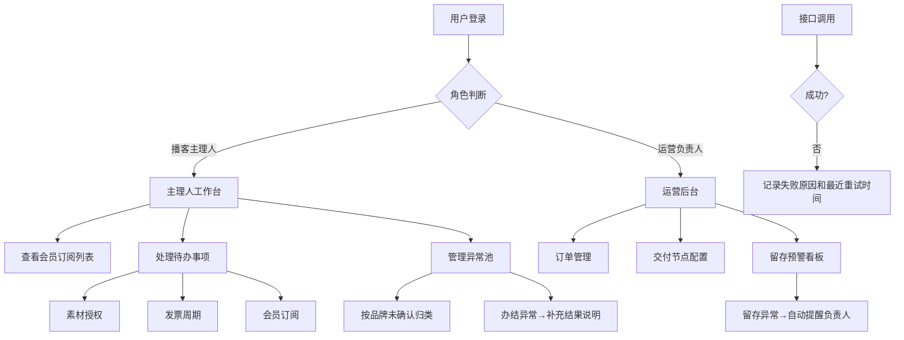

## 1. 产品概述
独立播客作品交付台，面向播客主理人和运营团队的SaaS平台，解决会员内容交付、订单管理、异常处理等核心业务痛点。
- 核心用户：播客主理人、运营负责人
- 核心价值：提升会员交付效率、降低付费留存流失、标准化异常处理流程

## 2. 核心功能

### 2.1 用户角色
| 角色 | 注册方式 | 核心权限 |
|------|----------|----------|
| 播客主理人 | 邀请/邮箱注册 | 查看订阅会员、处理待办、管理异常池、办结异常 |
| 运营负责人 | 邀请/邮箱注册 | 管理全量订单、配置交付节点、查看留存预警、管理会员 |

### 2.2 功能模块
1. **主理人工作台**：会员内容订阅列表、待办面板（素材授权/发票周期/会员订阅常驻字段）、异常池
2. **运营后台**：订单管理、交付节点配置、付费留存预警看板、会员管理
3. **异常管理**：按品牌未确认归类、办结补充结果说明
4. **接口监控**：失败原因记录、最近重试时间、排查追踪

### 2.3 页面详情
| 页面名称 | 模块名称 | 功能描述 |
|----------|----------|----------|
| 主理人工作台 | 会员订阅列表 | 展示主理人负责品牌下所有会员订阅，含素材授权状态、发票周期、订阅状态常驻字段 |
| 主理人工作台 | 待办面板 | 待办事项卡片，素材授权/发票周期/会员订阅字段一级展示，无需进入二级页 |
| 主理人工作台 | 异常池 | 按品牌未确认归类的异常列表，支持办结操作并补充结果说明 |
| 运营后台-订单 | 订单列表 | 全量订单筛选、状态管理、关联交付节点 |
| 运营后台-交付节点 | 节点配置 | 交付流程节点配置、进度追踪、责任人分配 |
| 运营后台-留存 | 留存预警 | 付费留存异常检测、自动提醒负责人、预警看板 |
| 接口监控 | 失败日志 | 接口失败记录、原因展示、最近重试时间标记 |

## 3. 核心流程
用户登录后根据角色进入对应工作台。播客主理人处理待办事项（素材授权审核、发票周期确认、会员订阅跟进），运营后台管理订单全生命周期并配置交付节点。当付费留存出现异常时，系统自动提醒对应负责人。异常池中的问题按品牌归类等待确认，主理人办结后需补充结果和说明。所有外部接口调用失败均记录原因和重试信息，便于运维排查。

## 4. 用户界面设计

### 4.1 设计风格
- 主色调：深海蓝 `#1e3a5f` 搭配琥珀金 `#d4a574`，传递专业与质感
- 辅助色：警示橙 `#e07856`、成功绿 `#4a9d7c`
- 按钮风格：圆角8px，主色填充+微阴影，hover态轻微上浮
- 字体：展示标题用 Fraunces（衬线字体，播客人文质感），正文用 Plus Jakarta Sans
- 布局风格：左侧导航 + 右侧内容区的经典Dashboard布局，卡片式信息容器
- 图标风格：Lucide 线性图标，统一1.5px描边

### 4.2 页面设计概览
| 页面名称 | 模块名称 | UI元素 |
|----------|----------|--------|
| 主理人工作台 | 会员订阅列表 | 数据表格，素材授权/发票周期/订阅状态为常驻列（标签样式），行hover高亮 |
| 主理人工作台 | 待办面板 | 卡片网格布局，每张卡片顶部展示三大常驻字段标签，底部操作按钮 |
| 主理人工作台 | 异常池 | 品牌分组折叠面板，未确认异常用警示色标记，办结模态框含结果+说明字段 |
| 运营后台-订单 | 订单列表 | 高级筛选栏+数据表格，状态列彩色徽章，支持批量操作 |
| 运营后台-留存 | 预警看板 | 统计卡片+趋势图+预警时间线，负责人头像展示，提醒按钮 |
| 通用 | 侧边导航 | 深色背景，活跃项琥珀金高亮，角色感知的菜单项 |

### 4.3 响应式
- 桌面端优先（1280px+），Dashboard布局双栏
- 平板端（768-1279px）：导航可折叠为图标模式
- 移动端（<768px）：导航抽屉式，表格转卡片列表

### 4.4 动画与交互
- 页面加载：卡片级交错淡入（stagger 80ms）
- 待办卡片：hover时轻微上浮+阴影加深（translateY(-2px)）
- 状态标签：过渡动画（颜色/背景色 200ms ease）
- 异常办结：模态框滑入+背景遮罩淡入
