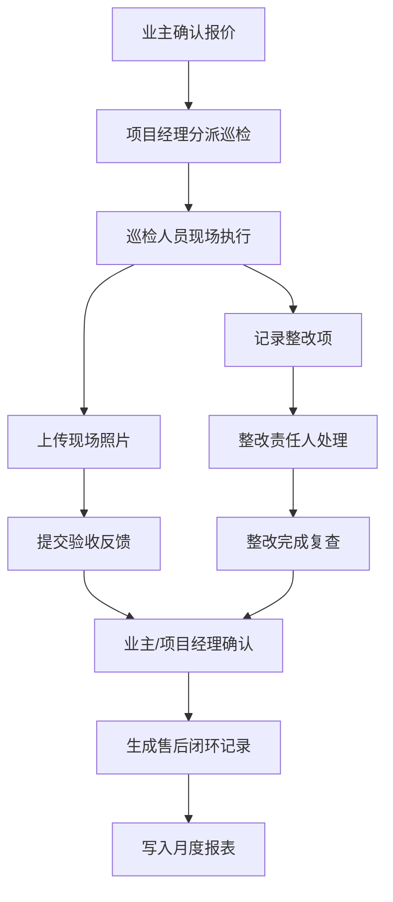
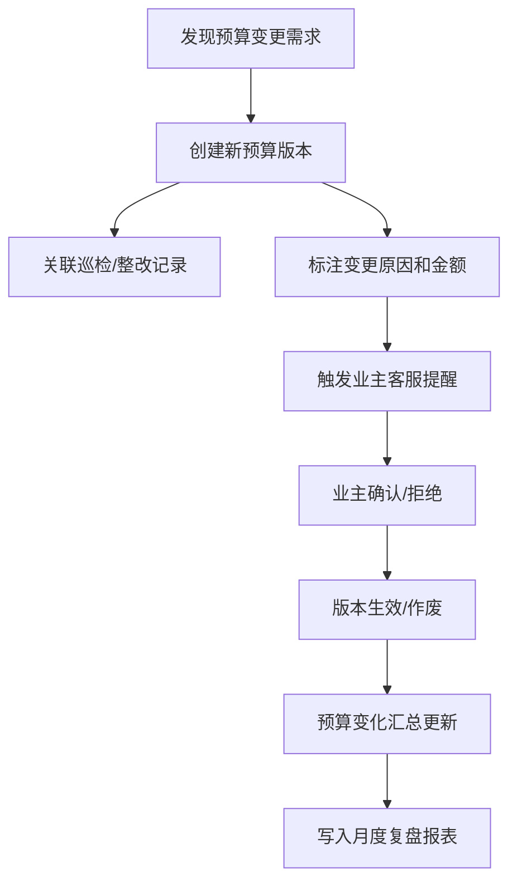

## 1. 产品概述

施工验收台是面向装修/建筑行业的设计图纸现场巡检管理系统，覆盖从业主确认报价、巡检分派、现场照片采集、整改追踪到预算变更闭环的全流程。

- 核心目标：解决施工现场巡检过程不透明、预算变更不可追溯、整改闭环缺失的问题
- 目标用户：业主、项目经理、巡检人员、客服人员
- 产品价值：通过版本化管理和流程闭环，实现巡检全链路可追溯，提升项目交付质量

## 2. 核心特性

### 2.1 用户角色

| 角色 | 注册方式 | 核心权限 |
|------|----------|----------|
| 业主 | 手机号注册 | 查看项目进度、确认报价与增项、查看巡检报告、接收预算变更提醒 |
| 项目经理 | 后台创建 | 项目全生命周期管理、巡检分派、预算版本管理、批量操作 |
| 巡检人员 | 后台创建 | 上传现场照片、记录整改项、提交验收反馈 |
| 客服人员 | 后台创建 | 接收预算变更提醒、跟进售后闭环、生成月度报表 |

### 2.2 功能模块

1. **项目总览**：项目列表、状态筛选、核心指标看板
2. **预算管理**：预算版本对比、增项确认、变更历史追溯
3. **巡检管理**：巡检分派、现场照片上传、整改项记录、验收反馈
4. **明细视图**：预算版本快照、合同附件、验收反馈前后变化
5. **提醒系统**：延期预警、预算变更通知、待办提醒
6. **报表中心**：售后闭环报表、月度复盘、批量操作记录
7. **批量操作**：影响范围预览、执行结果反馈、失败记录追踪

### 2.3 页面详情

| 页面名称 | 模块名称 | 功能描述 |
|----------|----------|----------|
| 项目总览页 | 项目列表卡片 | 项目状态、当前预算版本、最近巡检时间、延期预警标签 |
| 项目总览页 | 核心指标看板 | 进行中项目数、待验收数、逾期数、本月预算变化总额 |
| 项目详情页 | 基本信息区 | 项目名称、业主信息、合同附件、当前预算版本 |
| 项目详情页 | 时间线/巡检记录 | 历次巡检时间线，可展开查看详情 |
| 预算版本页 | 版本列表 | 所有预算版本快照，标注增项/减项及金额变化 |
| 预算版本页 | 版本对比 | 相邻版本差异高亮显示，变更原因和确认状态 |
| 巡检详情页 | 现场照片 | 照片上传、分组展示、支持标注说明 |
| 巡检详情页 | 整改项列表 | 整改内容、责任人、截止日期、状态追踪 |
| 巡检详情页 | 验收反馈 | 验收结论、前后对比、业主确认记录 |
| 批量操作页 | 操作预览 | 选中项目的影响范围、预计变更统计 |
| 批量操作页 | 执行结果 | 成功/失败数量、失败详情及责任人 |
| 报表中心页 | 售后闭环报表 | 项目闭环率、整改完成率、平均处理时长 |
| 报表中心页 | 月度复盘 | 预算变化汇总、延期项目统计、客服跟进记录 |

## 3. 核心流程

### 3.1 项目巡检主流程

业主确认报价后，项目经理分派巡检任务，巡检人员现场拍照并记录整改项，整改完成后提交验收反馈，形成闭环。

### 3.2 预算变更流程

巡检过程中发现增项或整改导致预算变化时，创建新版本并触发提醒，业主确认后生效。

## 4. 用户界面设计

### 4.1 设计风格

- **设计方向**：工业/实用主义风格，强调信息密度与操作效率，适配项目管理人员高频使用场景
- **主色调**：深青色（#0F766E）作为主色，传达专业与可信赖感
- **辅助色**：琥珀色（#F59E0B）用于警告/延期，翠绿色（#10B981）用于已完成，橙红色（#EF4444）用于异常/失败
- **字体**：标题使用 Noto Sans SC Bold，正文使用 Noto Sans SC Regular，数字使用等宽字体提升可读性
- **布局**：左侧导航 + 顶部面包屑的经典后台布局，内容区采用卡片式模块化设计
- **图标**：线性图标风格，统一使用 24px 网格，保持视觉一致性

### 4.2 页面设计概览

| 页面名称 | 模块名称 | UI 元素 |
|----------|----------|---------|
| 项目总览页 | 顶部统计卡片 | 四列指标卡片，带趋势小箭头和同比数字 |
| 项目总览页 | 项目列表 | 表格视图，支持多列筛选，行悬停显示快捷操作 |
| 项目详情页 | 时间线 | 左侧竖线时间轴，巡检节点带状态色标 |
| 预算版本页 | 版本对比 | 双栏布局，差异行背景色高亮，变更金额红色标注 |
| 巡检详情页 | 照片墙 | 瀑布流布局，悬停放大，点击查看原图和标注 |
| 批量操作页 | 预览面板 | 左侧选中列表，右侧影响统计，底部确认/取消按钮 |
| 报表中心页 | 数据图表 | 柱状图展示月度预算变化，折线图展示闭环率趋势 |

### 4.3 响应式

- 桌面端优先设计，主内容区最小宽度 1280px
- 平板端折叠侧边栏为图标模式
- 移动端简化为列表视图，详情页改为纵向堆叠
- 表格组件支持横向滚动，保证数据完整性

### 4.4 动效与交互

- 页面切换使用淡入淡出过渡，时长 200ms
- 卡片悬停提升 2px 阴影，过渡 150ms ease-out
- 时间线节点展开使用高度动画，配合内容渐入
- 批量操作预览面板从右侧滑入，带背景蒙层
- 状态变更时数字跳动动画，强化数据变化感知
