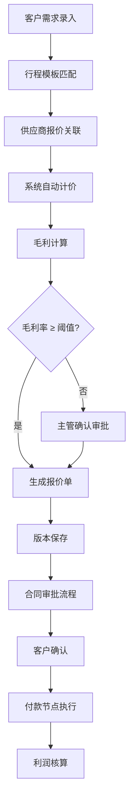

## 1. 产品概述
本地旅行定制报价平台，帮助小旅行社产品经理处理客户半定制路线需求，自动化计算酒店、车辆、门票和服务费，替代销售反复手工计算的流程。
- 核心用户：旅行社产品经理、销售、财务、主管负责人
- 核心价值：提升报价效率、保留历史版本、控制毛利风险、可视化管理流程

## 2. 核心功能

### 2.1 用户角色
| 角色 | 注册方式 | 核心权限 |
|------|----------|----------|
| 产品经理 | 管理员创建 | 录入客户需求、生成报价、管理行程模板 |
| 销售 | 管理员创建 | 查看报价、跟进客户、提交合同审批 |
| 财务 | 管理员创建 | 查看利润统计、管理付款节点、审批收款 |
| 主管 | 管理员创建 | 审批低毛利方案、查看后台看板、管理资源 |
| 管理员 | 系统初始化 | 全权限、用户管理、系统配置 |

### 2.2 功能模块
1. **客户需求管理**：需求表单录入、客户信息、路线天数、特殊要求
2. **报价生成中心**：自动计算酒店/车/门票/服务费、多版本报价、毛利计算
3. **版本对比**：报价历史版本、差异对比、版本回滚
4. **合同审批**：合同生成、多级审批流程、低毛利预警
5. **供应商管理**：酒店/车辆/门票供应商、报价管理、资源日历
6. **行程模板**：常用路线模板、快速复用、自定义模板
7. **付款节点**：分期付款配置、收款提醒、到账确认
8. **利润统计**：单团利润、月度统计、人员业绩、毛利分析
9. **后台看板**：超时预警、资源空闲、流程卡点、多维筛选

### 2.3 页面详情
| 页面名称 | 模块名称 | 功能描述 |
|---------|----------|----------|
| 登录页 | 登录表单 | 账号密码登录、测试账号快捷登录 |
| 后台看板 | 数据概览 | 超时任务、资源利用率、流程卡点统计 |
| 后台看板 | 筛选器 | 按时间范围、状态、负责人维度筛选 |
| 需求列表 | 需求表格 | 客户需求列表、状态标签、快捷操作 |
| 需求录入 | 需求表单 | 客户信息、出行日期、人数、天数、特殊要求 |
| 报价生成 | 报价编辑器 | 酒店选择、车辆配置、门票添加、服务费计算 |
| 报价详情 | 版本对比 | 历史版本列表、差异高亮对比、回滚操作 |
| 报价详情 | 毛利分析 | 成本明细、售价、毛利率、低毛利预警 |
| 合同审批 | 审批流 | 合同预览、提交审批、审批记录、主管确认 |
| 供应商管理 | 供应商列表 | 酒店/车队/门票供应商信息管理 |
| 供应商管理 | 报价管理 | 供应商历史报价、有效期、资源状态 |
| 行程模板 | 模板列表 | 常用路线模板、预览、编辑、克隆 |
| 付款节点 | 节点配置 | 分期比例、截止日期、提醒设置 |
| 利润统计 | 报表中心 | 单团利润、月度汇总、人员业绩、趋势图 |
| 系统设置 | 用户管理 | 用户增删改查、角色分配、权限配置 |

## 3. 核心流程

### 3.1 报价生成主流程
产品经理录入客户需求 → 选择或创建行程模板 → 关联供应商报价 → 系统自动计算成本 → 添加服务费和利润 → 生成报价单 → 毛利检查（低于阈值提示主管确认） → 提交审批 → 生成合同

### 3.2 看板管理流程
主管打开看板 → 选择时间范围/状态/负责人 → 查看超时任务列表 → 查看资源利用率 → 识别流程卡点 → 分配或协调资源 → 跟踪任务进度

## 4. 用户界面设计

### 4.1 设计风格
- **主色调**：深青色 #0F766E（专业、可信）
- **辅助色**：琥珀色 #F59E0B（警示、强调）、红色 #EF4444（危险、低毛利）
- **中性色**：石板灰系列，层次分明
- **按钮风格**：圆角 6px，轻微阴影，hover 上浮动效
- **字体**：标题使用 Noto Sans SC 粗体，正文使用 Noto Sans SC 常规
- **布局风格**：左侧导航 + 顶部面包屑 + 卡片式内容区
- **图标风格**：Lucide 线性图标，统一 20px 尺寸

### 4.2 页面设计概述
| 页面名称 | 模块名称 | UI 元素 |
|---------|----------|---------|
| 登录页 | 登录表单 | 渐变背景、玻璃态卡片、品牌 Logo、测试账号快捷按钮 |
| 后台看板 | 数据概览 | 统计卡片网格、趋势图、超时任务列表、资源热力图 |
| 报价生成 | 报价编辑器 | 分栏布局、左侧费用明细、右侧实时总价、拖拽排序费用项 |
| 报价详情 | 版本对比 | 双栏对比视图、差异行高亮、时间轴版本记录 |
| 合同审批 | 审批流 | 时间线审批节点、审批按钮、评论区、附件上传 |

### 4.3 响应式
- 桌面优先设计（1440px 基准）
- 适配 1024px 平板尺寸，侧边栏可折叠
- 关键数据看板支持移动端查看

### 4.4 动效设计
- 页面加载：顶部进度条 + 内容淡入
- 卡片悬停：轻微上浮 + 阴影加深
- 数据更新：数字滚动动画
- 表单验证：错误信息平滑滑入
