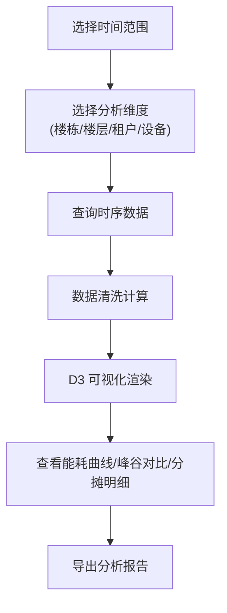
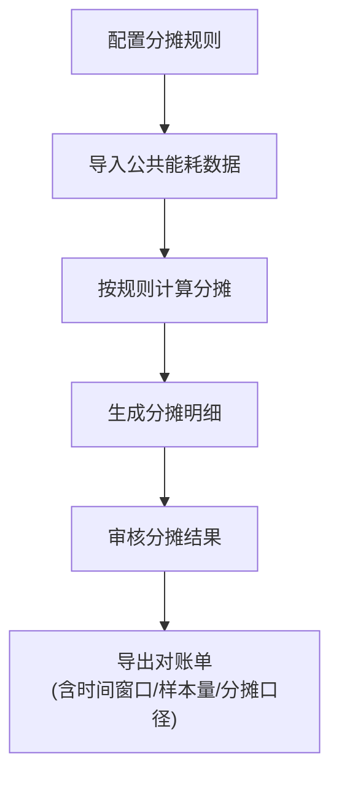
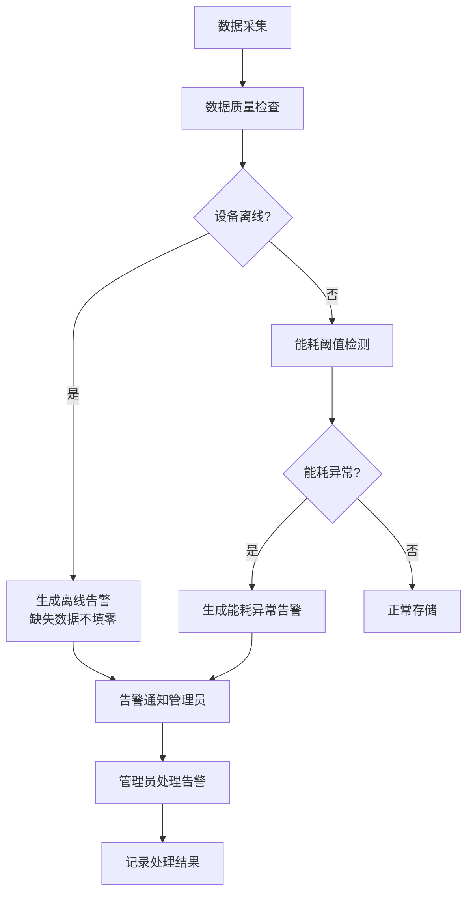

## 1. 产品概述

楼宇能耗分析平台是面向物业能源管理员的智能化能耗管理系统，通过多维度能耗数据分析、可视化展示和智能告警，帮助物业实现精细化能源管理和成本优化。

- **目标用户**：物业能源管理员、设施运维团队、财务结算人员
- **核心价值**：提升能耗透明度、优化峰谷用电策略、明确租户能耗分摊、及时发现异常能耗

## 2. 核心功能

### 2.1 用户角色

| 角色 | 登录方式 | 核心权限 |
|------|---------|---------|
| 能源管理员 | 账号密码登录 | 数据导入、查看所有能耗数据、配置分摊规则、导出报告、处理告警 |
| 设施运维 | 账号密码登录 | 查看设备状态、处理异常告警、设备管理 |
| 财务人员 | 账号密码登录 | 查看租户分摊数据、导出结算报告 |

### 2.2 功能模块

1. **综合能耗看板**：楼栋/楼层/租户/设备多维度能耗概览、实时能耗曲线、关键指标卡片
2. **峰谷对比分析**：分时电价时段能耗对比、峰谷占比分析、用电策略优化建议
3. **租户分摊管理**：公共区域能耗分摊计算、分摊规则配置、租户能耗明细
4. **异常告警中心**：设备离线告警、能耗异常告警、告警处理记录
5. **系统配置**：基础数据导入（电表/水表/空调/楼层/租户）、节假日模式配置、报告模板配置

### 2.3 页面详情

| 页面名称 | 模块名称 | 功能描述 |
|---------|---------|----------|
| 综合能耗看板 | 时间范围选择器 | 支持按日/周/月/季/年/自定义时间筛选 |
| 综合能耗看板 | 维度切换器 | 楼栋/楼层/租户/设备维度切换 |
| 综合能耗看板 | 能耗趋势图 | D3 绘制的多维度能耗曲线图，支持堆叠/对比模式 |
| 综合能耗看板 | 指标卡片组 | 总能耗、同比/环比、单位面积能耗、人均能耗 |
| 综合能耗看板 | 设备状态概览 | 在线/离线设备数量统计，离线设备高亮标注 |
| 峰谷对比分析 | 峰谷时段配置 | 尖/峰/平/谷时段及电价配置 |
| 峰谷对比分析 | 峰谷占比饼图 | 各时段能耗占比可视化 |
| 峰谷对比分析 | 分时柱状图 | 按小时/时段展示能耗分布 |
| 峰谷对比分析 | 费用测算 | 根据分时电价计算电费成本 |
| 租户分摊管理 | 分摊规则配置 | 支持按面积/人数/用量比例等多种分摊方式 |
| 租户分摊管理 | 分摊明细列表 | 各租户分摊明细，包含计算公式和口径说明 |
| 租户分摊管理 | 公共能耗拆分 | 公共区域与租户能耗分别展示 |
| 异常告警中心 | 告警列表 | 设备离线、能耗突增/突降、读数缺失等告警 |
| 异常告警中心 | 告警详情 | 告警时间、设备信息、历史数据对比、处理建议 |
| 异常告警中心 | 告警处理 | 标记处理状态、添加处理备注 |
| 系统配置 | 基础数据导入 | 电表/水表/空调/楼层/租户批量导入 |
| 系统配置 | 节假日模式 | 工作日/周末/节假日能耗模式配置 |
| 报告导出 | 导出配置 | 选择时间范围、维度、报告类型 |
| 报告导出 | 报告预览 | 预览报告内容，包含时间窗口、样本量、分摊口径 |
| 报告导出 | 报告下载 | 导出 PDF/Excel 格式报告 |

## 3. 核心流程

### 3.1 能耗分析流程

能源管理员登录系统后，选择时间范围和分析维度，系统从时序数据库查询能耗数据，经过清洗和计算后，通过 D3 图表展示能耗曲线、峰谷对比和分摊明细。

### 3.2 租户分摊流程

配置分摊规则后，系统自动计算公共区域能耗，根据规则分摊到各租户，生成分摊明细和对账报告。

### 3.3 异常告警流程

设备数据采集异常或能耗偏离正常范围时，系统自动触发告警，通知管理员处理。

## 4. 用户界面设计

### 4.1 设计风格

采用专业、数据驱动的工业级仪表板设计风格：

- **主色调**：深蓝色系 (#0F172A, #1E40AF)，传达专业、可靠的技术感
- **辅助色**：
  - 正常状态：翠绿色 (#10B981)
  - 警告状态：琥珀色 (#F59E0B)
  - 危险状态：赤红色 (#EF4444)
  - 信息状态：天蓝色 (#3B82F6)
- **背景**：深色主题 (Dark Mode)，深色背景 (#0F172A) + 卡片背景 (#1E293B)
- **字体**：
  - 标题：Space Grotesk - 现代几何无衬线字体，科技感强
  - 正文/数据：JetBrains Mono - 等宽字体，数字对齐清晰，适合数据展示
- **布局风格**：网格化卡片布局，信息密度适中，支持响应式
- **图标风格**：线性简约图标 (Lucide Icons)，与深色主题协调
- **动效**：数据加载时的渐入动画、悬停时的微交互、告警闪烁提示

### 4.2 页面设计概览

| 页面名称 | 模块名称 | UI 元素 |
|---------|---------|---------|
| 综合能耗看板 | 顶部导航栏 | Logo、用户信息、告警铃铛图标、主题切换 |
| 综合能耗看板 | 左侧侧边栏 | 功能菜单导航、图标+文字、当前页高亮 |
| 综合能耗看板 | 顶部筛选栏 | 时间范围选择器、维度下拉选择、刷新按钮 |
| 综合能耗看板 | 指标卡片组 | 4张关键指标卡片，带同比/环比趋势小箭头 |
| 综合能耗看板 | 主图表区 | 大面积 D3 能耗曲线图，支持图例切换、缩放 |
| 综合能耗看板 | 设备状态区 | 设备在线/离线统计卡片，离线设备列表 |
| 峰谷对比分析 | 时段配置区 | 峰谷时段配置表单，电价输入 |
| 峰谷对比分析 | 占比分析区 | 饼图+数据表格并排展示 |
| 峰谷对比分析 | 分时柱状图 | 24小时能耗分布柱状图，峰谷着色区分 |
| 租户分摊管理 | 规则配置区 | Tab 切换不同分摊方式，参数配置表单 |
| 租户分摊管理 | 分摊明细表格 | 可排序、可筛选的数据表格，展开可看计算明细 |
| 异常告警中心 | 告警统计卡片 | 按告警级别统计数量 |
| 异常告警中心 | 告警列表 | 时间倒序排列，告警级别用颜色标识 |
| 系统配置 | 数据导入区 | 文件上传组件，导入进度条 |
| 系统配置 | 节假日配置 | 日历选择器，标记工作日/周末/节假日 |

### 4.3 响应式设计

- **桌面端优先**：以 1440px 宽度为基准设计
- **平板适配**：侧边栏可折叠，卡片布局自动调整为 2 列
- **移动端**：顶部导航变为汉堡菜单，卡片单列布局，图表简化展示
- **触摸优化**：按钮最小 44px，手势滑动切换时间范围

## 5. 非功能需求

### 5.1 数据质量要求
- 设备离线时缺失读数**不得填充零值**，需单独标注
- 峰谷统计时排除离线时段数据
- 导出报告必须包含：时间窗口、样本量、分摊口径说明

### 5.2 性能要求
- 页面首屏加载 < 3s
- 图表渲染 < 500ms（万级数据点）
- 支持浏览器缩放和平滑交互
