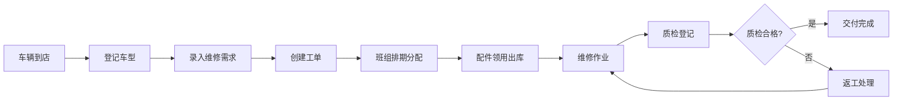

# 汽配门店业务一体化管理台 - 产品需求文档

## 1. 产品概述

汽配门店业务一体化管理台是面向汽车维修门店的全流程业务管理系统，涵盖车辆登记、配件库存、维修工单、班组排期、质检交付等核心业务环节，实现数据流统一、操作高效、数据可追溯的线上化管理。

- **核心价值**：打通维修全流程数据链路，减少一线人员操作跳转，提升工单处理效率
- **目标用户**：门店经理、维修技师、库房管理员、质检人员
- **解决痛点**：多系统数据割裂、操作跳转频繁、延期交付不可控、大批量数据卡顿

## 2. 核心功能

### 2.1 用户角色

| 角色 | 注册方式 | 核心权限 |
|------|----------|----------|
| 门店经理 | Clerk 邀请注册 | 全功能权限、数据报表、价格管理 |
| 维修技师 | Clerk 邀请注册 | 工单查看、排期查看、耗材领用 |
| 库房管理员 | Clerk 邀请注册 | 配件管理、出入库登记、库存盘点 |
| 质检人员 | Clerk 邀请注册 | 质检登记、交付确认、延期处理 |

### 2.2 功能模块

1. **工作台首页**：数据概览、待办提醒、快捷入口、今日排期
2. **车辆与维修管理**：车型登记、维修需求录入、工单全生命周期管理
3. **配件库存管理**：基础资料维护、库存周转统计、出入库记录、价格管理
4. **班组排期管理**：工单排期、人员分配、进度跟踪、成本核算
5. **质检交付管理**：质检记录、交付确认、延期处理、影响分析
6. **系统管理**：操作日志、导出任务、基础配置

### 2.3 页面详情

| 页面名称 | 模块名称 | 功能描述 |
|----------|----------|----------|
| 工作台首页 | 数据概览 | 今日工单量、待质检数、库存预警、延期预警 |
| 工作台首页 | 快捷入口 | 快速登记车辆、新建工单、配件出库 |
| 工作台首页 | 今日排期 | 班组当日任务列表，关键字段直接展示 |
| 车辆管理 | 车辆列表 | 车牌号、车型、车主、历史工单数，支持搜索筛选 |
| 车辆管理 | 车辆详情 | 基础信息、维修历史、配件更换记录 |
| 维修工单 | 工单列表 | 工单号、车型、状态、预计交付、负责班组，关键字段一览 |
| 维修工单 | 工单详情 | 维修项目、配件需求、质检记录、延期说明 |
| 配件管理 | 配件列表 | 配件编码、名称、分类、库存、单价、周转天数 |
| 配件管理 | 配件详情 | 基础信息、价格历史、出入库记录、周转统计 |
| 班组排期 | 排期看板 | 按班组/日期展示工单分配，拖拽调整 |
| 班组排期 | 工单成本 | 耗材成本、工时成本、总成本核算 |
| 质检交付 | 质检列表 | 待质检、已质检、延期工单分类展示 |
| 质检交付 | 延期详情 | 影响范围、处理动作、下一步计划时间线展示 |
| 系统设置 | 操作日志 | 全量操作记录可查，支持筛选导出 |
| 系统设置 | 导出任务 | 大批量数据异步导出，任务状态可追踪 |

## 3. 核心流程

### 3.1 维修工单主流程

车辆到店 → 登记车型信息 → 录入维修需求 → 创建工单 → 班组排期分配 → 配件领用出库 → 维修作业 → 质检登记 → 合格交付

### 3.2 配件周转流程

### 3.3 延期交付处理流程

## 4. 用户界面设计

### 4.1 设计风格

- **设计方向**：工业实用风格，专业可靠，信息密度高但层次清晰
- **主色调**：深靛蓝色 (#1e3a5f) 作为主色，传达专业稳重感
- **辅助色**：琥珀橙 (#f59e0b) 用于提醒和警告，翡翠绿 (#10b981) 用于成功状态，玫红 (#ef4444) 用于错误/延期
- **中性色**：深灰蓝底 (#0f172a) 配合石板灰系列，适合长时间工作
- **按钮风格**：直角微圆角 (2px)，实心按钮带轻微阴影，悬停有微妙的亮度提升
- **字体**：系统无衬线字体优先，数字使用等宽字体提升可读性
- **布局风格**：左侧导航 + 顶部状态栏 + 主内容区，卡片式模块布局
- **图标风格**：线性图标，统一 2px 描边，Lucide 图标库

### 4.2 页面设计概述

| 页面名称 | 模块名称 | UI 元素 |
|----------|----------|---------|
| 工作台首页 | 数据概览 | 4 张统计卡片，数字大字号，趋势小图表，背景微渐变 |
| 工作台首页 | 快捷入口 | 图标 + 文字的网格布局，悬停上浮效果 |
| 工作台首页 | 今日排期 | 时间线式列表，状态色块标记，关键字段直接展示 |
| 工单列表 | 筛选栏 | 顶部固定筛选条，多条件组合，搜索框实时过滤 |
| 工单列表 | 数据表格 | 斑马纹行，悬停高亮，状态标签，操作列固定 |
| 工单详情 | 信息分栏 | 左侧基本信息，右侧时间线，底部配件/质检 tab |
| 配件管理 | 周转统计 | 卡片式数据展示，进度条可视化库存状态 |
| 排期看板 | 甘特视图 | 按班组分栏，工单卡片可拖拽，颜色区分状态 |
| 延期详情 | 影响分析 | 时间线展示处理过程，影响范围高亮标注 |
| 操作日志 | 列表视图 | 时间倒序，操作类型标签，详情可展开 |

### 4.3 响应式设计

- 桌面端优先设计，最小支持 1280px 宽度
- 平板端折叠侧边栏为图标模式
- 移动端简化布局，重点信息单列展示
- 表格在小屏幕转为卡片列表模式

### 4.4 交互细节

- 列表页支持虚拟滚动，大批量数据不卡顿
- 表单提交有加载状态和成功/失败反馈
- 延期工单红色高亮闪烁提醒
- 关键操作二次确认弹窗
- 数据导出后台异步处理，进度条实时更新
