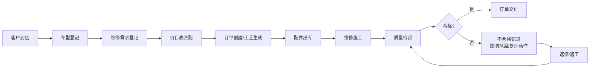
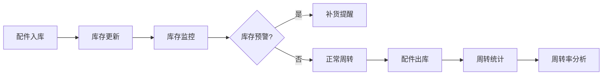

## 1. 产品概述

汽配门店业务经营驾驶舱是面向汽配门店店长的一体化经营管理平台，通过统一流程管控车型登记、配件管理、维修需求、质检追踪等核心业务环节，提供实时经营数据看板，支持多角色协同与权限闭环管理，助力门店提升运营效率与服务质量。

- 解决问题：汽配门店业务分散、数据不统一、流程不闭环、配件周转慢、质检追踪难
- 目标用户：门店店长、前台接待、维修技师、库管员、财务人员
- 产品价值：统一业务流程、实时数据洞察、精准配件管控、高效质检追溯

## 2. 核心功能

### 2.1 用户角色

| 角色 | 注册方式 | 核心权限 |
|------|----------|----------|
| 店长 | 系统创建 | 全部权限、指标配置、权限管理、数据导出 |
| 前台接待 | 店长创建 | 客户登记、车型登记、订单创建、价目表查询 |
| 维修技师 | 店长创建 | 工艺查看、维修记录、质检提交 |
| 库管员 | 店长创建 | 配件管理、出入库操作、库存预警、周转查询 |
| 财务人员 | 店长创建 | 价目表管理、收支查看、数据导出 |

### 2.2 功能模块

1. **驾驶舱首页**：核心经营指标看板、快速筛选入口、待办提醒
2. **客户与订单管理**：车型登记、维修需求登记、客户价目表、订单工艺、交付日期
3. **配件库存管理**：配件档案、出入库记录、库存预警、周转分析、批量导出
4. **质检管理**：质检记录、不合格详情、影响范围、处理动作、追踪下一步
5. **系统配置**：指标口径配置、角色权限管理、用户管理

### 2.3 页面详情

| 页面名称 | 模块名称 | 功能描述 |
|---------|----------|----------|
| 驾驶舱首页 | 核心指标看板 | 营收、订单量、配件周转率、质检合格率等KPI展示 |
| 驾驶舱首页 | 快速筛选区 | 客户价目表、交付日期、订单工艺三大快速筛选入口 |
| 驾驶舱首页 | 待办提醒 | 库存预警、待质检、即将交付等提醒事项 |
| 订单管理 | 车型登记 | 车辆品牌、型号、车架号、里程数等信息录入 |
| 订单管理 | 维修需求登记 | 故障描述、维修项目、配件需求、预计工时 |
| 订单管理 | 客户价目表 | 按客户/车型/配件分类的价格体系查询 |
| 订单管理 | 订单工艺 | 维修工艺流程、工序进度、技师分配 |
| 订单管理 | 交付日期 | 订单交付时间追踪、延期预警 |
| 配件管理 | 配件档案 | 配件基础信息、分类、规格、供应商 |
| 配件管理 | 库存周转 | 周转率分析、呆滞品预警、补货提醒 |
| 配件管理 | 出入库记录 | 入库、出库、调拨、盘点记录 |
| 配件管理 | 批量导出 | 按角色权限导出库存/周转/出入库数据 |
| 质检管理 | 质检列表 | 质检记录列表、状态筛选 |
| 质检管理 | 不合格详情 | 影响范围、处理动作、下一步计划、责任人 |
| 系统配置 | 指标口径 | 各项经营指标的计算规则配置 |
| 系统配置 | 角色权限 | 角色定义、菜单权限、数据权限配置 |

## 3. 核心流程

### 3.1 业务主流程

客户到店后，前台接待登记车辆信息和维修需求，系统自动匹配客户价目表和预计交付日期；维修技师按订单工艺执行维修，库管员根据配件需求进行出库；维修完成后进行质检，不合格则记录影响范围和处理措施；最终交付客户。

### 3.2 配件周转流程

## 4. 用户界面设计

### 4.1 设计风格

- **主色调**：工业深蓝 (#1E3A5F) 搭配金属银 (#B0B7C0)，体现专业汽配行业特性
- **辅助色**：警示橙 (#FF6B35) 用于预警提醒，成功绿 (#2ECC71) 用于正常状态，危险红 (#E74C3C) 用于不合格
- **字体**：标题使用思源黑体 Bold，正文使用思源黑体 Regular，数字使用等宽字体增强可读性
- **布局风格**：卡片式布局，左侧导航 + 顶部工具栏 + 主内容区
- **图标风格**：线性图标，统一2px描边，与工业风格匹配
- **整体调性**：专业、高效、数据驱动，类似工业级驾驶舱的仪表盘视觉

### 4.2 页面设计概览

| 页面名称 | 模块名称 | UI元素 |
|---------|----------|--------|
| 驾驶舱首页 | 核心指标看板 | 大数字KPI卡片、趋势小图、状态色标、网格布局 |
| 驾驶舱首页 | 快速筛选区 | 三栏筛选卡片、搜索框、标签筛选、快捷操作按钮 |
| 驾驶舱首页 | 待办提醒 | 时间线列表、状态徽章、优先级标识、点击跳转 |
| 订单管理 | 车型/需求登记 | 分步表单、自动联想、必填校验、保存草稿 |
| 配件管理 | 库存周转 | 数据表格、进度条、预警高亮、导出按钮、角色切换 |
| 质检管理 | 不合格详情 | 分段式详情卡、影响范围标签、处理时间线、责任人头像 |
| 系统配置 | 指标口径 | 可折叠配置项、公式编辑器、预览计算结果 |

### 4.3 响应式

- 桌面端优先设计（1440px基准）
- 平板端自适应（1024px）：侧边栏可折叠，卡片重新排列
- 移动端适配（768px以下）：底部导航，单列布局，简化数据展示
- 触控优化：点击区域不小于44x44px，支持滑动操作

### 4.4 数据可视化

- 图表类型：柱状图（订单趋势）、环形图（质检占比）、折线图（周转率）、热力图（工位负荷）
- 交互效果：悬停显示详情、点击下钻、数据筛选联动
- 动效设计：数据加载动画、数字滚动效果、状态切换过渡
