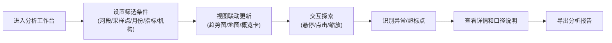
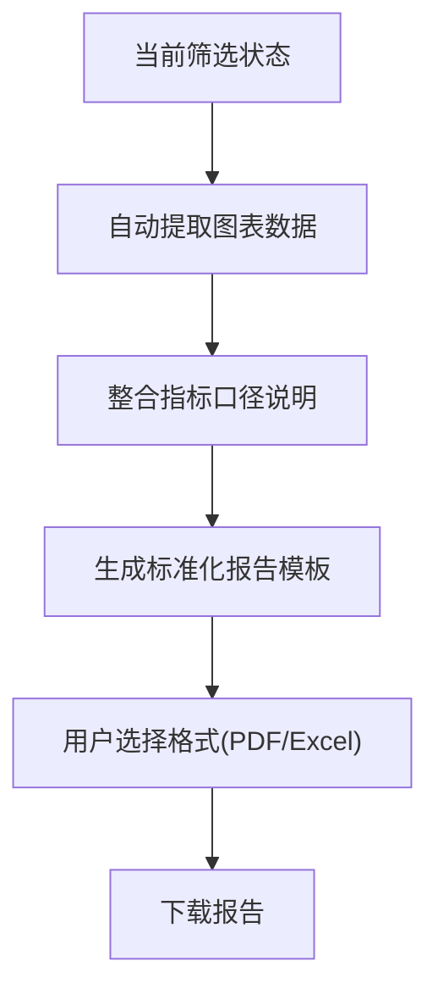

## 1. 产品概述

河流水质监测公开平台是面向地方研究团队和公众的水质数据可视化分析工作台。平台整合水温、pH、溶解氧、氨氮等核心指标，结合采样点空间分布和降雨记录，通过多维度筛选、交互式图表联动和标准化报告，帮助用户快速识别水质异常、追溯污染趋势、辅助决策行动。

- 解决问题：避免单纯图表堆砌，让数据可解释、可追溯、可行动
- 目标用户：地方环保研究团队、水质监测机构、社会公众
- 核心价值：用可视化语言讲好水质故事，让专业数据服务于决策

## 2. 核心功能

### 2.1 用户角色
| 角色 | 访问方式 | 核心权限 |
|------|----------|----------|
| 公众用户 | 公开访问 | 浏览基础水质数据、查看公开报告、使用地图和趋势图 |
| 研究团队 | 账号登录 | 全部公开功能 + 下载原始数据 + 自定义报表 + 查看异常详情 |
| 管理员 | 后台登录 | 数据管理 + 用户管理 + 定时报表配置 + 权限分配 |

### 2.2 功能模块
1. **分析工作台首页**：全局筛选器、数据概览卡片、核心图表区
2. **趋势分析视图**：多指标时间序列对比、人工/自动站数据分层、超标标记
3. **空间分布视图**：采样点地图、河段热力图、降雨关联分析
4. **报告中心**：标准化报告生成、筛选条件固化导出、定时报表订阅
5. **指标口径说明**：每个图表旁的指标定义、采样方法、数据局限性说明

### 2.3 页面详情
| 页面名称 | 模块名称 | 功能描述 |
|-----------|-------------|---------------------|
| 分析工作台 | 全局筛选器 | 河段、采样点、月份、指标类型、采样机构多选筛选，筛选状态实时联动所有图表 |
| 分析工作台 | 数据概览卡片 | 展示筛选范围内的达标率、超标次数、采样频次、降雨总量等关键指标 |
| 分析工作台 | 趋势图组件 | D3绘制多指标时间序列，人工采样与自动站分层展示，缺测点断开连线，超标点高亮标注 |
| 分析工作台 | 采样地图 | D3地理可视化，采样点按水质等级着色，点击联动趋势图，悬停显示详情 |
| 分析工作台 | 超标记录列表 | 按时间排序的超标事件，可跳转定位到对应图表位置 |
| 分析工作台 | 口径说明面板 | 每个图表旁的可折叠说明，包含指标定义、检测标准、数据限制 |
| 报告中心 | 报告生成 | 根据当前筛选条件生成PDF/Excel报告，包含图表、数据、说明文字 |
| 报告中心 | 定时报表 | 配置周报/月报自动生成并推送 |
| 权限管理 | 视图切换 | 根据用户角色显示/隐藏高级功能和原始数据 |

## 3. 核心流程

### 3.1 主工作流程

### 3.2 报告生成流程

## 4. 用户界面设计

### 4.1 设计风格
- **主色调**：深蓝 #0F3460（代表水与专业）+ 青绿 #16C79A（代表生态与健康）
- **警示色**：橙红 #E94560（超标标记）+ 琥珀 #FFB72B（警告）
- **中性色**：石板灰系列（zinc），确保信息层次清晰
- **按钮风格**：轻微圆角(6px)、悬停阴影、平滑过渡
- **字体**：标题使用思源宋体（人文感），正文使用 Inter（清晰易读）
- **布局风格**：卡片式模块化布局，顶部固定筛选栏，主区域网格排布
- **视觉质感**：水体纹理背景、玻璃态卡片、微妙的数据流动画

### 4.2 页面设计概述
| 页面名称 | 模块名称 | UI元素 |
|-----------|-------------|-------------|
| 分析工作台 | 顶部筛选栏 | 下拉选择器、日期范围、标签式指标切换、重置按钮 |
| 分析工作台 | 概览卡片区 | 4张卡片横向排列，数字动效，趋势箭头 |
| 分析工作台 | 趋势图区 | 左右分栏：左侧D3折线图，右侧折叠式说明面板 |
| 分析工作台 | 地图区 | 左侧D3地图，右侧采样点列表和超标记录 |
| 分析工作台 | 底部工具栏 | 导出按钮、视图切换、全屏模式 |
| 报告中心 | 报告列表 | 卡片式报告历史，生成时间、筛选条件摘要 |

### 4.3 响应式
- Desktop-first设计，1280px起最优体验
- 平板端：筛选栏折叠为抽屉，图表单列排布
- 移动端：概览卡垂直堆叠，地图默认缩略可展开

### 4.4 动效与交互
- 页面加载：数据卡片渐入 + 数字滚动动画
- 筛选变化：图表平滑过渡动画(300ms ease)
- 悬停效果：采样点放大 + 信息浮窗淡入
- 超标标记：呼吸灯动画吸引注意力
- 数据加载：骨架屏 + 脉冲动画
