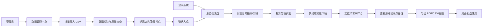

## 1. 产品概述

河流水质监测公开页面，面向地方研究团队日常复盘使用。整合水温、pH、溶解氧、氨氮、采样点和降雨记录，支持从整体趋势一路下钻到河段、采样点、月份、指标、采样机构的多维度分析。

- 解决问题：水质监测数据分散、异常发现滞后、复盘效率低
- 目标用户：地方水环境研究团队、监测机构、流域管理人员
- 核心价值：数据可视化整合、快速异常定位、高效团队复盘

## 2. 核心 Features

### 2.1 用户角色
| 角色 | 注册方式 | 核心权限 |
|------|----------|----------|
| 研究人员 | 系统账号 | 浏览数据、下钻分析、导出报告、标注异常 |
| 管理员 | 系统账号 | 全部功能 + 数据批量导入、用户管理、权限配置 |

### 2.2 功能模块
1. **总览仪表盘**：核心指标概览、水质等级分布、异常告警统计、样本量统计
2. **地图监测视图**：采样点地图分布、超标标记、河段划分、降雨叠加
3. **趋势分析页面**：多指标趋势图、人工/自动站数据分层、缺失值断点展示
4. **采样点详情**：单站点多维度分析、原始记录查看、异常备注管理
5. **数据管理中心**：批量导入、数据字典、缺失值检查、异常点标注
6. **报告导出中心**：截图导出、PDF 报告、CSV 数据导出

### 2.3 页面详情
| 页面名称 | 模块名称 | 功能描述 |
|----------|----------|----------|
| 总览仪表盘 | 指标卡片 | 展示水温、pH、溶解氧、氨氮的最新均值、达标率、异常数 |
| 总览仪表盘 | 趋势概览 | 4 个核心指标的近期趋势小图，支持快速跳转 |
| 总览仪表盘 | 河段概览 | 各河段水质等级分布热力条，点击下钻 |
| 总览仪表盘 | 异常告警 | 最新异常点列表，支持点击查看详情 |
| 地图监测视图 | Mapbox 地图 | 采样点标记、河段边界、超标颜色分级 |
| 地图监测视图 | 图层控制 | 人工采样点/自动站/降雨/河段的图层开关 |
| 地图监测视图 | 信息弹窗 | 点击采样点显示最新数据、超标情况 |
| 趋势分析页面 | 时间序列图 | 支持多指标对比、缺测点断点、数据分层展示 |
| 趋势分析页面 | 筛选器 | 河段、采样点、时间范围、指标、采样机构筛选 |
| 趋势分析页面 | 异常标记 | 超标点高亮标注，悬停显示详情 |
| 采样点详情 | 基本信息 | 站点名称、位置、所属河段、采样机构 |
| 采样点详情 | 指标趋势 | 单站点多指标长期趋势 |
| 采样点详情 | 原始记录 | 数据表展示，支持备注添加和查看 |
| 数据管理中心 | 批量导入 | CSV 批量上传、数据校验、导入预览 |
| 数据管理中心 | 数据字典 | 指标定义、标准限值、单位说明 |
| 数据管理中心 | 质量检查 | 缺失值统计、异常值检测、样本量分析 |
| 报告导出中心 | 导出选项 | 截图、PDF 报告、CSV 原始数据 |
| 报告导出中心 | 报告模板 | 周会报告模板，自动汇总关键指标 |

## 3. 核心流程

### 3.1 日常复盘流程
研究人员登录系统 → 查看总览仪表盘发现异常河段 → 点击进入趋势分析 → 通过筛选器缩小范围 → 定位异常采样点 → 查看原始记录和备注 → 导出报告用于周会

### 3.2 数据管理流程
管理员登录 → 进入数据管理中心 → 批量导入 CSV 数据 → 系统自动校验和质量检查 → 标记缺失值和异常点 → 确认入库 → 前端实时更新

### 3.3 Mermaid 流程图

## 4. 用户界面设计

### 4.1 设计风格
- **主色调**：深蓝 #0C4A6E（专业、可信赖的水环境主题）
- **辅助色**：青绿 #0D9488（达标/正常）、琥珀 #F59E0B（预警）、红色 #EF4444（超标/异常）
- **中性色**： slate 色系为主，保证数据可读性
- **按钮风格**：圆角 6px，轻微阴影，hover 状态有透明度变化
- **字体**：标题使用 DM Sans，正文使用 Inter，数据数字使用 JetBrains Mono
- **布局风格**：卡片式布局，网格化信息层级，左侧固定导航
- **图标风格**：Lucide 线性图标，保持统一描边粗细

### 4.2 页面设计概述
| 页面名称 | 模块名称 | UI 元素 |
|----------|----------|----------|
| 总览仪表盘 | 指标卡片 | 渐变背景、数据大字、趋势小箭头、达标率环形图 |
| 总览仪表盘 | 河段列表 | 水质等级色条、悬停高亮、点击展开 |
| 地图监测视图 | 地图容器 | 全屏地图、右上角图层控制、左下角图例 |
| 趋势分析页面 | 图表区域 | ECharts 折线图、断点显示、分层图例 |
| 趋势分析页面 | 筛选面板 | 顶部横排筛选器、下拉选择、日期范围 |
| 采样点详情 | 信息面板 | 左右分栏，左侧信息右侧图表 |
| 数据管理中心 | 导入区域 | 拖拽上传、进度条、校验结果表格 |

### 4.3 响应式设计
- **桌面优先**：1440px 基准设计，左侧导航 240px 固定宽度
- **平板适配**：导航折叠为图标模式，内容区自适应
- **移动适配**：底部导航栏，卡片纵向堆叠，地图可全屏切换
- **触摸优化**：可点击区域 ≥ 44px，手势缩放地图

### 4.4 数据可视化规范
- **水质等级颜色**：Ⅰ类#10B981、Ⅱ类#34D399、Ⅲ类#FBBF24、Ⅳ类#F97316、Ⅴ类#EF4444、劣Ⅴ类#7C2D12
- **趋势线**：人工采样用虚线圆点，自动站用实线
- **缺失值**：折线断开，不连线，灰色虚线标记缺失区间
- **异常点**：红色外圈高亮，点击可弹窗查看详情
