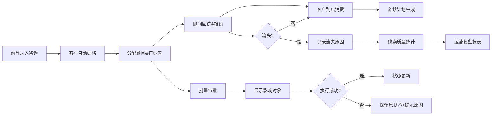

## 1. 产品概述

牙科诊所客户画像库系统，为前台和后台人员提供统一的客户信息管理平台，解决客户信息分散、跨部门协同效率低、线索转化追踪困难等问题。

- 核心目标：整合客户咨询、复诊、消费、回访全生命周期数据，辅助诊所运营决策
- 目标用户：前台接待、咨询顾问、运营经理、诊所管理层

## 2. 核心功能

### 2.1 用户角色

| 角色 | 登录方式 | 核心权限 |
|------|----------|----------|
| 前台接待 | 账号密码 | 录入咨询意向、复诊偏好、消费记录，查看客户画像 |
| 咨询顾问 | 账号密码 | 维护归属客户、报价版本、回访计划，查看线索质量 |
| 运营经理 | 账号密码 | 维护标签/等级/顾问配置，查看转化报表，批量审批 |
| 管理层 | 账号密码 | 全量数据查看、报表统计、审批权限 |

### 2.2 功能模块

1. **前台工作台**：客户快速搜索、咨询意向录入、复诊偏好记录、消费登记
2. **客户画像库**：客户全景视图（基本信息+标签+等级+消费+回访+报价一体化）
3. **后台配置中心**：标签管理、客户等级、顾问列表、回访模板
4. **跨部门协同页**：流失原因记录、报价版本对比、回访计划时间轴（单页不跳转）
5. **来源转化报表**：渠道漏斗、报价过期分析、响应节点追踪、责任人标记
6. **批量审批中心**：待审批列表、影响对象预览、失败原因提示、原状态保留

### 2.3 页面详情

| 页面名称 | 模块名称 | 功能描述 |
|----------|----------|----------|
| 前台工作台 | 快速录入区 | 新客户/老客户快速登记，下拉式来源渠道选择 |
| 前台工作台 | 今日待办 | 今日回访提醒、复诊提醒、待确认预约 |
| 客户画像详情 | 基本信息卡 | 姓名、电话、标签、等级、归属顾问核心字段聚合 |
| 客户画像详情 | 咨询-复诊-消费时间轴 | 三栏并列展示，支持横向滚动，不跳转 |
| 客户画像详情 | 协同工作区 | 流失原因选择器、报价版本Tab、回访计划侧栏同屏 |
| 标签管理 | 标签列表 | 增删改、颜色标记、使用统计、批量启用/禁用 |
| 客户等级 | 等级配置 | 升级阈值、权益配置、自动打标规则 |
| 来源转化报表 | 渠道漏斗图 | 曝光→咨询→到店→成交转化率，点击钻取 |
| 来源转化报表 | 报价过期分析 | 过期原因饼图、责任人柱状图、响应节点甘特图 |
| 批量审批中心 | 待办审批列表 | 多选审批、影响对象数量实时显示、审批类型标签 |
| 批量审批中心 | 执行结果面板 | 成功/失败分组展示，失败项保留原状态+原因说明 |

## 3. 核心流程

## 4. 用户界面设计

### 4.1 设计风格
- **主色调**：医疗青 `#0EA5A9`（信任专业感）+ 暖辅助色 `#F59E0B`（提醒关怀）
- **次色调**：深灰 `#1F2937` + 浅灰背景 `#F8FAFC`
- **按钮样式**：圆角 8px，主按钮实色填充 + 微阴影，次按钮描边
- **字体**：中文 PingFang SC + Noto Sans SC，标题 600/700，正文 400
- **布局**：左侧导航 + 右侧内容区，卡片式模块，模块间 24px 间距
- **图标**：Lucide Icons 线性风格，医疗场景相关图标

### 4.2 页面设计概览

| 页面名称 | 模块名称 | UI 元素 |
|----------|----------|----------|
| 前台工作台 | 快速录入区 | 渐变背景卡 + 大号搜索框 + 快捷操作悬浮按钮组 |
| 客户画像详情 | 核心字段聚合卡 | 三列紧凑布局，标签胶囊徽章，顾问头像悬停展示详情 |
| 客户画像详情 | 协同工作区 | 左侧流失原因快选 | 中间报价Tab切换 | 右侧回访日历侧栏，同屏不跳转 |
| 来源转化报表 | 过期原因卡片 | 渐变色数据卡片 + Tooltip 悬停解释节点延误 |
| 批量审批中心 | 执行结果面板 | 成功项绿底勾选，失败项红底保留原状态并展开原因 |

### 4.3 响应式
- 桌面优先设计，最小支持 1366px 宽度
- 1366~1920px 自适应，内容区最大 1440px 居中
- 平板端折叠左侧导航为图标模式
- 关键操作按钮在各分辨率下保持可点击

### 4.4 交互与动效
- 卡片悬停：`translateY(-2px)` + 阴影加深，150ms 缓动
- 标签/徽章：颜色渐变填充，支持点击变色编辑
- 数据钻取：报表柱/饼点击 → 右侧滑出详情抽屉，抽屉 300ms 滑入
- 审批执行：按钮 Loading → 结果渐显，失败项抖动 1 次提示
