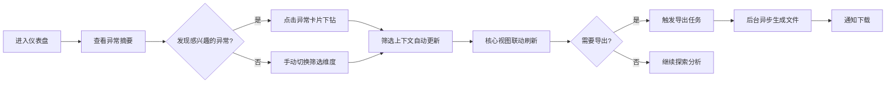

## 1. 产品概述
生鲜门店临期损耗分析仪表盘，面向生鲜采购经理，通过多维度数据关联分析，揭示入库批次、保质期、促销、报损、退货、天气与门店客流之间的复杂关系，帮助精准识别损耗根因并优化采购策略。

- **目标用户**：生鲜采购经理、门店运营经理
- **核心价值**：从"看报表"升级为"发现问题→定位原因→指导行动"的分析闭环

## 2. 核心功能

### 2.1 用户角色

| 角色 | 权限说明 |
|------|----------|
| 采购经理 | 查看全部门店数据、导出报告、保存分析视角 |
| 门店运营 | 仅查看所属门店数据 |

### 2.2 功能模块

1. **异常摘要面板**：智能识别高损耗异常，优先展示最需关注的问题
2. **多维度筛选器**：门店、品类、供应商、批次、日期五维视角切换
3. **临期漏斗视图**：展示入库→可售→临期→促销→报损/退货的全链路转化
4. **损耗Pareto视图**：按品类/供应商/门店排列的80/20损耗分布
5. **促销前后对比**：促销活动对临期消化率的影响量化分析
6. **供应商排行**：按损耗率、准时率、品质评分的供应商综合排行
7. **数据导出**：支持按当前筛选上下文导出Excel/CSV报告

### 2.3 页面详情

| 页面名称 | 模块名称 | 功能描述 |
|----------|----------|----------|
| 主仪表盘 | 异常摘要区 | 卡片式展示Top5异常：高损耗品类、临期预警批次、低效促销、异常天气日、低客流门店 |
| 主仪表盘 | 筛选上下文栏 | 常驻顶部，显示当前筛选条件，支持一键清除和保存视角 |
| 主仪表盘 | 临期漏斗 | 桑基图/漏斗图形式，每批次独立追踪，不同批次同SKU不合并 |
| 主仪表盘 | 损耗Pareto | 双轴柱状+折线图，展示累计损耗占比，支持下钻 |
| 主仪表盘 | 促销效果对比 | 分组柱状图，对比促销前7天vs促销期间的临期消化率、销量、毛利 |
| 主仪表盘 | 供应商排行 | 可排序表格，展示各供应商的损耗率、准时交付率、品质异常率 |

## 3. 核心流程

## 4. 用户界面设计

### 4.1 设计风格
- **设计基调**：专业数据洞察风，深色主题为主，突出数据的可读性
- **主色调**：深海蓝 `#0F172A`（背景），搭配生鲜绿 `#10B981`（正常）、警示橙 `#F59E0B`（临期）、损耗红 `#EF4444`（报损）
- **字体**：标题使用 `Space Grotesk`，数据数字使用 `JetBrains Mono` 等宽字体，正文使用 `Inter`
- **布局**：非对称网格布局，异常摘要区占据视觉焦点，四宫格核心视图支持拖拽重排
- **动效**：数据加载时的渐进式渲染、筛选切换时的平滑过渡、异常卡片的微高亮动效

### 4.2 页面设计概览

| 区域 | UI元素 | 设计细节 |
|------|--------|----------|
| 顶部导航 | Logo、用户信息、视角保存按钮 | 深色导航栏，毛玻璃效果 |
| 筛选栏 | 门店、品类、供应商、批次、日期选择器 | 标签式展示已选条件，悬停显示详情 |
| 异常摘要 | 5张异常卡片 | 卡片悬浮阴影，点击缩放效果，颜色编码异常等级 |
| 核心视图区 | 4个图表容器 | 支持最大化、拖拽重排，每个图表自带筛选上下文指示 |

### 4.3 响应式设计
- **桌面端**（1440px+）：完整布局，四宫格视图
- **平板端**（768px-1439px）：上下两栏布局，图表堆叠
- **移动端**（<768px）：单列滚动，简化筛选器，卡片式图表

### 4.4 数据可视化规范
- **临期漏斗**：使用渐变色彩表示阶段健康度，每个阶段标注数量和转化率
- **Pareto图**：柱状图按损耗金额降序，折线图展示累计占比，80%处标注参考线
- **促销对比**：同一品类/批次的前后对比，使用误差线显示波动范围
- **供应商排行**：使用数据条直观展示相对水平，支持多列组合排序
