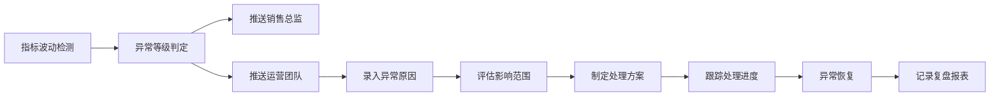

## 1. 产品概述

用户增长指标驾驶舱是面向运营负责人的企业级数据监控平台，提供核心增长指标的实时监控、异常检测、原因分析和告警通知能力。解决运营团队在数据监控中的痛点：指标口径不统一、异常发现不及时、原因追溯困难、交接信息不透明。

产品目标是提升运营决策效率，确保指标波动可追溯、责任可落实、改动可回看，为月度复盘提供完整的数据支撑。

## 2. 核心功能

### 2.1 用户角色

| 角色 | 注册方式 | 核心权限 |
|------|----------|----------|
| 运营负责人 | 企业账号登录 | 查看驾驶舱、配置告警、订阅日报、审批口径变更 |
| 运营专员 | 企业账号登录 | 维护指标口径、录入异常原因、查看明细数据 |
| 销售总监 | 企业账号登录 | 接收异常告警、查看交付进度报表 |
| 系统管理员 | 企业账号登录 | 权限管理、系统配置、历史版本管理 |

### 2.2 功能模块

1. **驾驶舱首页**：核心指标概览、异常波动卡片、趋势图表、实时告警
2. **指标详情页**：维度配置、日报订阅、告警规则、历史趋势、明细查询
3. **异常分析页**：异常原因记录、影响范围评估、关联指标分析、处理进度
4. **口径维护页**：指标定义管理、口径版本对比、变更审批、历史回溯
5. **交付进度页**：项目进度跟踪、交付报表生成、月底复盘看板
6. **系统设置页**：用户权限管理、金额改动审批、操作日志

### 2.3 页面详情

| 页面名称 | 模块名称 | 功能描述 |
|-----------|-------------|---------------------|
| 驾驶舱首页 | 指标概览区 | 展示DAU、新增用户、留存率、转化率等核心指标，支持时间范围切换 |
| 驾驶舱首页 | 异常监控区 | 卡片式展示当前异常指标，标注波动幅度、异常等级、持续时间 |
| 驾驶舱首页 | 趋势分析区 | 多指标对比趋势图，支持维度下钻（渠道、地区、用户群） |
| 驾驶舱首页 | 告警通知区 | 实时推送未处理告警，支持快速认领和处理 |
| 指标详情页 | 维度配置区 | 优先展示指标的分析维度（渠道/地区/版本/用户分层），支持自定义组合 |
| 指标详情页 | 日报订阅区 | 优先展示订阅状态、订阅人员、推送渠道、报表模板配置 |
| 指标详情页 | 告警规则区 | 优先展示告警阈值、检测算法、通知对象、静默时间配置 |
| 指标详情页 | 历史趋势区 | 展示指标长期趋势，支持同比环比对比 |
| 指标详情页 | 明细查询区 | 支持多条件筛选，导出明细数据，展示SQL查询逻辑 |
| 异常分析页 | 异常原因记录 | 结构化录入原因分类、影响评估、处理方案、负责人 |
| 异常分析页 | 波动趋势分析 | 展示异常发生前后的指标波动曲线，标注关键事件点 |
| 异常分析页 | 关联指标分析 | 展示相关指标的波动情况，辅助定位根因 |
| 口径维护页 | 指标定义管理 | 维护指标名称、计算逻辑、数据源、业务含义 |
| 口径维护页 | 版本对比 | 支持任意两个版本的口径定义对比，高亮差异 |
| 口径维护页 | 变更审批 | 口径修改需提交备注，支持审批流程 |
| 交付进度页 | 项目进度跟踪 | 展示各项目交付里程碑，更新进度需填写备注 |
| 交付进度页 | 复盘报表 | 自动生成月度复盘报表，汇总异常、交付、指标完成情况 |
| 系统设置页 | 权限管理 | 角色权限配置，金额或权限改动强制带备注 |

## 3. 核心流程

### 3.1 异常告警流程

运营负责人查看驾驶舱发现指标异常 → 系统自动检测并触发告警 → 推送通知给运营团队和销售总监 → 运营专员录入异常原因 → 评估影响范围 → 制定处理方案 → 跟踪处理进度 → 异常恢复后关闭告警 → 自动记录到月度复盘报表。

### 3.2 口径变更流程

运营专员提交口径修改申请 → 填写变更原因和影响范围 → 提交审批 → 运营负责人审批 → 生成新版本 → 通知相关人员 → 历史版本可回溯。

### 3.3 日报订阅流程

用户选择订阅指标 → 配置维度组合 → 选择推送渠道（邮件/企业微信） → 设置推送时间 → 确认订阅 → 系统每日自动生成并推送报表。

## 4. 用户界面设计

### 4.1 设计风格

- **主色调**：深空蓝 `#0F172A`（专业、稳重），搭配科技蓝 `#3B82F6`（高亮、交互）
- **辅助色**：告警红 `#EF4444`（严重异常）、警告橙 `#F59E0B`（轻微异常）、成功绿 `#10B981`（正常）
- **中性色**：深灰 `#1E293B`、中灰 `#475569`、浅灰 `#94A3B8`、背景灰 `#F8FAFC`
- **字体**：显示字体使用「Space Grotesk」提升科技感，正文字体使用「Noto Sans SC」确保中文可读性
- **布局**：采用卡片式布局，强调数据层级，使用阴影和边框区分不同信息区块
- **按钮风格**：圆角 8px，悬浮效果使用轻微上浮 + 阴影加深，禁用状态降低不透明度
- **图标**：使用 lucide-react 线性图标，保持统一风格

### 4.2 页面设计概述

| 页面名称 | 模块名称 | UI 元素 |
|-----------|-------------|----------|
| 驾驶舱首页 | 指标概览区 | 大字号数据卡片、微增长趋势图、环比变化箭头、异常标签 |
| 驾驶舱首页 | 异常监控区 | 堆叠式卡片布局、异常等级色带边框、倒计时动画、处理按钮 |
| 驾驶舱首页 | 趋势分析区 | 交互式折线图、多系列切换、维度筛选标签组、时间选择器 |
| 指标详情页 | 维度配置区 | 标签式维度选择器、已选维度胶囊、组合预览按钮 |
| 指标详情页 | 日报订阅区 | 订阅状态开关、人员选择器、渠道图标按钮、时间配置面板 |
| 指标详情页 | 告警规则区 | 阈值滑块、算法选择下拉、通知对象列表、静默时间配置 |
| 异常分析页 | 原因分析区 | 时间线布局、原因分类标签、富文本备注、附件上传 |
| 口径维护页 | 版本对比 | 左右分栏布局、差异高亮、版本切换器、回滚按钮 |

### 4.3 响应式

- **设计优先**：桌面端（1440px+）优先设计，确保复杂数据表格和多图表布局的展示效果
- **平板适配**：1024px 断点，调整为两列布局，折叠侧边菜单
- **移动适配**：768px 断点，单列布局，底部导航，简化图表为关键数据展示
- **触摸优化**：移动端按钮最小高度 44px，手势操作支持图表缩放和左右滑动切换指标

### 4.4 动效设计

- **页面加载**：骨架屏 + 渐入动画，内容区块按顺序延迟出现（staggered reveal）
- **数据更新**：数字变化使用滚动动画（count-up），异常指标使用呼吸灯效果
- **告警推送**：顶部滑入通知，配合轻微震动反馈（移动端）
- **卡片交互**：悬浮时轻微上浮（translateY -2px），阴影加深，边框高亮
- **图表交互**：数据点悬浮显示详情 tooltip，曲线绘制使用描边动画
