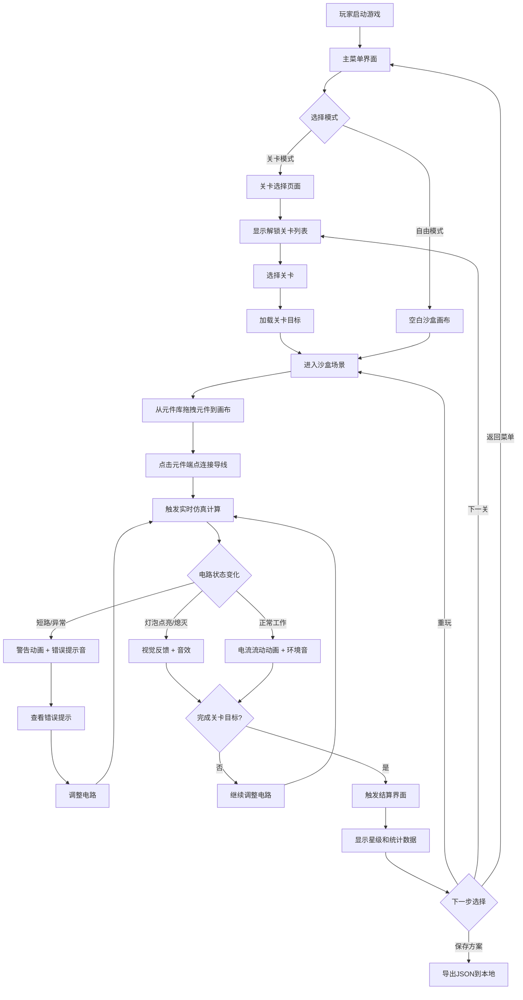

## 1. 产品概述
电子电路沙盒是一款面向初学者的教育类小游戏，通过拖拽元件、连接导线、观察仿真结果的方式，让玩家在趣味互动中理解基础电路原理。界面明确标注非专业工程软件，仿真采用教学近似模型，确保难度平滑渐进。
- 目标用户：对电子电路感兴趣的青少年和成人初学者
- 核心价值：将抽象的电路知识转化为可视化、可交互的游戏体验，通过即时的视觉和声音反馈建立直觉认知

## 2. 核心功能

### 2.1 功能模块
1. **主菜单页面**：游戏入口、关卡选择、设置、存档管理、数据统计
2. **游戏沙盒场景**：元件库、画布工作区、连线系统、实时仿真、任务提示
3. **关卡挑战系统**：分级关卡、通关条件、星级评价、难度渐进
4. **存档与分享系统**：本地存档、电路方案保存、JSON格式导出/导入
5. **设置面板**：音频开关、音量调节、画质选项、教程重置
6. **数据记录系统**：失败步骤记录、重试次数统计、教程跳过追踪、学习进度可视化

### 2.2 页面详情
| 页面名称 | 模块名称 | 功能描述 |
|-----------|-------------|---------------------|
| 主菜单 | 游戏标题区 | 动态Logo展示，标题动画，副标题说明"教育沙盒 · 非专业工具" |
| 主菜单 | 关卡选择 | 网格布局展示所有关卡，显示星级、解锁状态、关卡名称 |
| 主菜单 | 功能入口 | 继续游戏、自由模式、设置、数据统计、存档管理 |
| 主菜单 | 底部信息 | 版本号、提示文案、重置进度按钮 |
| 沙盒场景 | 顶部工具栏 | 关卡目标、返回按钮、提示按钮、重置按钮、保存按钮、声音开关 |
| 沙盒场景 | 左侧元件库 | 分类元件卡片：电源、电阻、电容、开关、灯泡、导线，带拖拽提示 |
| 沙盒场景 | 中央画布区 | 电路编辑画布，支持拖放、选中、删除、缩放、平移，网格背景 |
| 沙盒场景 | 右侧信息面板 | 元件属性编辑、任务进度、仿真状态指示、步骤引导 |
| 沙盒场景 | 底部状态栏 | 电流/电压指示、仿真运行状态、错误提示、快捷操作提示 |
| 设置面板 | 音频设置 | 背景音乐开关、音效开关、音量滑块、试听按钮 |
| 设置面板 | 显示设置 | 画质预设、网格显示、动画效果开关、深色/浅色主题 |
| 设置面板 | 游戏设置 | 教程开关、自动保存开关、难度偏好 |
| 设置面板 | 数据管理 | 清空存档、导出存档、导入存档、重置教程 |
| 结算页面 | 通关信息 | 完成时间、使用元件数、星级评定（3星标准） |
| 结算页面 | 数据展示 | 失败次数分析、重试步骤统计、耗时分布 |
| 结算页面 | 操作按钮 | 重玩本关、下一关、返回选关、保存方案 |

## 3. 核心流程

## 4. 用户界面设计

### 4.1 设计风格
**复古电子实验室风格** —— 融合8-bit像素元素与现代扁平化设计
- **主色调**：深色背景 `#1a1a2e`（电路板蓝黑）+ 霓虹蓝 `#00d4ff`（电流色）+ 琥珀黄 `#ffb347`（灯泡发光色）
- **辅助色**：电阻棕 `#d4a373`、电容紫 `#c084fc`、开关绿 `#4ade80`、错误红 `#f87171`
- **按钮风格**：圆角矩形，双层边框（外边框深色、内边框高光），按下时内缩2px模拟物理按键
- **字体**：标题用 "Press Start 2P"（像素风）+ 正文用 "JetBrains Mono"（等宽代码风）
- **布局风格**：面板分区明显，带有金属质感边框和螺丝装饰（纯CSS绘制）
- **图标风格**：手绘风电路符号，元件采用等轴测透视图风格

### 4.2 页面设计概述
| 页面名称 | 模块名称 | UI元素 |
|-----------|-------------|-------------|
| 主菜单 | 标题区 | 大号像素字标题，下方闪烁的电路动画装饰，副标题灰色小字标注"教学模拟 · 非专业工具" |
| 主菜单 | 关卡选择 | 卡片网格4列，每关显示编号、名称、3个星级槽位，锁定关卡显示🔒和遮罩 |
| 主菜单 | 功能入口 | 垂直按钮列表，每个按钮左侧有图标，hover时按钮右侧出现▶指示符 |
| 沙盒场景 | 元件库 | 可折叠面板，元件采用圆形底托+等轴测图，hover放大并显示名称提示，拖拽时半透明跟随 |
| 沙盒场景 | 画布区 | 点阵网格背景，选中元件时显示青色选中框和控制点，导线支持贝塞尔曲线 |
| 沙盒场景 | 仿真效果 | 电流流动时导线显示发光粒子沿路径移动，灯泡点亮时有径向光晕扩散动画 |
| 沙盒场景 | 错误反馈 | 短路时错误导线闪烁红色，伴随震动动画（画布微小抖动），弹出气泡提示 |
| 结算页面 | 数据展示 | 进度条形式展示各项指标，失败步骤高亮红色，优秀步骤绿色，带动画展开 |

### 4.3 响应式
- 桌面端优先（Canvas游戏需要较大画布空间），最小支持1280x720
- 画布区域自适应，使用CSS `aspect-ratio: 16/9` 保持比例
- 移动端（≥768px）元件库改为底部抽屉式布局
- 触摸操作支持：长按选中元件，双指缩放画布

### 4.4 音频设计
- **元件放置**：短促的"咔嗒"机械声
- **导线连接**：电流接通的"滋滋"声
- **开关切换**：金属弹片"啪"声
- **灯泡点亮**：灯丝预热的渐强"嗡嗡"声 + 明亮的"叮"
- **电路错误**：警告"哔"声（2短1长）
- **任务完成**：上行三音阶旋律（C-E-G）
- **背景环境音**：轻微的电流白噪声（可关闭）
