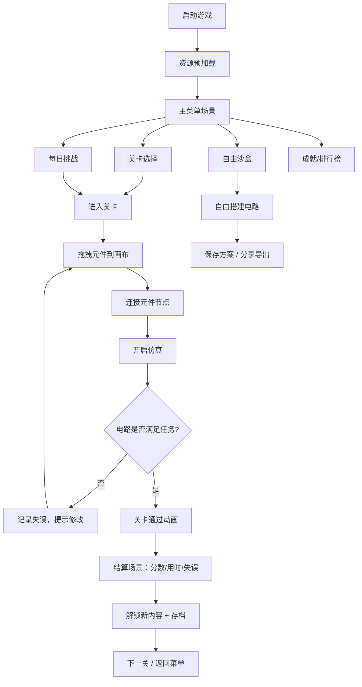

## 1. 产品概述

电子电路沙盒是一款面向学生和电子爱好者的教育类游戏，通过拖拽元件、搭建电路来学习基础电路原理。玩家在任务挑战中完成电路设计，观察灯泡亮度等状态变化，获得即时反馈与成就感。

- **目标用户**：中学生、STEM 教育者、电子入门爱好者
- **核心价值**：零风险学习电路，可视化理解电流/电压/电阻关系，游戏化激励持续学习

## 2. 核心功能

### 2.1 功能模块

1. **主菜单场景**：开始游戏、每日挑战、成就墙、排行榜、设置、继续游戏
2. **关卡选择场景**：任务地图、解锁进度、星级评价
3. **沙盒游戏场景**：元件库面板、电路画布、连线工具、任务提示、仿真控制
4. **结算场景**：分数、用时、失误数、解锁内容、下一关/重玩
5. **自由沙盒场景**：无限制搭建、保存/载入方案、分享导出

### 2.2 页面详情

| 页面名称 | 模块名称 | 功能描述 |
|----------|----------|----------|
| 主菜单 | Hero 动画区 | 动态电路演示背景、游戏 Logo、开始按钮 |
| 主菜单 | 功能导航 | 关卡模式、自由模式、每日挑战、成就、排行榜入口 |
| 关卡选择 | 任务地图 | 节点式关卡展示、锁/解锁状态、星级 |
| 关卡选择 | 进度条 | 总完成度、当前章节、最高分 |
| 游戏场景 | 元件库面板 | 电阻/电容/开关/灯泡/电池/导线分类拖拽区 |
| 游戏场景 | 电路画布 | Canvas 渲染区、拖拽放置、节点吸附、连线绘制 |
| 游戏场景 | 仿真控制 | 开关电源、步进仿真、重置、速度调节 |
| 游戏场景 | 任务提示 HUD | 当前目标、已完成项、用时、失误数 |
| 游戏场景 | 工具栏 | 撤销/重做、删除、保存、截图分享 |
| 结算场景 | 数据面板 | 分数、用时、失误数、星级评定 |
| 结算场景 | 解锁展示 | 新元件、新关卡、成就卡片动画 |
| 成就墙 | 成就网格 | 已达成/未达成成就、成就描述、进度条 |
| 排行榜 | 排行列表 | 每日挑战本地排行、玩家名、分数、用时 |
| 设置 | 设置面板 | 音量、画质、语言、控制方式（键鼠/手柄/触屏）、数据导出 |

## 3. 核心流程

### 关键子流程

1. **仿真流程**：开启电源 → 节点电压计算 → 电流路径追踪 → 灯泡亮度/电容充电状态更新 → 实时渲染
2. **连线流程**：点击元件引脚 → 拖出虚线 → 吸附到目标引脚 → 生成连接线对象
3. **任务判定流程**：检查指定灯泡是否点亮 → 检查元件使用约束 → 检查短路/错误 → 计算星级

## 4. 用户界面设计

### 4.1 设计风格

- **主题方向**：赛博教学风 — 深色背景配霓虹高亮导线，科技感但不复杂，保留教育软件的清晰感
- **主色**：深靛蓝 `#0F172A`，次色：青色 `#06B6D4`（导线/激活），琥珀色 `#F59E0B`（灯泡/警告），薄荷绿 `#10B981`（成功）
- **字体**：
  - 标题：`Orbitron`（科技感等宽字体，强化电路主题）
  - 正文：`JetBrains Mono`（清晰易读的代码字体，适合显示数值）
- **按钮风格**：圆角 8px，微发光 hover 效果，按下时内阴影
- **图标风格**：SVG 线性图标 + 霓虹描边，元件用示意图风格
- **布局风格**：左侧元件库抽屉 + 中央画布 + 右侧属性/HUD 面板，顶栏工具栏

### 4.2 页面设计概览

| 页面名称 | 模块名称 | UI 元素 |
|----------|----------|----------|
| 主菜单 | Hero 区 | 背景流动的导线动画，大标题渐入，开始按钮脉冲光效 |
| 游戏场景 | 元件库 | 可折叠分类卡片，元件图标拖拽预览，数量角标 |
| 游戏场景 | 画布 | 栅格背景，元件阴影+选中发光，导线发光渐变，节点圆圈 |
| 游戏场景 | HUD | 半透明玻璃拟态面板，用时数字跳动，失误数红色警告 |
| 结算场景 | 数据卡 | 3 张卡片依次滑入（分数/用时/失误），星级粒子动画 |
| 成就墙 | 成就卡 | 未达成灰度+锁，达成彩色+勾，悬停翻转显示详情 |

### 4.3 响应式与多输入

- **桌面优先**：1280px 以上完整三栏布局
- **平板适配**：元件库改为底部抽屉，HUD 改为悬浮角标
- **触屏优化**：元件拖拽长按触发，连线双击端点删除，捏合缩放画布
- **手柄支持**：左摇杆移动光标，A 键拾取/放置，B 键取消，X 键连线，肩键切换工具
- **键盘快捷键**：`1-6` 选元件，`Space` 开/关仿真，`Ctrl+Z` 撤销，`Delete` 删除

### 4.4 教学近似声明

- 启动时显示轻量提示：「本软件为教学演示，仿真结果为简化模型，不代表真实电路」
- 设置面板内常驻声明文字
- 元件属性显示标注「教学值」
