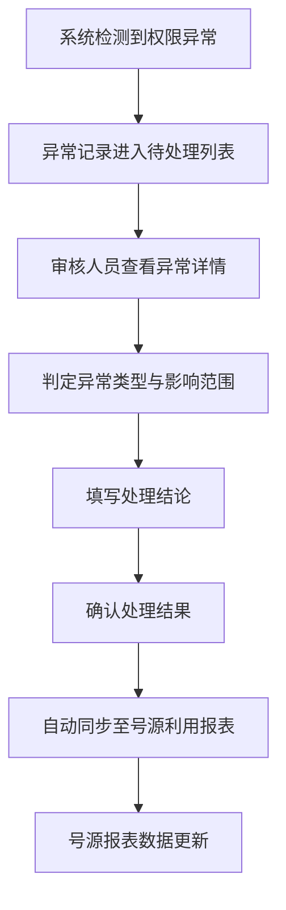

## 1. 产品概述

病历随访台是一套面向中医馆的复诊提醒与随访管理平台，连接前台操作与后台审核流程，帮助运营负责人高效管理病历、随访任务、患者复诊统计及号源利用分析。

- **主要目的**：提升中医馆复诊率，降低患者流失率，规范随访流程，实现病例权限异常的快速处理与数据同步。
- **目标用户**：中医馆运营负责人、前台接诊人员、后台审核人员。
- **市场价值**：解决传统中医馆随访管理混乱、患者流失率高、号源利用效率低的行业痛点，提供数字化运营管理解决方案。

## 2. 核心功能

### 2.1 用户角色

| 角色 | 注册方式 | 核心权限 |
|------|----------|----------|
| 运营负责人 | 系统管理员分配 | 查看病历总览、随访任务、统计报表、导出明细、处理权限异常、管理筛选规则 |
| 前台接诊人员 | 系统管理员分配 | 录入病历、创建随访任务、查看复诊计划、记录收费项目 |
| 后台审核人员 | 系统管理员分配 | 审核病历、审批随访质量、处理病例权限异常 |

### 2.2 功能模块

1. **运营仪表盘**：病历总览卡片、随访任务概览、复诊/流失统计趋势
2. **病历管理**：主诉记录查看、复诊计划管理、收费项目明细
3. **随访任务管理**：任务列表、多条件筛选（日期/状态/人员）、筛选规则保存与复用
4. **患者统计分析**：复诊率统计、流失患者分析、趋势图表展示
5. **随访质量导出**：按随访质量筛选、导出明细数据（Excel/CSV）
6. **病例权限异常处理**：异常列表、处理流程、处理结论同步至号源利用报表
7. **号源利用报表**：号源使用统计、异常病例影响分析、报表展示

### 2.3 页面详情

| 页面名称 | 模块名称 | 功能描述 |
|----------|----------|----------|
| 登录页 | 登录表单 | 账号密码登录、角色识别、权限校验 |
| 运营仪表盘 | 数据概览卡片 | 显示今日病历数、待随访数、复诊率、流失率等核心指标 |
| 运营仪表盘 | 趋势图表 | 近30天复诊/流失趋势折线图、随访任务完成率环形图 |
| 运营仪表盘 | 快捷入口 | 快速跳转至病历、随访、统计、异常处理等模块 |
| 病历管理 | 病历列表 | 按日期/科室/医生筛选病历列表，支持搜索 |
| 病历管理 | 病历详情 | 查看主诉记录、诊断信息、复诊计划、收费项目明细 |
| 随访任务管理 | 任务列表 | 展示待随访/随访中/已完成/已逾期任务，支持批量操作 |
| 随访任务管理 | 高级筛选 | 按日期范围、随访状态、负责人员、患者类型筛选 |
| 随访任务管理 | 筛选规则管理 | 保存当前筛选条件为命名规则，支持快速加载与删除 |
| 患者统计分析 | 复诊统计 | 按时间段、科室、医生统计复诊率，支持图表与明细表切换 |
| 患者统计分析 | 流失分析 | 流失患者列表、流失原因分析、流失趋势图 |
| 随访质量导出 | 质量筛选 | 按随访评分、随访方式、随访结果等维度筛选 |
| 随访质量导出 | 数据导出 | 生成Excel/CSV格式的随访明细报表下载 |
| 权限异常处理 | 异常列表 | 展示待处理的病例权限异常，标注紧急程度 |
| 权限异常处理 | 异常处理 | 填写处理结论、选择处理结果、同步至号源报表 |
| 号源利用报表 | 号源统计 | 号源预约率、到诊率、号源利用率分析 |
| 号源利用报表 | 异常影响分析 | 展示权限异常对号源利用的影响及关联病例 |

## 3. 核心流程

### 3.1 病历录入与随访任务创建流程

前台接诊人员接诊患者，录入主诉记录与诊断信息，系统自动根据复诊计划生成随访任务，分配给对应随访人员。

### 3.2 病例权限异常处理流程

当发现病例权限异常时，后台审核人员发起处理流程，处理完成后结论自动同步至号源利用报表。

## 4. 用户界面设计

### 4.1 设计风格

- **主色调**：深青色 `#0D7377`（体现中医的稳重与专业）
- **辅助色**：赭石色 `#C87941`（中医传统元素）、暖金色 `#D4A84B`
- **中性色**：米白背景 `#FAF8F5`、深灰文字 `#2C3639`、中灰 `#6B7280`
- **按钮风格**：圆角矩形（radius-lg），主按钮为深青色配浅青文字，悬停时有微妙上浮阴影
- **字体选择**：
  - 标题：Noto Serif SC（衬线体，体现中医文化底蕴）
  - 正文：Noto Sans SC（无衬线体，保证可读性）
  - 数据数字：JetBrains Mono（等宽字体，数据展示更规整）
- **布局风格**：左侧导航栏 + 顶部状态栏 + 主内容区的经典后台布局，采用卡片式模块划分
- **图标风格**：使用Lucide图标库，线性风格，统一1.5px线宽
- **装饰元素**： subtle 中药纹理背景、传统云纹分隔线、数据卡片使用淡金色边框点缀

### 4.2 页面设计概述

| 页面名称 | 模块名称 | UI元素 |
|----------|----------|--------|
| 运营仪表盘 | 数据概览卡片 | 四列卡片网格，每卡片含图标、数值、同比变化标签、迷你趋势图，主色深青/赭石交替 |
| 运营仪表盘 | 趋势图表 | 左侧折线图（复诊/流失双线）、右侧环形图（随访完成率），图表有淡金色网格线 |
| 病历管理 | 病历列表 | 表格布局，斑马纹浅米灰，悬停行深青高亮，支持行展开查看摘要 |
| 病历管理 | 病历详情 | 左右分栏，左侧患者基本信息卡片，右侧主诉/诊断/复诊/收费标签页 |
| 随访任务管理 | 任务列表 | 状态标签色彩区分（待办赭石/进行中暖金/完成深青/逾期深红），支持批量选择 |
| 随访任务管理 | 高级筛选 | 顶部筛选抽屉式展开，含日期选择器、状态多选、人员下拉、保存规则按钮组 |
| 患者统计分析 | 图表区 | 顶部时间范围选择器，下方柱状图+折线图组合，支持科室/医生维度切换 |
| 权限异常处理 | 异常列表 | 紧急程度标识（红色圆点/橙色圆点），处理状态进度条，展开面板展示处理记录 |
| 号源利用报表 | 报表区 | KPI卡片行 + 数据透视表，异常影响病例用赭石色行背景标注 |

### 4.3 响应式设计

- **设计原则**：桌面端优先（1440px基准），适配1280px及以上屏幕
- **平板适配**（768-1280px）：左侧导航折叠为图标模式，卡片布局自动降为2列
- **移动端适配**（<768px）：导航转为底部Tab栏，表格转为卡片式列表，筛选转为底部抽屉

### 4.4 动效与交互

- 页面进入：内容区模块从下往上渐入，staggered延迟50ms
- 卡片悬停：`translateY(-2px)` + 阴影加深，过渡200ms ease-out
- 按钮点击：轻微scale(0.97)回弹效果
- 数据加载：骨架屏脉冲动画（animate-pulse），深青到浅青渐变
- 状态变更：状态标签切换时有颜色渐变过渡
- 表格行展开：平滑高度过渡300ms
