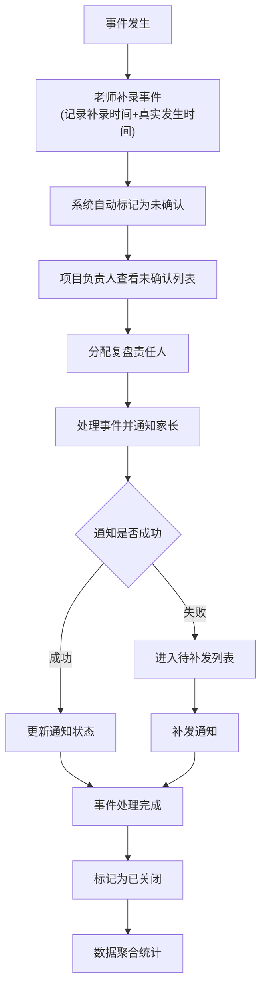
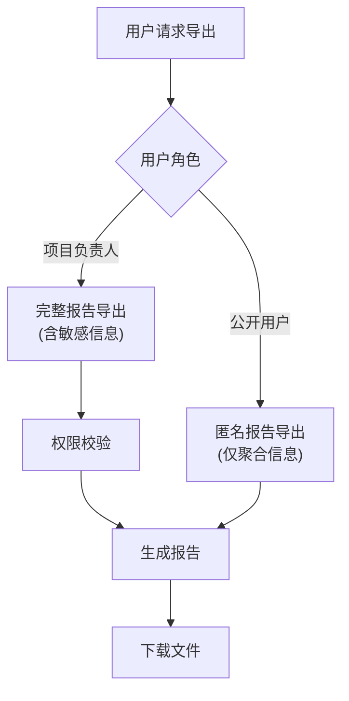

## 1. 产品概述

研学营地安全事件复盘看板是一个专为研学营地设计的安全事件管理与复盘系统，以事件时间线为核心展示方式，帮助项目负责人高效追踪、分析和复盘安全事件。系统通过可视化地图、通知状态追踪、处理耗时分析等功能，提升安全事件响应效率和管理透明度。

## 2. 核心功能

### 2.1 用户角色

| 角色 | 注册方式 | 核心权限 |
|------|----------|----------|
| 项目负责人 | 系统分配 | 查看全部事件、分配复盘责任人、导出报告、查看点位地图 |
| 带队老师 | 系统分配 | 补录事件、查看自己负责的事件、通知家长 |
| 公开用户 | 无需注册 | 仅查看聚合统计报表，无详细事件信息 |

### 2.2 功能模块

1. **主看板页面**：事件时间线、未确认/已关闭事件分区、待补发通知列表
2. **事件详情页**：原始记录查看、事件信息编辑、附件管理
3. **点位地图页**：签到点分布、事件地理位置可视化
4. **数据报表页**：通知完成率、事件状态口径、处理耗时聚合分析
5. **事件补录页**：老师补录事件，标记补录时间和真实发生时间
6. **公开报表页**：匿名化聚合数据展示

### 2.3 页面详情

| 页面名称 | 模块名称 | 功能描述 |
|-----------|-------------|---------------------|
| 主看板 | 时间线区域 | 按时间倒序展示事件卡片，显示签到点、带队老师、事件等级、家长通知状态、处理时长、复盘责任人 |
| 主看板 | 未确认事件区 | 独立分区展示待处理的未确认事件，支持快速确认操作 |
| 主看板 | 已关闭事件区 | 独立分区展示已处理完成的事件 |
| 主看板 | 待补发通知列表 | 单独展示家长通知失败的事件，支持一键补发 |
| 事件详情 | 基本信息 | 展示事件完整信息，点击可跳转原始记录 |
| 事件详情 | 附件管理 | 按权限控制附件查看，支持上传/下载 |
| 事件详情 | 处理流程 | 展示事件处理全过程时间节点 |
| 点位地图 | 地图展示 | 显示所有签到点位置，标记事件发生地点 |
| 点位地图 | 筛选功能 | 按时间、等级、状态筛选事件在地图上的展示 |
| 数据报表 | 通知完成率 | 展示家长通知成功率/失败率统计图表 |
| 数据报表 | 事件状态口径 | 各状态事件数量分布饼图/柱状图 |
| 数据报表 | 处理耗时聚合 | 按事件等级、时间段聚合平均处理时长 |
| 数据报表 | 匿名导出 | 导出不含敏感信息的匿名报告 |
| 事件补录 | 表单录入 | 录入事件信息，系统自动记录补录时间，需手动填写真实发生时间 |
| 公开报表 | 聚合数据 | 仅展示脱敏后的聚合统计信息 |

## 3. 核心流程

### 3.1 事件处理流程

### 3.2 报表导出流程

## 4. 用户界面设计

### 4.1 设计风格
- **主色调**：深蓝色(#1e3a5f)作为主色，代表专业、可信；橙色(#f59e0b)作为强调色，用于告警和未确认事件
- **辅助色**：绿色(#10b981)表示成功/正常，红色(#ef4444)表示紧急/失败
- **按钮风格**：圆角8px，轻微阴影，hover时有上浮效果
- **字体**：标题使用思源黑体Bold，正文使用思源黑体Regular
- **布局风格**：卡片式布局，左侧导航+右侧内容区，时间线采用纵向流式布局
- **图标风格**：线性图标，统一24px尺寸

### 4.2 页面设计概述

| 页面名称 | 模块名称 | UI元素 |
|-----------|-------------|-------------|
| 主看板 | 时间线 | 纵向时间轴，事件卡片悬浮效果，状态标签色彩区分 |
| 主看板 | 分区标题 | 大号加粗字体，底部装饰线，未确认区使用橙色边框强调 |
| 事件详情 | 信息卡片 | 网格布局，关键信息高亮显示，附件区域可折叠 |
| 点位地图 | 地图容器 | 全屏地图，事件点脉冲动画，点击弹出信息窗 |
| 数据报表 | 图表区域 | ECharts图表，响应式布局，支持切换图表类型 |
| 事件补录 | 表单 | 分组表单，时间选择器，必填项红星标记 |

### 4.3 响应式
- 桌面端优先设计，1440px基准宽度
- 平板端(≥768px)：侧边栏折叠，时间线保持纵向
- 移动端(≥375px)：底部导航，事件卡片改为列表式布局

### 4.4 动效设计
- 页面加载：内容区域渐入+轻微上移，staggered动画
- 事件卡片：hover时轻微上浮+阴影加深
- 时间线：滚动时节点依次出现
- 通知状态变化：状态标签颜色过渡动画
- 地图标记点：未确认事件点脉冲呼吸效果
