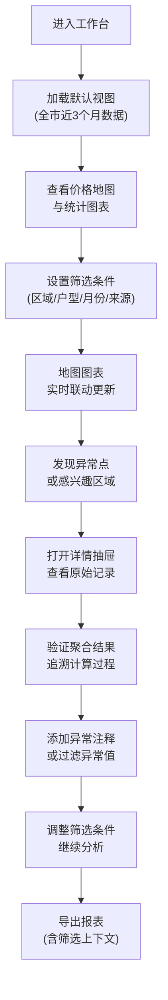

## 1. 产品概述

租赁房源价格变化地图分析工作台是面向城市研究学生的专业数据分析工具，通过地图可视化、统计图表和多维筛选，帮助研究者深度洞察租赁市场的价格变动规律、户型分布、区域差异等核心特征。

- 解决问题：租赁市场数据分散、多平台数据不统一、缺乏可追溯的聚合分析工具
- 目标用户：城市研究、房地产经济、地理信息等专业的学生和研究者
- 核心价值：提供可追溯、可过滤、可导出的一体化租赁市场分析环境

## 2. 核心功能

### 2.1 用户角色

| 角色 | 注册方式 | 核心权限 |
|------|----------|----------|
| 学生用户 | 学号/邮箱登录 | 查看地图、筛选数据、导出报表、保存筛选条件 |
| 导师用户 | 教师认证登录 | 管理学生权限、查看聚合统计、发布定时报表 |
| 管理员 | 后台登录 | 数据源管理、系统配置、数据更新调度 |

### 2.2 功能模块

1. **地图工作台主页面**：价格热力地图、区域筛选、样本量标注、异常点标记
2. **统计分析面板**：价格分布箱线图、时间趋势折线图、户型对比柱状图
3. **多维筛选器**：小区、区域、户型、月份、挂牌来源、地铁距离、楼龄、成交周期
4. **数据详情抽屉**：原始记录查看、异常注释、数据可追溯验证
5. **导出中心**：报表导出（含筛选条件、样本量、更新时间）、定时报表订阅
6. **权限视图**：角色级数据可见性控制、敏感字段脱敏

### 2.3 页面详情

| 页面名称 | 模块名称 | 功能描述 |
|----------|----------|----------|
| 地图工作台 | 价格热力图层 | 按小区/区域展示租金均价，颜色梯度映射价格区间，hover显示详细指标 |
| 地图工作台 | 样本量弱化层 | 样本量<30的区域降低透明度，标注"样本不足"提示 |
| 地图工作台 | 异常点标记 | 超出IQR 1.5倍的样本用特殊图标标记，支持一键过滤 |
| 统计分析面板 | 价格分布箱线图 | 按区域/户型分组展示价格分布，显示中位数、四分位、异常值 |
| 统计分析面板 | 价格趋势线 | 月度均价走势，支持多条线对比（不同户型/区域） |
| 统计分析面板 | 成交周期分布 | 展示挂牌到成交的时间分布直方图 |
| 多维筛选器 | 条件组合 | 支持多选、区间选择、级联筛选，筛选条件实时联动所有图表 |
| 多维筛选器 | 异常过滤开关 | 一键开启/关闭异常样本过滤，支持自定义IQR阈值 |
| 数据详情抽屉 | 原始记录列表 | 点击地图区域或图表数据点，展示该分组下的全部原始房源记录 |
| 数据详情抽屉 | 可追溯验证 | 展示聚合指标计算过程（如均价=sum(租金)/样本数），逐条核对 |
| 数据详情抽屉 | 异常注释 | 对异常样本添加人工注释，标记数据质量问题 |
| 导出中心 | 报表导出 | 导出CSV/Excel/PDF，自动包含数据更新时间、筛选条件、样本量信息 |
| 导出中心 | 定时报表 | 设置订阅周期（周/月），自动推送分析报告到邮箱 |
| 权限视图 | 角色切换 | 不同角色看到不同数据粒度，学生看不到个人房源联系方式 |

## 3. 核心流程

用户进入工作台后，首先看到全局价格地图和默认统计图表。通过左侧筛选器选择关注的区域、户型或时间范围，地图和图表实时联动更新。发现异常数据点时，可点击查看原始记录并验证聚合计算的正确性。完成分析后，导出包含完整筛选上下文的分析报告。

## 4. 用户界面设计

### 4.1 设计风格

- **主色调**：深海蓝 (#0F2B4A) 作为主色，搭配数据可视化专用的蓝-黄-红渐变色谱
- **辅助色**：青色 (#17A2B8) 用于交互元素，橙色 (#FD7E14) 用于异常标记，绿色 (#28A745) 用于正常状态
- **背景**：深色工作台风格 (#0B1E33)，减少视觉疲劳，突出数据可视化
- **字体**：标题使用 Space Grotesk（现代几何无衬线），正文使用 JetBrains Mono（等宽字体，便于数据表格阅读）
- **布局**：三栏式工作台布局，左侧筛选器、中间地图、右侧统计图表面板
- **风格关键词**：专业分析工作台、深色主题、数据密集型、科研风格

### 4.2 页面设计概述

| 页面名称 | 模块名称 | UI元素 |
|----------|----------|--------|
| 地图工作台 | 顶部导航栏 | 数据更新时间显示、样本量统计、用户角色切换、导出按钮 |
| 地图工作台 | 左侧筛选面板 | 折叠式筛选器组，每个维度可展开/收起，已选条件用标签展示 |
| 地图工作台 | 中央地图区 | Leaflet地图，支持缩放平移，热力图层、区域边界、异常点标记层 |
| 地图工作台 | 右侧图表区 | 可拖拽调整大小的面板，包含箱线图、趋势线两个Tab切换 |
| 地图工作台 | 底部状态栏 | 当前筛选条件摘要、样本量、异常值数量快捷过滤开关 |
| 数据详情抽屉 | 左侧聚合信息 | 区域名称、均价、中位数、样本量、指标口径说明 |
| 数据详情抽屉 | 右侧原始记录 | 分页表格，支持排序、搜索，每条记录标注来源平台 |
| 数据详情抽屉 | 追溯面板 | 展开显示聚合计算过程，可逐条勾选验证 |

### 4.3 响应性

- Desktop-first 设计，最小支持 1440px 宽度
- 平板端：右侧图表区折叠为底部面板
- 移动端：筛选器改为全屏覆盖层，地图全屏展示

### 4.4 交互动效

- 地图区域hover：边界高亮、信息面板淡入
- 筛选条件变更：图表数据平滑过渡动画（ECharts animation）
- 抽屉展开/收起：滑入滑出动效
- 异常点标记：脉冲呼吸动画吸引注意
- 数据加载：骨架屏占位，图表渐进式渲染
