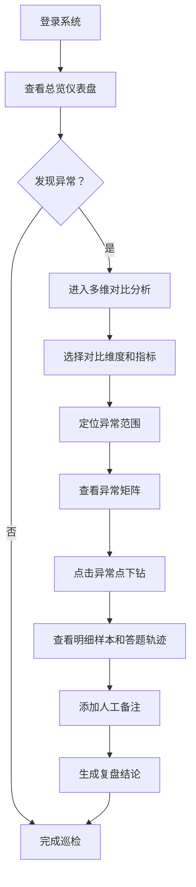

## 1. 产品概述

线上问卷样本质量监控运营复盘工作台，为调研项目经理提供多维度数据对比、异常检测和深度分析能力，通过可视化图表和下钻明细快速发现样本质量问题，支持人工备注标记，保障调研数据的可靠性和决策准确性。

- **核心目标**：建立问卷样本质量的全链路监控体系，从答题行为、设备、地域等多维度识别异常样本
- **目标用户**：调研项目经理、数据分析师、质量管控人员
- **核心价值**：降低脏数据对调研结果的影响，提升数据质控效率，支持追溯和复盘

## 2. 核心特性

### 2.1 用户角色

| 角色 | 注册方式 | 核心权限 |
|------|----------|----------|
| 调研项目经理 | 企业 SSO 登录 | 查看仪表盘、多维度对比、下钻明细、添加人工备注、导出报告 |
| 数据分析师 | 企业 SSO 登录 | 全量数据访问、自定义口径、高级筛选、配置质检规则 |
| 质量管控人员 | 企业 SSO 登录 | 质检标记管理、异常样本审核、备注编辑 |

### 2.2 功能模块

1. **总览仪表盘**：核心质量指标 KPI、样本漏斗转化、异常趋势概览
2. **多维度对比分析**：按问卷/渠道/题组/地区/设备类型交叉对比质量指标
3. **异常检测矩阵**：异常提交热力矩阵、渠道质量排行、题组耗时分布
4. **明细下钻**：异常样本明细表、答题行为轨迹、校验规则命中详情
5. **人工备注系统**：异常点标记、备注添加与编辑、历史备注追溯
6. **口径说明**：指标定义、计算逻辑、时间窗口说明、数据来源

### 2.3 页面详情

| 页面名称 | 模块名称 | 功能描述 |
|----------|----------|----------|
| 总览仪表盘 | KPI 指标卡 | 展示有效样本量、异常率、平均答题时长、重复提交率等核心指标 |
| 总览仪表盘 | 样本漏斗图 | 展示从问卷分发→开始答题→完成提交→通过质检的转化漏斗 |
| 总览仪表盘 | 异常趋势图 | 近 7/30 天异常样本数量和异常率的时间序列趋势 |
| 多维对比页 | 维度筛选器 | 支持选择问卷、渠道、题组、地区、设备类型等维度进行对比 |
| 多维对比页 | 指标选择器 | 选择答题时长、跳题率、IP 异常、设备异常、重复提交、质检标记等指标 |
| 多维对比页 | 对比图表区 | 柱状图/雷达图/热力图展示各维度下的指标对比 |
| 异常矩阵页 | 异常提交矩阵 | 渠道 × 异常类型的热力矩阵，快速定位问题渠道和异常类型 |
| 异常矩阵页 | 渠道质量排行 | 按综合质量分排序的渠道排行榜，支持升/降序切换 |
| 异常矩阵页 | 题组耗时分布 | 各题组的答题时长箱线图/小提琴图，识别耗时异常题组 |
| 明细下钻页 | 样本明细表 | 分页展示异常样本列表，支持多条件筛选和排序 |
| 明细下钻页 | 答题详情面板 | 展示单份样本的答题轨迹、跳题记录、时间分布 |
| 明细下钻页 | 质检详情 | 展示命中的质检规则、自动标记结果、人工复核状态 |
| 备注管理 | 备注弹窗 | 为异常点添加/编辑人工备注，支持 @ 提及和标签 |
| 备注管理 | 备注时间线 | 展示该异常点的所有历史备注记录 |
| 口径说明 | 指标字典 | 所有质量指标的定义、计算公式、统计口径 |
| 口径说明 | 时间窗口 | 说明不同时间粒度的数据刷新频率和延迟 |
| 口径说明 | 数据校验 | 原始记录校验逻辑、去重规则、隐私处理说明 |

## 3. 核心流程

### 3.1 异常发现与分析流程

调研项目经理登录系统后，首先查看总览仪表盘了解整体质量状况。当发现 KPI 异常或漏斗转化异常时，进入多维对比页选择不同维度交叉分析，定位具体问题范围。在异常矩阵页进一步确认问题渠道和异常类型后，点击异常点下钻查看明细样本，分析具体答题行为。最后为异常点添加人工备注，记录分析结论和处理措施。

### 3.2 数据处理流程

## 4. 用户界面设计

### 4.1 设计风格

- **主色调**：深空蓝 #0F172A 作为背景主色，科技感青色 #06B6D4 作为强调色，警示红 #EF4444 标记异常，成功绿 #10B981 标记正常
- **辅助色**：琥珀色 #F59E0B 用于警告状态，紫色 #8B5CF6 用于人工标记
- **按钮风格**：极简直角按钮，2px 描边，hover 时背景色填充过渡
- **字体**：标题使用 JetBrains Mono 等宽字体体现数据专业性，正文使用 Inter 保证可读性
- **布局风格**：模块化卡片布局，网格系统对齐，严格的视觉层次
- **图标风格**：线性图标，统一 2px 描边，图标与文字严格对齐
- **整体风格**：科技感数据仪表盘风格，深色主题，强调数据的严谨性和专业性

### 4.2 页面设计概览

| 页面名称 | 模块名称 | UI 元素 |
|----------|----------|---------|
| 总览仪表盘 | KPI 指标卡 | 深色卡片、大号数值、同比趋势箭头、微动效 |
| 总览仪表盘 | 样本漏斗图 | D3 绘制的漏斗图、分段着色、hover 显示详情、转化百分比 |
| 总览仪表盘 | 异常趋势图 | 面积图 + 折线图组合、双 Y 轴、时间滑块缩放 |
| 多维对比页 | 维度筛选器 | 下拉选择器、多选标签、维度切换 Tab、应用筛选按钮 |
| 多维对比页 | 对比图表 | 分组柱状图、数据标签、图例切换、支持导出 |
| 异常矩阵页 | 异常矩阵 | 热力矩阵、单元格着色与数值、点击下钻交互 |
| 异常矩阵页 | 渠道排行 | 排行表、进度条、质量分色阶、排序切换 |
| 异常矩阵页 | 耗时分布 | 箱线图、离群点高亮、参考线标记 |
| 明细下钻页 | 明细表 | 固定表头、斑马纹、行 hover 高亮、分页器 |
| 明细下钻页 | 详情抽屉 | 右侧滑出、分 Tab 展示、关闭动效 |
| 备注管理 | 备注弹窗 | 模态框、文本编辑器、标签选择、提交按钮 |
| 口径说明 | 指标字典 | 折叠面板、公式展示、示例说明 |

### 4.3 响应式

- 采用桌面优先设计，最小支持宽度 1440px
- 图表区域自适应容器宽度，支持在较大和较小屏幕下重排
- 侧边栏在小屏幕下可折叠，筛选区域可收起
- 表格支持横向滚动，保证数据完整性

### 4.4 交互与动效

- 页面加载：卡片依次淡入，延迟 50ms 级联
- 图表加载：骨架屏占位，数据返回后平滑过渡
- Hover 交互：数值微动放大，卡片轻微上浮 + 阴影增强
- 下钻交互：点击矩阵单元格时涟漪扩散效果，抽屉从右侧滑入
- 数据更新：数字滚动动效，新旧值平滑过渡
- 筛选切换：图表数据平滑过渡动画，时长 300ms
