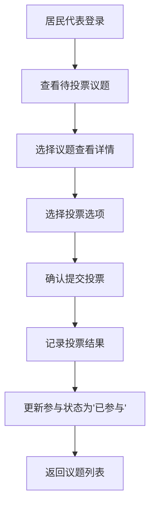
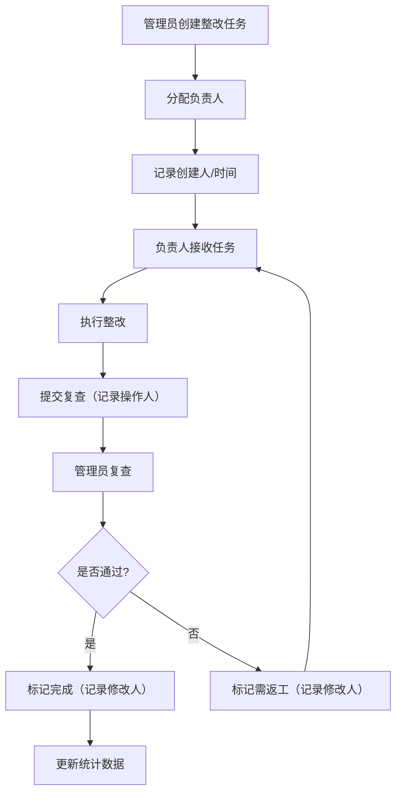
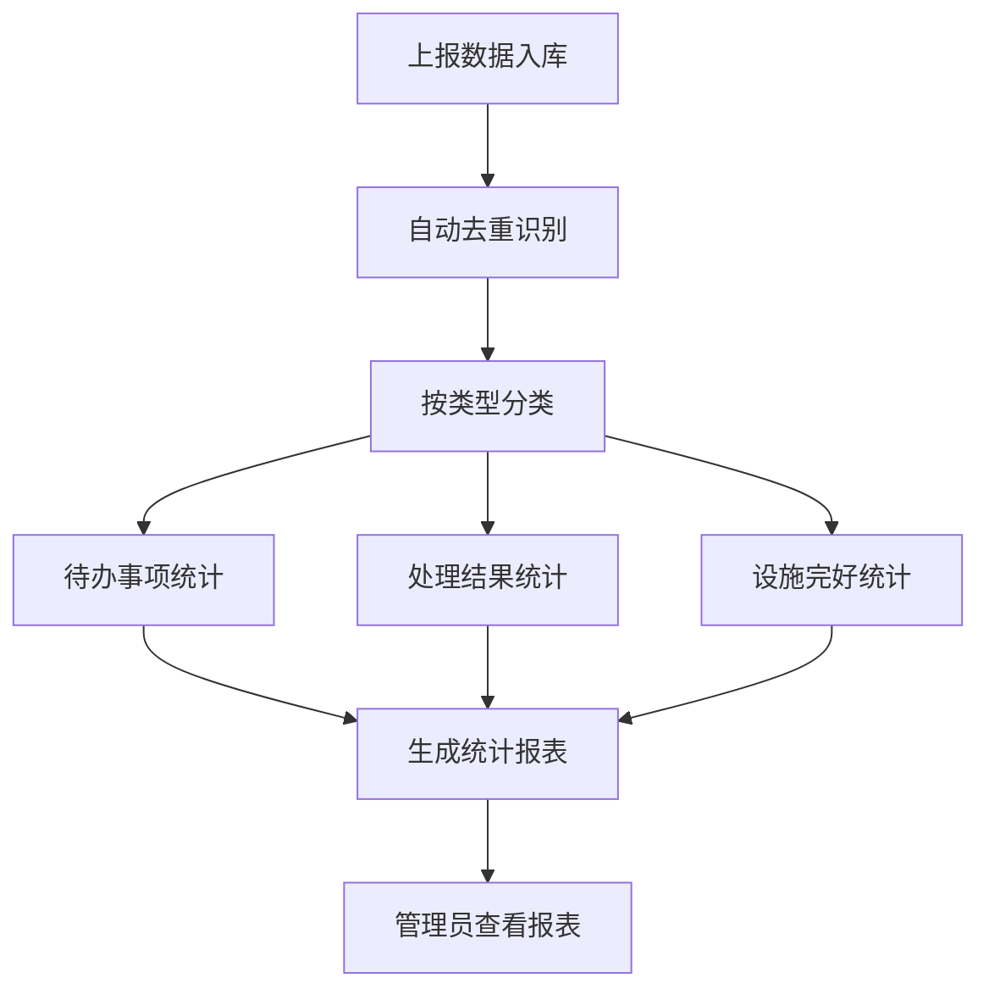
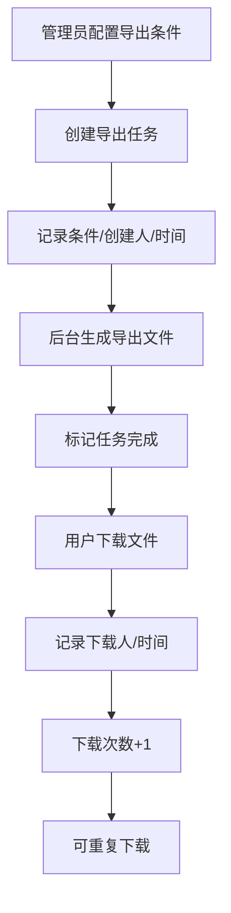

## 1. 产品概述

网格事件台是基于Next.js、Supabase、PostgreSQL和Tailwind CSS构建的居民议题台账管理系统，旨在提升社区治理效率，实现居民议题全生命周期管理。

- 主要目的：为社区网格管理员提供居民议题台账管理、投票组织、任务分配和数据统计能力，同时为居民代表提供便捷的议题参与渠道
- 解决问题：重复上报缺乏自动追踪、居民参与状态不透明、整改复查缺乏审计追踪、导出任务无历史记录等痛点
- 目标用户：社区网格管理员、居民代表、社区工作人员
- 产品价值：实现社区治理数字化，减少人工追问，提升响应效率，数据可追溯

## 2. 核心功能

### 2.1 用户角色

| 角色 | 登录方式 | 核心权限 |
|------|----------|----------|
| 居民代表 | 账号密码/手机验证码 | 参与议题投票、查看个人参与记录、查看议题状态 |
| 管理员 | 账号密码 | 居民台账管理、议题投票维护、整改复查管理、巡逻任务分配、数据统计、导出任务管理、系统设置 |

### 2.2 功能模块

1. **登录页**：角色选择、身份认证、权限路由
2. **居民代表首页**：待投票议题、已参与议题、个人参与状态统计
3. **议题投票页**：议题详情、投票选项、投票历史、参与居民列表
4. **管理后台首页**：数据概览、待办提醒、关键指标统计
5. **居民台账页**：居民信息列表、参与状态筛选、参与详情查看
6. **议题管理页**：议题创建编辑、投票设置、参与状态追踪
7. **整改复查页**：复查任务列表、状态流转、处理结果记录
8. **巡逻任务页**：任务分配、进度追踪、设施完好统计
9. **重复上报统计页**：待办事项、处理结果统计、设施完好率分析
10. **导出任务页**：导出条件配置、任务历史、下载记录追踪
11. **系统设置页**：操作日志、修改人记录、权限配置

### 2.3 页面详情

| 页面名称 | 模块名称 | 功能描述 |
|-----------|-------------|---------------------|
| 登录页 | 身份认证 | 角色切换、表单验证、错误提示、记住登录 |
| 居民代表首页 | 待办卡片 | 展示待投票议题数量、截止时间、快速参与入口 |
| 居民代表首页 | 参与统计 | 已投票数、参与率、议题类型分布 |
| 居民代表首页 | 历史记录 | 分页展示个人参与过的议题及投票结果 |
| 议题投票页 | 议题详情 | 议题标题、描述、发起时间、截止时间、发起人 |
| 议题投票页 | 投票区域 | 选项展示、投票提交、投票确认、结果展示 |
| 议题投票页 | 参与情况 | 居民参与列表、参与状态（已投票/未投票）、投票占比 |
| 管理后台首页 | 数据看板 | 居民总数、议题总数、待办任务、设施完好率 |
| 管理后台首页 | 待办提醒 | 待处理整改、待分配巡逻、即将截止投票 |
| 居民台账页 | 居民列表 | 分页、搜索、筛选（参与状态/片区/楼栋） |
| 居民台账页 | 参与状态 | 每位居民的参与次数、最近参与时间、参与率标签 |
| 居民台账页 | 详情弹窗 | 个人信息、参与历史、投票记录 |
| 议题管理页 | 议题列表 | 状态筛选（进行中/已结束/草稿）、批量操作 |
| 议题管理页 | 议题编辑 | 标题、描述、选项、起止时间、参与范围设置 |
| 整改复查页 | 任务列表 | 问题描述、整改状态、复查时间、负责人 |
| 整改复查页 | 状态流转 | 待整改→整改中→待复查→已完成/需返工 |
| 整改复查页 | 操作记录 | 每次状态变更记录修改人、时间、备注 |
| 巡逻任务页 | 任务列表 | 巡逻区域、时间、设施检查项、执行人 |
| 巡逻任务页 | 设施统计 | 设施类型、完好数量、损坏数量、完好率 |
| 重复上报统计页 | 待办统计 | 按类型、片区、紧急程度分类统计 |
| 重复上报统计页 | 处理结果 | 已解决/处理中/待处理数量、平均处理时长 |
| 重复上报统计页 | 设施完好统计 | 自动统计，无需人工追问，趋势图表 |
| 导出任务页 | 新建导出 | 选择数据类型、设置筛选条件、选择导出格式 |
| 导出任务页 | 任务历史 | 导出条件、发起时间、完成时间、下载次数 |
| 导出任务页 | 操作记录 | 记录下载人、下载时间，支持多次下载 |
| 系统设置页 | 操作日志 | 所有修改操作的审计追踪，包含修改人、时间、变更内容 |
| 系统设置页 | 维护配置 | 整改复查类型、议题投票模板、巡逻任务模板配置 |

## 3. 核心流程

### 3.1 居民投票流程
居民代表登录后查看待投票议题，选择议题查看详情，进行投票，系统记录投票结果并更新参与状态。

### 3.2 整改复查流程
管理员创建整改任务，分配负责人，负责人整改后提交复查，管理员复查通过或要求返工，全程记录操作人。

### 3.3 重复上报自动统计流程
系统自动汇总重复上报数据，分类统计待办、处理结果和设施完好情况，无需人工追问。

### 3.4 导出任务流程
管理员配置导出条件，系统异步生成文件，记录导出历史，支持多次下载并统计下载次数。

## 4. 用户界面设计

### 4.1 设计风格
- **主色调**：深邃藏青 `#1e3a5f`，体现专业稳重的政务风格
- **辅助色**：政务蓝 `#2563eb`、成功绿 `#10b981`、警示橙 `#f59e0b`、危险红 `#ef4444`
- **中性色**：层次分明的灰色系，从 `#f8fafc` 到 `#1e293b`
- **按钮风格**：直角微圆角（4px），轻微阴影，hover时上移1px，点击时下沉效果
- **字体**：标题使用"Noto Serif SC"宋体类衬线字体体现正式感，正文使用"PingFang SC"无衬线字体保证可读性
- **布局风格**：左右分栏布局，左侧固定侧边导航，右侧内容区卡片式布局，强调数据层级
- **图标风格**：使用Phosphor Icons线性图标，统一20px尺寸，保持简洁专业

### 4.2 页面设计概述

| 页面名称 | 模块名称 | UI元素 |
|-----------|-------------|-------------|
| 登录页 | 登录表单 | 深色渐变背景，居中卡片，角色切换标签，底部渐变装饰条 |
| 居民代表首页 | 统计卡片 | 交错排列的彩色统计卡片，悬停放大动画，底部进度条 |
| 居民代表首页 | 议题列表 | 横向时间轴布局，状态标签着色区分，投票按钮微动画 |
| 议题投票页 | 投票区域 | 选项卡片选中效果，进度条实时更新，提交按钮涟漪动画 |
| 管理后台首页 | 数据看板 | 大数字展示，趋势迷你图，状态卡片带渐变边框 |
| 管理后台首页 | 待办提醒 | 竖向时间线，新事项红点闪烁，点击展开详情 |
| 居民台账页 | 居民列表 | 表格斑马纹，参与状态彩色标签，行悬停背景高亮 |
| 居民台账页 | 筛选区域 | 标签式筛选器，联动效果，搜索框带清除按钮 |
| 议题管理页 | 议题列表 | 卡片网格布局，进度环展示投票进度，状态角标 |
| 整改复查页 | 任务流转 | 步骤条展示当前状态，操作按钮组，修改记录折叠面板 |
| 巡逻任务页 | 设施统计 | 环形图、柱状图组合，数据卡片带图标，颜色分区 |
| 重复上报统计页 | 统计面板 | 三栏布局（待办/处理/设施），数据可钻取，趋势线图 |
| 导出任务页 | 任务列表 | 状态徽章，进度条，下载按钮带计数，条件折叠展示 |
| 系统设置页 | 操作日志 | 时间轴布局，修改内容高亮对比，筛选追溯 |

### 4.3 响应式
- **设计原则**：桌面优先（1440px基准），自适应平板和移动端
- **断点设置**：lg(1024px)、md(768px)、sm(640px)
- **桌面端**：左侧260px固定导航，右侧内容区最大1200px居中
- **平板端**：导航可折叠为图标栏，表格可横向滚动
- **移动端**：导航转为底部Tab，表格改为卡片列表，图表简化展示

### 4.4 交互与动效
- **页面加载**：内容区从下往上渐入， staggered 延迟100ms
- **卡片悬停**：上移2px，阴影加深，边框颜色微变
- **按钮点击**：scale(0.97) 回弹效果
- **状态变更**：颜色过渡动画300ms，数字变化滚动效果
- **数据更新**：新数据从右侧滑入，背景色闪烁提示
