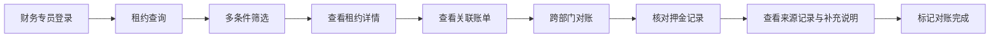
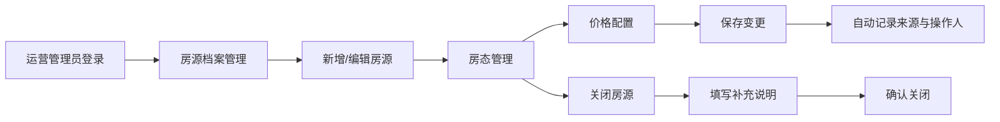
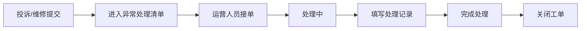

## 1. 产品概述

联合办公房源管理台是一套面向联合办公空间运营的全栈式管理系统，涵盖前台业务办理与后台运营管理两大场景，服务财务专员、运营人员及跨部门对账人员。

- 解决问题：统一管理房源档案、租约账单、房态价格、维修投诉等核心业务数据，实现数据可查、可筛、可追踪、可导出
- 目标用户：财务专员、运营管理员、跨部门对账人员
- 市场价值：提升联合办公空间运营效率，确保数据来源可追溯，规范异常处理流程

## 2. 核心功能

### 2.1 用户角色

| 角色 | 登录方式 | 核心权限 |
|------|----------|----------|
| 财务专员 | 账号密码登录 | 租约查询、账单管理、对账、数据导出、押金记录查看 |
| 运营管理员 | 账号密码登录 | 房源档案管理、房态管理、价格管理、维修投诉处理、系统配置 |
| 跨部门对账人员 | 账号密码登录 | 押金记录查看、房态价格核对、房源档案查阅、来源记录追踪 |

### 2.2 功能模块

1. **前台工作台**：租约查询、账单管理、押金记录、数据导出
2. **后台管理台**：房源档案、房态管理、价格管理、维修投诉处理清单
3. **数据中心**：来源记录追踪、补充说明、操作日志
4. **异常处理**：维修投诉清单、长租公寓关闭补充说明

### 2.3 页面详情

| 页面名称 | 模块名称 | 功能描述 |
|----------|----------|----------|
| 登录页 | 登录模块 | 账号密码登录、记住密码、响应式布局 |
| 工作台首页 | 数据概览 | 今日房源状态统计、待处理账单、待处理投诉、关键指标卡片 |
| 租约查询页 | 租约列表 | 多条件筛选、分页、详情查看、来源记录追溯 |
| 账单管理页 | 账单列表 | 账单查询、状态筛选、导出、对账标记、补充说明 |
| 押金记录页 | 押金管理 | 押金查询、对账、来源记录、补充说明 |
| 房源档案页 | 房源管理 | 房源列表、新增/编辑/详情、房态价格记录、来源追踪 |
| 房态管理页 | 房态看板 | 日历视图、房态变更、批量操作、历史记录 |
| 价格管理页 | 价格配置 | 价格方案、时段定价、价格历史、来源记录 |
| 维修投诉页 | 异常清单 | 投诉/维修列表、状态流转、处理记录、关闭补充说明 |
| 数据导出页 | 导出中心 | 多维度导出、导出记录、下载管理 |
| 系统设置页 | 基础配置 | 用户管理、权限配置、字典管理 |

## 3. 核心流程

### 3.1 租约查询与对账流程

财务专员登录系统后，进入租约查询页面，通过房源、客户、时间等多维度筛选租约，查看租约详情及关联账单。进行跨部门对账时，可查看押金记录的来源记录与补充说明，确认无误后标记对账完成。

### 3.2 房态与价格管理流程

运营管理员维护房源基础档案，设置房间状态（空置、已租、维修中、已关闭等），配置不同时段的价格方案。所有变更操作均保留来源记录，长租公寓关闭时需填写补充说明。

### 3.3 维修投诉处理流程

维修投诉类异常独立进入处理清单，支持状态流转（待处理、处理中、已完成、已关闭），处理过程记录完整处理轨迹。

## 4. 用户界面设计

### 4.1 设计风格

- **主色调**：深蓝 #1976d2（Material UI 标准色），体现专业稳重的企业级管理系统气质
- **辅助色**：青绿色 #00bcd4 用于强调操作，橙色 #ff9800 用于警示提示
- **按钮风格**：Material Design 风格，圆角 4px，包含悬浮、点击、禁用等状态
- **字体**：思源黑体（Source Han Sans）中文显示，Roboto 英文数字，搭配清晰的字体层级
- **布局风格**：左侧导航 + 顶部工具栏 + 主内容区的经典后台管理布局
- **图标风格**：Material Icons 官方图标库，保持一致的视觉风格

### 4.2 页面设计概览

| 页面名称 | 模块名称 | UI 元素 |
|----------|----------|---------|
| 登录页 | 登录表单 | 居中卡片布局、品牌标识、输入框、登录按钮、移动端适配 |
| 工作台首页 | 数据概览 | 统计卡片网格、快捷入口、待办列表、趋势图表 |
| 列表页通用 | 列表布局 | 顶部筛选栏、数据表格、分页器、操作列、详情抽屉 |
| 详情页 | 详情展示 | 标签页布局、基础信息、关联数据、操作日志、来源记录 |
| 表单页 | 表单布局 | 分组字段、必填标记、验证提示、提交/取消按钮 |

### 4.3 响应式设计

- **桌面优先**：以 1440px 宽度为基准设计，适配 1280px 至 1920px 屏幕
- **平板适配**：1024px 以下左侧导航可折叠，表格支持横向滚动
- **手机适配**：768px 以下导航转为底部 Tab 或抽屉式，列表改为卡片式布局
- **触摸优化**：移动端按钮尺寸不小于 44x44px，表单输入框适配软键盘
- **核心功能移动端可用**：查询、填写、提交三类核心操作在手机上流畅完成

### 4.4 数据可视化

- 使用 Material UI 图表组件展示房源状态分布、账单趋势
- 房态日历视图支持月份切换，不同状态以色块区分
- 关键指标卡片带有同比/环比趋势箭头
