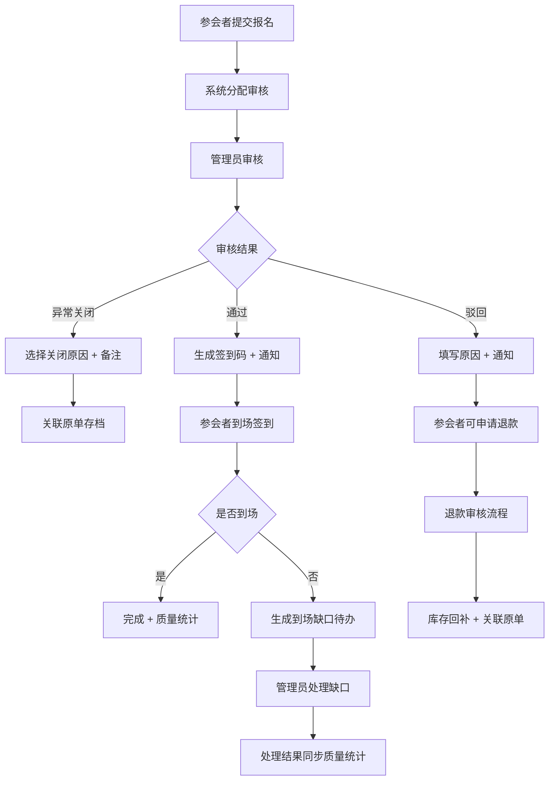

## 1. 产品概述
行业峰会报名审核台是面向票务运营团队的一站式报名管理系统，解决大型峰会报名审核、嘉宾管理、签到退款、质量统计全链路问题。
- 面向参会者：在线提交报名资料、选择票种、查询审核状态
- 面向运营管理员：审核身份、管理嘉宾名额、生成签到码、处理退款、发送通知、统计报名质量
- 核心价值：提升审核效率，降低人工追问成本，数据驱动报名质量优化

## 2. 核心功能

### 2.1 用户角色
| 角色 | 登录方式 | 核心权限 |
|------|---------|---------|
| 参会者 | 手机号/邮箱 | 提交报名、查询状态、申请退款、查看签到码 |
| 运营管理员 | 账号密码 | 全部功能：审核、嘉宾管理、签到、退款、通知、统计 |
| 超级管理员 | 账号密码 | 运营权限 + 账号管理、系统配置 |

### 2.2 功能模块
1. **参会者报名页**：资料填写、票种选择、场次座位选择、提交报名
2. **参会者状态查询页**：审核进度、签到码、退款申请入口
3. **管理端总览仪表板**：核心指标、待办事项、实时统计
4. **报名审核工作台**：报名列表、审核详情、身份验证、审核操作、异常关闭原因记录
5. **嘉宾名额管理**：嘉宾票配额、分配记录、优先级标记
6. **票种库存管理**：票种配置、库存维护、价格策略、停售/开售
7. **座位场次管理**：场次配置、座位图、分区管理、与报名质量关联
8. **签到码管理**：批量生成、下载导出、核销记录
9. **退款申请中心**：退款列表、审核流程、退款执行、关联原单
10. **通知中心**：邮件/短信模板、批量发送、发送记录
11. **报名质量统计**：多维度分析、来源质量、转化漏斗、ROI指标
12. **到场缺口待办**：未到场预警、补位建议、处理记录、与质量统计联动
13. **异常关闭复盘**：关闭原因分类、原单追溯、统计分析

### 2.3 页面详情
| 页面名称 | 模块名称 | 功能描述 |
|---------|---------|---------|
| 报名提交页 | 资料表单 | 姓名、公司、职位、手机、邮箱、身份证、发票信息 |
| 报名提交页 | 票种选择 | 普通票/VIP票/嘉宾票展示、价格、剩余库存、说明 |
| 报名提交页 | 场次座位 | 场次日历、座位区域图、选座交互 |
| 状态查询页 | 进度追踪 | 审核状态流、当前步骤、预计时间 |
| 状态查询页 | 签到码 | 二维码展示、下载、核销状态 |
| 状态查询页 | 退款申请 | 退款原因选择、金额明细、提交申请 |
| 管理端仪表板 | KPI卡片 | 总报名数、通过数、到场数、退款率、完成率 |
| 管理端仪表板 | 待办事项 | 待审核、待退款、到场缺口、异常处理 |
| 管理端仪表板 | 实时图表 | 报名趋势、票种分布、渠道来源、到场率 |
| 审核工作台 | 报名列表 | 搜索/筛选/批量操作、状态标签 |
| 审核工作台 | 审核详情 | 报名资料、身份核验、操作记录、审核按钮 |
| 审核工作台 | 异常关闭 | 原因选择器、备注输入、关联原单记录 |
| 嘉宾管理 | 配额管理 | 各嘉宾票数、已分配、剩余、优先级 |
| 嘉宾管理 | 分配记录 | 分配历史、操作人、时间、备注 |
| 票种管理 | 票种列表 | 票种卡片、库存条、价格、状态开关 |
| 票种管理 | 库存维护 | 库存调整、预警值、售罄自动停售 |
| 座位管理 | 场次配置 | 场次时间、容量、状态、关联质量权重 |
| 座位管理 | 座位图 | 可视化座位、区域定价、选座状态 |
| 签到码管理 | 生成中心 | 批量生成、自定义规则、导出PDF/Excel |
| 签到码管理 | 核销记录 | 扫码记录、时间、地点、操作人 |
| 退款中心 | 申请列表 | 待处理/已处理、金额、退款方式 |
| 退款中心 | 退款审核 | 资料核对、审批、执行退款、关联原单 |
| 通知中心 | 模板管理 | 邮件/短信模板、变量占位、预览 |
| 通知中心 | 批量发送 | 人群筛选、发送计划、发送记录 |
| 质量统计 | 多维度报表 | 渠道质量、公司级别、职位分布、地域分布 |
| 质量统计 | 转化漏斗 | 曝光→点击→提交→审核→缴费→到场 |
| 质量统计 | ROI分析 | 各渠道投入产出、获客成本 |
| 到场缺口 | 缺口预警 | 未确认、待到场、已缺席清单 |
| 到场缺口 | 补位建议 | 根据质量评分推荐补位候选人 |
| 到场缺口 | 处理记录 | 处理人、处理结果、与质量统计联动 |
| 异常复盘 | 原因分析 | 关闭原因分类统计、趋势图 |
| 异常复盘 | 原单追溯 | 按条件搜索、查看完整原单链路 |

## 3. 核心流程

### 3.1 参会者报名流程
参会者打开报名页 → 选择场次/座位 → 选择票种 → 填写报名资料 → 确认订单 → 在线支付(如需) → 提交审核 → 等待通知 → 查询状态 → 审核通过后获取签到码 → 到场签到

### 3.2 报名审核流程
管理员登录 → 审核工作台 → 查看待审列表 → 打开详情 → 核验身份资料 → 通过/驳回/异常关闭 → 填写审核意见(异常关闭必须选原因) → 自动发送通知 → 更新报名状态

### 3.3 退款处理流程
参会者申请退款 → 管理员收到待办 → 打开退款详情 → 核对原单和支付记录 → 同意/驳回 → 执行退款操作 → 发送通知 → 库存自动回补 → 记录关联原单

### 3.4 到场缺口处理流程
系统自动识别未确认/未到场 → 生成缺口待办 → 推送至管理员工作台 → 查看缺口详情和质量评分 → 执行补位/关闭名额/联系参会者 → 记录处理结果 → 同步至质量统计

## 4. 用户界面设计

### 4.1 设计风格
- 主色：深海蓝 #1e3a8a（专业可靠）
- 辅助色：翡翠绿 #059669（通过/正向）、琥珀橙 #d97706（待办/警告）、玫瑰红 #e11d48（拒绝/退款）
- 中性色：石板灰系列（文字、背景、边框）
- 按钮风格：Material Design 圆角按钮，圆角 8px，涟漪动效
- 字体：Noto Sans SC（思源黑体），标题 24-32px，正文 14-16px，辅助 12px
- 布局风格：左侧导航 + 顶部操作栏 + 内容卡片区，Material Design 规范
- 图标：Material Icons，线性风格，统一尺寸

### 4.2 页面设计概览
| 页面名称 | 模块名称 | UI 元素 |
|---------|---------|---------|
| 报名提交页 | 顶部横幅 | 峰会品牌海报、渐变色背景、倒计时 |
| 报名提交页 | 表单卡片 | 分组卡片、步骤指示器、浮动标签输入框 |
| 报名提交页 | 票种选择 | 横向卡片列表、选中高亮、库存进度条 |
| 状态查询页 | 进度条 | 水平步骤流、当前步骤脉冲动画 |
| 状态查询页 | 签到码 | 大尺寸二维码、背景光晕、下载按钮 |
| 管理端仪表板 | KPI区 | 统计卡片带趋势箭头、渐变背景、悬停抬升 |
| 管理端仪表板 | 图表区 | ECharts 折线图/饼图/柱状图、网格布局 |
| 管理端仪表板 | 待办区 | 数字徽标、时间轴、优先级色标 |
| 审核工作台 | 列表区 | 密度可调表格、状态彩色Chip、行悬停操作 |
| 审核工作台 | 侧滑详情 | 右侧抽屉、标签页、操作栏吸底 |
| 审核工作台 | 异常关闭弹窗 | 原因下拉必填、备注文本域、确认二次校验 |
| 嘉宾管理 | 配额卡片 | 圆形进度环、分配历史时间线 |
| 票种管理 | 库存卡片 | 库存环形进度、预警阈值红线、状态开关 |
| 座位管理 | 座位图 | SVG可视化、分区颜色、已选/锁定/可选状态 |
| 质量统计 | 报表 | 多维筛选器、可下钻表格、导出按钮 |
| 到场缺口 | 待办卡片 | 缺口人数大数字、补位建议列表、快捷操作 |

### 4.3 响应式设计
- 桌面端优先（1440px基准），管理端自适应 1280-1920px
- 参会者报名页适配平板（768px）和手机（375px）
- 管理端小屏自动折叠侧栏为图标模式
- 表格在移动端转为卡片列表展示
- 触控优化：按钮最小 44px 触控区

### 4.4 数据可视化指引
- 报名趋势：双轴折线图（报名数 vs 审核通过数）
- 票种分布：环形图带中心总数
- 渠道质量：气泡图（气泡大小=人数，X轴=转化率，Y轴=到场率）
- 转化漏斗：梯形漏斗图带各环节流失率
- 关闭原因：堆叠柱状图按周/月趋势
