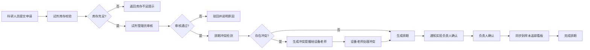

## 1. 产品概述
试剂库存使用排期系统是面向科研实验室的全流程试剂管理平台，解决试剂领用、排期冲突、安全合规、设备维保等核心问题。
- 核心用户：试剂管理员、设备老师、实验负责人、科研人员
- 核心价值：提升试剂使用效率，消除排期冲突，保障安全合规，实现全链路可追溯

## 2. 核心特性

### 2.1 用户角色

| 角色 | 登录方式 | 核心权限 |
|------|----------|----------|
| 试剂管理员 | 账号密码登录 | 试剂全生命周期管理、排期审核、配置管理、安全合规看板 |
| 设备老师 | 账号密码登录 | 设备预约管理、冲突提醒处理、维保记录管理 |
| 实验负责人 | 账号密码登录 | 领用申请确认、样本追踪看板、业务通知查询 |
| 科研人员 | 账号密码登录 | 提交领用申请、查看排期状态、查看个人申请记录 |

### 2.2 功能模块

1. **首页仪表板**：关键指标概览、待办事项、近期排期、安全告警
2. **领用申请**：申请提交、申请列表、申请详情、状态追踪
3. **排期管理**：排期日历、冲突检测、排期调整、批量安排
4. **安全合规看板**：合规状态总览、危化品监控、过期预警、违规记录
5. **配置中心**：试剂批次管理、危化标签配置、维保问题配置、操作审计
6. **通知中心**：业务通知列表、支付/通知失败记录、消息重试
7. **样本追踪看板**：样本流转状态、试剂使用关联、全链路追溯

### 2.3 页面详情

| 页面名称 | 模块名称 | 功能描述 |
|----------|----------|----------|
| 首页仪表板 | 概览卡片 | 展示库存总量、待审核申请、今日排期、安全告警数 |
| 首页仪表板 | 待办事项 | 列出待处理的申请、冲突、确认事项 |
| 首页仪表板 | 近期排期 | 日历视图展示近7天排期安排 |
| 领用申请 | 申请列表 | 分页展示所有申请，支持多条件筛选 |
| 领用申请 | 新建申请 | 试剂选择、用量填写、用途说明、附件上传 |
| 领用申请 | 申请详情 | 展示完整申请信息、审批流、操作记录 |
| 排期管理 | 排期日历 | 月/周/日视图，拖拽调整排期 |
| 排期管理 | 冲突检测 | 实时检测库存不足、时间重叠、设备占用冲突 |
| 排期管理 | 冲突处理 | 冲突详情展示、解决方案建议、一键处理 |
| 安全合规 | 合规看板 | 整体合规率、危化品分布、过期预警趋势 |
| 安全合规 | 危化监控 | 危化品库存、使用记录、存储位置 |
| 配置中心 | 试剂批次 | 批次录入、库存调整、过期管理 |
| 配置中心 | 危化标签 | 标签配置、分类管理、安全说明 |
| 配置中心 | 维保配置 | 维保问题模板、设备维保计划 |
| 配置中心 | 操作审计 | 所有配置修改记录、修改人、修改时间 |
| 通知中心 | 通知列表 | 所有业务通知、状态筛选 |
| 通知中心 | 失败记录 | 通知/支付失败记录、失败原因、重试操作 |
| 样本追踪 | 追踪看板 | 样本全生命周期流转展示 |
| 样本追踪 | 关联查询 | 试剂-样本-实验关联关系图 |

## 3. 核心流程

### 3.1 领用申请流程

### 3.2 配置变更流程

## 4. 用户界面设计

### 4.1 设计风格
- **主色调**：深海蓝 (#165DFF) - 专业、可信赖
- **辅助色**：翡翠绿 (#00B42A) 表示正常/通过，珊瑚橙 (#FF7D00) 表示警告，朱砂红 (#F53F3F) 表示危险/冲突
- **中性色**：深灰 (#1D2129) 正文，中灰 (#4E5969) 次要文字，浅灰 (#C9CDD4) 边框，极浅灰 (#F2F3F5) 背景
- **按钮风格**：圆角 6px，主按钮有轻微阴影，hover 状态有明度变化
- **字体**：标题使用 Noto Sans SC Bold，正文使用 Noto Sans SC Regular
- **布局风格**：左侧导航栏 + 顶部工具栏 + 内容区卡片式布局
- **图标风格**：线性图标，统一 16px/20px 尺寸

### 4.2 页面设计概览

| 页面名称 | 模块名称 | UI 元素 |
|----------|----------|----------|
| 首页仪表板 | 概览卡片 | 渐变背景卡片，大号数字，趋势箭头，悬浮动效 |
| 首页仪表板 | 排期日历 | 色块标记不同状态，hover 显示详情，点击展开 |
| 领用申请 | 申请列表 | 斑马纹表格，状态标签，快捷操作按钮 |
| 领用申请 | 新建表单 | 分组表单，分步引导，实时校验 |
| 排期管理 | 冲突提示 | 红色高亮闪烁，冲突连接线，弹窗详情 |
| 安全合规 | 监控看板 | 环形进度图，热力图，风险等级色阶 |
| 配置中心 | 操作审计 | 时间轴样式，差异对比高亮 |
| 通知中心 | 失败记录 | 红色状态标签，重试按钮，错误详情展开 |
| 样本追踪 | 关联图谱 | 节点连线图，可缩放，点击高亮路径 |

### 4.3 响应式
- 桌面优先设计，最小支持 1280px 宽度
- 平板适配：导航栏收起为图标模式，卡片自适应换行
- 移动端：底部 Tab 导航，列表改为卡片堆叠

## 5. 非功能需求

### 5.1 性能要求
- 页面首屏加载 < 2s
- 排期冲突检测响应 < 500ms
- 支持 1000+ 条排期数据流畅渲染

### 5.2 安全要求
- 所有接口需 Token 鉴权
- 操作日志不可篡改
- 危化品相关操作需二次确认

### 5.3 可用性要求
- 关键操作提供撤销机制
- 表单数据自动暂存
- 支持键盘快捷键操作
