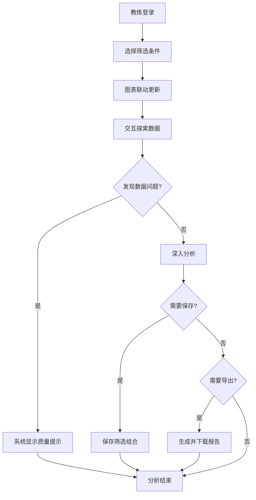

## 1. 产品概述

运动训练负荷可视化仪表盘是面向专业体能教练团队的数据分析平台，将多源训练数据（训练计划、心率、配速、力量测试、恢复评分、伤病记录）整合为可交互探索的可视化界面。系统支持多维度比较分析、权限分级访问、数据质量监控，帮助教练团队科学决策，优化训练方案，预防运动损伤。

核心价值：打破数据孤岛，实现训练负荷的全维度可视化；通过智能筛选和图表联动，快速定位训练问题；分级权限保护敏感伤病信息；完善的数据质量保障机制确保决策可靠。

## 2. 核心功能

### 2.1 用户角色

| 角色 | 登录方式 | 核心权限 |
|------|----------|----------|
| 教练组 | 账号密码登录 | 查看所有队员数据、访问伤病备注、管理筛选组合、导出报告、管理队员信息 |
| 队员 | 账号密码登录 | 仅查看本人数据、无法访问伤病备注、保存个人筛选组合 |

### 2.2 功能模块

1. **仪表盘主页**：综合概览、核心指标卡片、负荷趋势概览
2. **负荷分析页**：负荷曲线图表、多维度筛选面板、时间窗口切换
3. **对比分析页**：队员/项目/动作横向对比、雷达图、柱状图对比
4. **恢复监测页**：恢复评分趋势、疲劳累积分析、预警提示
5. **伤病管理页**（教练组可见）：伤病记录时间线、备注详情、关联训练分析
6. **报告中心**：筛选组合管理、报告模板、导出下载

### 2.3 页面详情

| 页面名称 | 模块名称 | 功能描述 |
|----------|----------|----------|
| 仪表盘主页 | 顶部筛选栏 | 队员选择、项目选择、训练日范围、动作筛选、指标选择 |
| 仪表盘主页 | 核心指标卡片 | 总训练量、平均心率、峰值配速、力量水平、恢复评分均值、样本量提示 |
| 仪表盘主页 | 负荷曲线区 | 多指标叠加趋势图、时间窗口切换（日/周/月/自定义）、悬停详情 |
| 仪表盘主页 | 个人雷达图 | 六维能力雷达图（力量/耐力/速度/柔韧/恢复/负荷）、多人对比模式 |
| 仪表盘主页 | 恢复趋势区 | 恢复评分折线图、疲劳预警阈值线、异常数据标记 |
| 对比分析页 | 训练对比图表 | 多队员/多项目柱状图、堆叠面积图、数据表格 |
| 对比分析页 | 筛选组合管理 | 保存当前筛选条件、加载已存组合、删除组合、设为默认 |
| 数据质量模块 | 数据状态提示 | 数据更新失败告警、字段缺失提示、空数据状态、可追溯明细链接 |
| 报告中心 | 报告导出 | PDF/Excel导出、包含当前筛选状态、图表快照、数据明细 |

## 3. 核心流程

### 3.1 教练分析训练数据流程

教练登录系统后，首先在顶部筛选栏选择分析范围（队员、项目、时间），仪表盘实时联动更新所有图表。通过悬停查看数据详情，切换时间窗口观察不同周期趋势，使用对比功能横向比较多名队员表现。发现异常数据时，系统自动提示数据质量问题。分析完成后可保存筛选组合便于下次快速访问，或导出完整报告存档。

### 3.2 队员查看个人数据流程

队员登录后系统自动过滤为仅展示本人数据，可查看训练负荷曲线、恢复趋势、个人能力雷达图，但伤病区域显示无权限提示。队员可调整时间窗口和指标筛选，保存个人常用筛选条件。

## 4. 用户界面设计

### 4.1 设计风格

- **主色调**：深邃藏蓝 (#0F172A) 作为主背景，搭配科技感青蓝 (#38BDF8) 作为主强调色
- **辅助色**：活力橙 (#F97316) 用于预警标记，健康绿 (#10B981) 表示正常状态，警示红 (#EF4444) 标记伤病和严重异常
- **中性色**：多层次灰度构建信息层级，确保数据可读性
- **按钮风格**：圆角8px，微妙悬浮效果，主按钮使用渐变青蓝
- **字体**：标题使用 Space Grotesk 粗体，数据展示使用 JetBrains Mono 等宽字体，正文使用 Inter 保证可读性
- **布局风格**：模块化卡片布局，精细边框和微妙阴影，数据密度适中
- **图标风格**：线性简约图标，统一2px描边，配合数据可视化使用

### 4.2 页面设计概览

| 页面名称 | 模块名称 | UI 元素 |
|----------|----------|---------|
| 仪表盘主页 | 顶部筛选栏 | 深色背景、下拉选择器、日期范围选择器、标签式指标切换、保存筛选按钮 |
| 仪表盘主页 | 指标卡片组 | 半透明玻璃态卡片、数据大字展示、趋势小箭头、样本量微提示 |
| 仪表盘主页 | 负荷曲线区 | 大面积图表容器、时间窗口切换标签、图例交互、悬停数据浮层 |
| 仪表盘主页 | 雷达图区 | 对称布局、多人对比时彩色区分、可点击维度详情 |
| 仪表盘主页 | 恢复趋势区 | 面积图、阈值虚线标记、异常点高亮闪烁 |
| 数据质量提示 | 告警横幅 | 顶部滑入、颜色区分严重程度、可展开查看详情、一键刷新按钮 |
| 空数据状态 | 空状态占位 | 简约矢量插图、友好提示文案、引导操作按钮 |

### 4.3 响应式

桌面端优先设计，支持1280px以上分辨率最佳体验。平板端采用自适应网格布局，图表堆叠展示。移动端简化为核心指标卡片和单图滚动查看模式，筛选功能收至侧边抽屉。

### 4.4 动效设计

- 页面加载：指标卡片依次淡入上移，图表从左向右渐进绘制
- 筛选变化：数据平滑过渡动画，避免生硬跳变
- 悬停交互：卡片微妙上浮，图表数据点放大高亮
- 告警提示：顶部滑入动画，严重告警配合轻微呼吸动效
