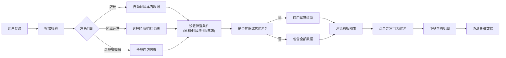

## 1. 产品概述

连锁茶饮原料损耗看板是一套面向茶饮连锁企业的运营数据分析系统，通过整合进货、领用、报损、盘点、销量及员工班次数据，帮助运营团队精准识别门店损耗差异、定位异常问题。

- **核心价值**：降低原料损耗成本、提升门店运营效率、辅助新品试营决策
- **目标用户**：门店店长、区域运营经理、总部数据分析人员

---

## 2. 核心功能

### 2.1 用户角色

| 角色 | 注册方式 | 核心权限 |
|------|----------|----------|
| 门店店长 | 企业账号分配 | 查看本店损耗数据、导出本店报表 |
| 区域运营 | 企业账号分配 | 横向对比区域内门店、查看异常排行、导出区域报表 |
| 总部管理员 | 企业账号分配 | 全部门店数据查看、口径配置、数据导入管理、用户权限管理 |

### 2.2 功能模块

1. **数据看板首页**：多维度筛选器、损耗率趋势图、异常门店排行、核心指标卡
2. **损耗明细下钻**：门店/原料/时段/班组维度的损耗明细、关联数据溯源
3. **数据管理中心**：数据导入、口径配置、试营原料标记管理
4. **报表导出中心**：自定义报表生成、导出记录管理、试营原料排除标记

### 2.3 页面详情

| 页面名称 | 模块名称 | 功能描述 |
|---------|----------|----------|
| 数据看板首页 | 多维筛选器 | 门店、原料分类、时段、班组、日期范围筛选；试营原料排除开关 |
| 数据看板首页 | 核心指标卡 | 总损耗率、损耗金额、异常门店数、试营原料占比 |
| 数据看板首页 | 损耗率趋势图 | 时间序列趋势对比，支持多门店叠加展示 |
| 数据看板首页 | 异常门店排行 | 按损耗率降序排列，标注试营原料影响，支持点击下钻 |
| 数据看板首页 | 原料损耗TOP榜 | 高损耗原料排行，区分常规/试营 |
| 损耗明细页 | 明细表格 | 分页展示损耗明细，支持多条件过滤排序 |
| 损耗明细页 | 数据溯源 | 点击单条记录查看关联的进货/领用/报损/盘点/销量/班次详情 |
| 数据管理页 | 数据导入 | 支持Excel/CSV批量导入，异步处理进度展示 |
| 数据管理页 | 口径配置 | 损耗率计算公式配置、异常阈值设置 |
| 数据管理页 | 试营管理 | 新品原料标记、试营时段配置 |
| 报表导出页 | 报表生成 | 自定义选择维度和指标，预览后导出 |
| 报表导出页 | 导出记录 | 历史导出列表下载，注明是否排除试营原料 |

---

## 3. 核心流程

### 3.1 数据查看流程

### 3.2 数据导入与聚合流程

---

## 4. 用户界面设计

### 4.1 设计风格

- **主色调**：深茶绿 `#2D5A27`（专业、可信）
- **辅助色**：琥珀橙 `#E67E22`（警示、异常标记）、暖金黄 `#F1C40F`（试营标记）
- **中性色**：深灰 `#2C3E50`、中灰 `#7F8C8D`、浅灰背景 `#F8F9FA`
- **按钮风格**：圆角4px，微阴影，hover态有轻微上浮效果
- **字体**：标题使用思源黑体（粗体），正文使用系统无衬线字体
- **布局风格**：卡片式布局，清晰的信息层级，数据可视化为主
- **图标风格**：线性简约图标，关键数据使用emoji增强辨识度（📊 🍵 ⚠️ 🆕）

### 4.2 页面设计概览

| 页面名称 | 模块名称 | UI元素 |
|---------|----------|--------|
| 数据看板首页 | 顶部导航 | 品牌Logo、用户角色标签、消息通知、个人中心下拉 |
| 数据看板首页 | 筛选栏 | 下拉选择器组、日期范围选择、试营排除开关（金黄色高亮） |
| 数据看板首页 | 指标卡区域 | 4张并排卡片，大数字+趋势箭头+环比变化百分比 |
| 数据看板首页 | 趋势图区域 | ECharts折线图，多系列对比，支持图例切换 |
| 数据看板首页 | 排行区域 | 左右分栏：左侧异常门店排行（带警告图标），右侧原料损耗TOP榜 |
| 损耗明细页 | 筛选工具栏 | 高级筛选、搜索框、列配置、导出按钮 |
| 损耗明细页 | 数据表格 | 斑马纹、悬停高亮、异常行背景色标记、分页器 |
| 损耗明细页 | 详情抽屉 | 右侧滑出面板，分Tab展示关联数据 |
| 数据管理页 | 导入区域 | 拖拽上传区、模板下载按钮、进度条 |
| 报表导出页 | 配置表单 | 分步式表单向导，实时预览缩略图 |

### 4.3 响应式设计

- **Desktop优先**：1920px为基准设计，支持1440px、1280px自适应
- **Tablet适配**：≥768px时图表单列排布，表格支持横向滚动
- **移动端**：≥375px时核心指标卡片堆叠展示，图表简化为静态图片预览

### 4.4 数据可视化规范

- **损耗率趋势**：折线图，Y轴为损耗率百分比，X轴为时间
- **异常排行**：横向柱状图，按损耗率降序，异常阈值用红色虚线标注
- **原料分布**：环形图，展示各原料分类损耗占比
- **班组对比**：分组柱状图，对比不同班次的损耗表现
- **试营标记**：所有涉及试营原料的数据点使用金黄色边框/背景，标注「🆕 试营」标签
