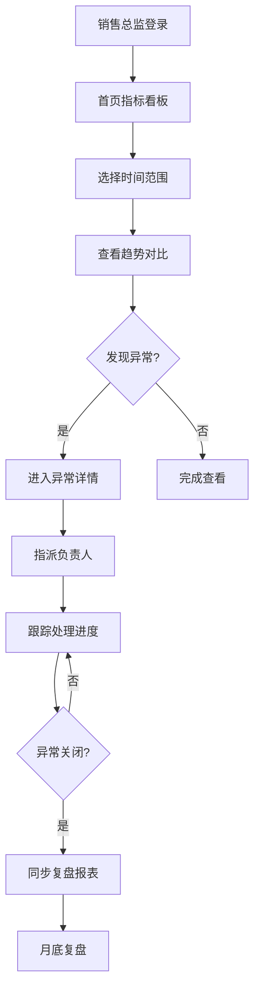

## 1. 产品概述

销售经营权限数据门户是面向销售团队的经营数据可视化与权限管理平台。以销售总监视角为核心，提供指标看板、异常监控、权限审批、告警管理等功能，帮助管理层快速洞察经营状况，同时通过精细化的权限控制确保数据安全合规。

- 核心用户：销售总监、供应链经理、数据管理员、业务负责人
- 核心价值：经营数据可视化、权限分级管控、异常主动预警、月底复盘支持

## 2. 核心功能

### 2.1 用户角色

| 角色 | 注册方式 | 核心权限 |
|------|----------|----------|
| 销售总监 | 管理员创建 | 查看全部经营指标、审批权限申请、查看异常波动报表 |
| 数据管理员 | 管理员创建 | 维护权限配置、数据脱敏规则、数据集权限 |
| 业务负责人 | 管理员创建 | 查看所辖数据集、处理告警待办、管理摘要推送 |
| 供应链经理 | 管理员创建 | 接收接口错误通知、处理供应链相关异常 |

### 2.2 功能模块

1. **总监首页**：核心指标看板、快速时间范围选择、趋势对比、异常概览
2. **权限管理**：权限申请审批、角色配置、数据脱敏规则
3. **数据集管理**：数据集权限分配、按负责人拆分待办
4. **告警中心**：告警规则配置、异常波动记录、待办处理
5. **复盘报表**：月底复盘报表、异常波动汇总、处理时效统计
6. **系统设置**：用户管理、角色管理、接口监控

### 2.3 页面详情

| 页面名称 | 模块名称 | 功能描述 |
|----------|----------|----------|
| 总监首页 | 核心指标区 | 展示销售额、订单量、客单价、毛利率等核心KPI，支持日/周/月切换 |
| 总监首页 | 趋势图表 | 展示指标趋势线，保留历史趋势对比，支持同比环比 |
| 总监首页 | 异常概览 | 待处理异常数、今日新增异常、高优先级异常快速入口 |
| 总监首页 | 时间选择器 | 预设快捷选项（今日、本周、本月、本季度）+ 自定义范围 |
| 权限管理 | 审批列表 | 待审批权限申请，支持通过/驳回，查看申请详情 |
| 权限管理 | 脱敏配置 | 字段级脱敏规则，支持手机号、金额、客户名称等脱敏 |
| 数据集管理 | 数据集列表 | 按业务线划分的数据集，配置查看权限 |
| 数据集管理 | 负责人待办 | 按负责人拆分待办事项，支持批量分配和转移 |
| 告警中心 | 告警规则 | 阈值配置、波动检测规则、通知方式设置 |
| 告警中心 | 异常波动 | 异常列表、可读原因、负责人、截止处理时间、处理状态 |
| 告警中心 | 摘要推送 | 每日/每周摘要推送配置，按负责人订阅 |
| 复盘报表 | 月度报表 | 月度经营总结、异常汇总、处理时效分析 |
| 复盘报表 | 异常详情 | 单条异常完整链路，从发现到关闭的全流程记录 |
| 系统设置 | 用户管理 | 用户增删改查、角色分配 |
| 系统设置 | 角色管理 | 角色权限配置、菜单权限、数据权限 |

## 3. 核心流程

### 3.1 销售总监日常查看流程
销售总监登录门户 → 查看首页核心指标 → 切换时间范围（今日/本周/本月）→ 查看趋势对比 → 发现异常 → 点击进入异常详情 → 指派负责人 → 跟踪处理进度

### 3.2 权限申请审批流程
业务负责人提交权限申请 → 数据管理员审核 → 销售总监审批 → 权限生效 → 同步脱敏规则

### 3.3 异常波动处理流程
系统检测指标异常 → 生成异常记录（含可读原因、负责人、截止时间）→ 推送待办给负责人 → 负责人处理 → 关闭异常 → 同步到月度复盘报表 → 月底汇总复盘

### 3.4 接口错误处理流程
接口调用失败 → 记录错误日志 → 触发告警 → 通知供应链经理 → 写入异常波动报表 → 关联月底复盘

## 4. 用户界面设计

### 4.1 设计风格

**设计定位：专业商务、数据驱动、清晰高效**

- **主色调**：深海蓝 (#0F3460) - 代表专业、信任、商务感
- **辅助色**：珊瑚橙 (#FF6B35) - 用于告警、强调、CTA按钮
- **成功色**：翡翠绿 (#2ECC71) - 正常状态、完成状态
- **警告色**：琥珀黄 (#F39C12) - 中等异常、待处理
- **危险色**：朱砂红 (#E74C3C) - 严重异常、错误
- **中性色**： slate 色系 - 文本、背景、边框

**字体选择**：
- 标题：Noto Sans SC - 700/600 字重，清晰有力
- 正文：Noto Sans SC - 400/500 字重，易读性强
- 数据数字：JetBrains Mono - 等宽字体，数字对齐

**布局风格**：
- 左侧导航 + 顶部标题栏 + 主内容区的经典布局
- 卡片式数据展示，卡片带轻微阴影和圆角
- 指标卡片采用网格布局，重要指标更大更醒目
- 图表区域与数据列表区域清晰分区

**交互特点**：
- 时间选择器采用快捷标签 + 日历的组合，减少操作路径
- 卡片悬停有轻微上浮和阴影加深效果
- 异常状态用颜色和图标双重编码
- 页面切换有平滑过渡动画

### 4.2 页面设计概览

| 页面名称 | 模块名称 | UI元素 |
|----------|----------|--------|
| 总监首页 | 顶部导航 | Logo、用户头像、消息通知、全局搜索 |
| 总监首页 | 侧边菜单 | 首页、权限管理、数据集、告警中心、复盘报表、设置 |
| 总监首页 | 时间选择区 | 快捷标签（今日/本周/本月/本季/自定义）、日期范围显示 |
| 总监首页 | 核心指标卡 | 4-6个大卡片，显示指标值、同比、环比、趋势小图 |
| 总监首页 | 趋势图区 | 主趋势折线图，支持多指标对比 |
| 总监首页 | 异常概览卡 | 待处理数、今日新增、高优先级、平均处理时长 |
| 权限管理 | 审批列表 | 表格展示，申请人、申请权限、状态、操作按钮 |
| 权限管理 | 脱敏配置 | 字段列表 + 脱敏方式选择（全脱敏/部分脱敏/不脱敏） |
| 告警中心 | 异常列表 | 卡片式列表，异常原因、负责人、截止时间、状态标签 |
| 告警中心 | 异常详情 | 异常描述、影响范围、历史数据图表、处理记录时间线 |
| 复盘报表 | 月度总览 | 关键指标汇总、异常分类统计、处理时效饼图 |
| 复盘报表 | 异常明细 | 可筛选的异常列表，支持导出 |

### 4.3 响应性

- 桌面端优先设计（1440px 基准）
- 平板端适配：侧边栏可收起，指标卡片自适应排列
- 移动端：底部导航 + 卡片单列布局，图表可横向滑动
- 触控优化：按钮最小 44px，重要操作位置在拇指可达区域

### 4.4 动效设计

- 页面入场：内容区从下向上淡入，延迟错开
- 指标卡加载：骨架屏 → 数据填充 → 数字滚动动画
- 悬停反馈：卡片上浮 2px，阴影加深
- 状态切换：平滑过渡动画，持续 200-300ms
- 异常告警：新异常出现时有脉冲提示动画
