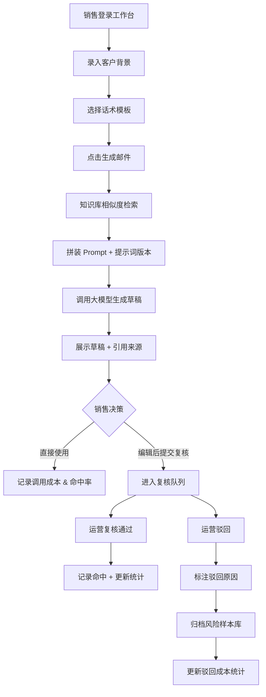

## 1. 产品概述

销售邮件知识检索助手是一套面向 B2B 销售团队的 AI 辅助系统，通过知识库 + 大模型生成的方式，帮助销售快速产出贴合客户背景的高质量邮件草稿，同时为销售运营提供全链路的内容治理、版本追踪与成本归因能力。

- 核心问题：销售写邮件效率低、话术不统一、无法追溯知识来源、运营难以量化 AI 调用效果与成本
- 目标用户：一线销售人员（生成端）、销售运营人员（管理端）、团队管理者（分析端）
- 产品价值：缩短邮件撰写周期 60%+，统一对外话术口径，沉淀组织知识资产，精细化核算 AI 调用成本

---

## 2. 核心功能

### 2.1 用户角色

| 角色 | 注册方式 | 核心权限 |
|------|----------|----------|
| 销售人员 | 企业账号 / SSO | 录入客户背景、生成邮件草稿、查阅引用来源、提交人工复核 |
| 销售运营 | 管理员分配 | 维护知识库条目、管理话术版本与提示词版本、复核邮件草稿、查看操作日志、管理风险样本 |
| 团队管理者 | 管理员分配 | 查看命中率统计、调用成本分析、驳回原因分布、版本效果对比 |

### 2.2 功能模块

1. **销售工作台**：客户背景录入区、邮件生成器、草稿列表、引用来源展示、复核提交
2. **知识库管理**：知识条目 CRUD、分类标签、引用来源关联、相似度检索预览
3. **话术与提示词版本中心**：话术模板版本管理、提示词（Prompt）版本管理、A/B 切换、灰度发布
4. **人工复核工作台**：待复核草稿队列、通过/驳回操作、驳回原因标注、修改痕迹对比
5. **风险样本库**：驳回样本归档、风险标签、样本检索、样本复用为负例
6. **统计分析看板**：命中率趋势、调用成本拆解（按运营/日期/驳回原因）、版本效果对比、TOP 话术
7. **操作日志中心**：全量操作审计、按人员/时间/操作类型筛选

### 2.3 页面详情

| 页面名称 | 模块名称 | 功能描述 |
|----------|----------|----------|
| 销售工作台 | 客户背景录入 | 多字段录入：客户行业、规模、痛点、沟通阶段、上次跟进记录 |
| 销售工作台 | 邮件生成器 | 话术模板选择、一键生成、重新生成、温度调节滑块 |
| 销售工作台 | 草稿详情 | 正文预览、引用来源悬浮展示、复制/导出、提交复核 |
| 知识库管理 | 条目列表 | 分页/搜索/分类筛选、批量导入、状态开关 |
| 知识库管理 | 条目编辑器 | 富文本编辑、来源链接、关联话术、版本历史 |
| 话术版本中心 | 模板列表 | 版本号、状态、启用/停用、灰度比例设置 |
| 话术版本中心 | 提示词版本 | Prompt 内容对比、Diff 视图、发布/回滚 |
| 复核工作台 | 草稿队列 | 待复核/已通过/已驳回 Tab、优先级排序 |
| 复核工作台 | 复核操作 | 一键通过、驳回原因下拉+备注、前后版本 Diff |
| 风险样本库 | 样本面板 | 风险标签筛选、样本详情、一键转为训练负例 |
| 统计看板 | 核心指标卡 | 总调用量、命中率、平均成本、驳回率 |
| 统计看板 | 成本拆解图表 | 多维度堆叠图：按销售运营人员、日期、驳回原因 |
| 统计看板 | 版本效果对比 | 折线图：各版本命中率/成本随时间变化 |
| 操作日志 | 审计列表 | 操作人、时间、操作类型、对象 ID、前后值快照 |

---

## 3. 核心流程

### 3.1 邮件生成主流程

销售人员登录系统后，在工作台录入客户背景信息（行业、规模、痛点、沟通阶段等），选择对应话术模板后点击"生成邮件"。系统从知识库检索 Top-K 相关条目，结合选中的提示词版本拼装 Prompt，调用大模型生成邮件草稿，并附带来源引用。销售可查看引用、微调内容后提交复核，或直接复制使用。

### 3.2 运营内容治理流程

销售运营定期维护知识库（新增/下架条目）、迭代话术版本和提示词版本，可设置灰度比例进行 A/B 测试。每日在复核工作台处理待审草稿，通过的草稿计入命中率统计，驳回的草稿标注原因后落入风险样本库，用于后续 Prompt 优化和模型微调。所有操作均记录操作日志。

---

## 4. 用户界面设计

### 4.1 设计风格

- **主色**：深海蓝 `#0B4F8C`（信任与专业），搭配琥珀金 `#D4A853`（高价值感点缀）
- **背景**：分层蓝灰渐变 + 微妙噪点纹理，避免纯白空洞感
- **卡片风格**：圆角 12px，精细描边 1px，多层级投影营造纵深感
- **按钮风格**：主按钮采用渐变填充 + 微立体浮雕效果，悬停时轻微上浮 + 发光
- **字体**：标题用 "Charter" 衬线体（经典商务感），正文用 "Inter Tight"（清晰紧致）
- **图标风格**：Phosphor Icons Thin 线性图标，辅以点状装饰元素
- **数据可视化**：采用半透明面积图 + 渐变折线，关键节点脉冲动画

### 4.2 页面设计概述

| 页面名称 | 模块名称 | UI 元素 |
|----------|----------|---------|
| 销售工作台 | 生成面板 | 分栏布局：左侧背景录入表单（浮动标签），右侧生成结果区（卡片式草稿 + 引用气泡），生成按钮带脉冲加载动画 |
| 知识库管理 | 条目列表 | 表格 + 卡片双视图切换，行悬停展开引用预览，状态标签彩色胶囊 |
| 话术版本中心 | 版本对比 | 左右分栏 Diff 视图，差异处高亮背景，顶部版本号时间轴 |
| 统计看板 | 核心指标 | 4 张大指标卡（带环比箭头 + 迷你趋势线），下方三栏图表区（堆叠面积图、热力图、散点气泡图） |
| 复核工作台 | 队列列表 | 左窄列表右宽详情，详情页上下对比 Diff，驳回原因为标签化选择器 |
| 操作日志 | 审计列表 | 时间轴布局，每个节点含头像、操作描述、前后值折叠面板 |

### 4.3 响应性

- Desktop 优先（1440px 基准设计），核心操作区最小 1024px 可用
- 管理类页面（知识库、版本中心、日志）采用左右分栏：左侧导航 240px 固定，右侧自适应
- 移动端（<768px）：导航折叠为底部 Tab 栏，表格转为卡片列表，图表纵向堆叠
- 表单类组件统一触摸热区 ≥ 44px，关键操作提供触觉反馈样式

### 4.4 交互与动效

- 页面入场：分模块错峰淡入（stagger 80ms），配合 Y 轴 12px 位移
- 生成按钮：点击后出现三点脉动加载动画，完成时按钮周围迸发光粒子
- 图表区：数据系列从左至右"绘制"动画（stroke-dashoffset），柱状图从 Y=0 弹起
- 复核操作：通过/驳回按钮带有颜色过渡 + 轻微缩放，驳回面板展开使用手风琴动画
- 导航切换：当前页左侧出现蓝色垂直指示条，平滑过渡到新位置
