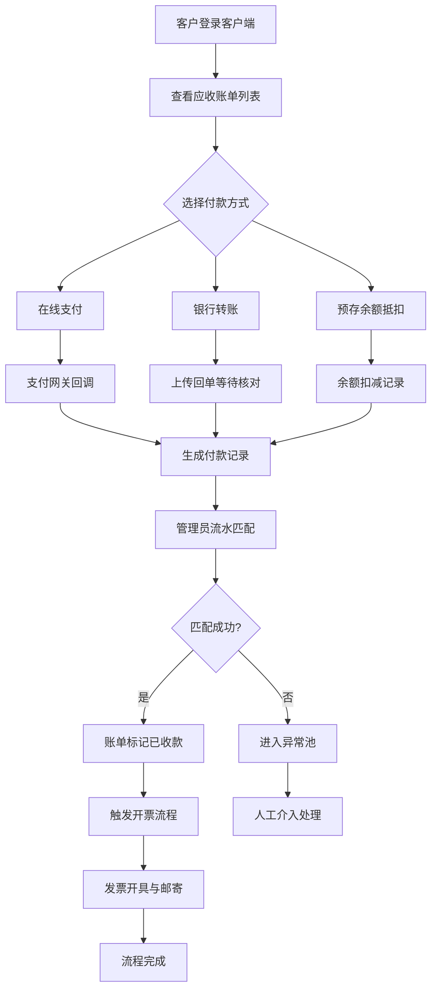

## 1. 产品概述

《青禾应收对账台》是一套面向订阅制企业的应收账单收款跟踪系统，解决订阅业务中账单生成、应收管理、流水匹配、回款跟踪的全链路问题。目标用户包括企业财务人员（管理端）和B端客户（客户端），通过FastAPI+HTMX架构提供高性能、低延迟的查询与操作体验，配合PostgreSQL存储核心数据、Redis承载高频查询缓存与实时统计。

产品核心价值：将分散的账单、流水、发票、预存数据统一管理，通过看板与自动化提醒缩短回款周期，通过流水智能匹配降低人工对账成本，通过现金流预测辅助经营决策。

## 2. 核心功能

### 2.1 用户角色

| 角色 | 注册方式 | 核心权限 |
|------|----------|----------|
| 管理员（财务/运营） | 后台开通 | 全量看板、流水匹配、订单对账、导出、异常处理、发票管理 |
| 普通用户（客户） | 邮箱+密码自助注册/邀请 | 查看应收账单、发起付款、申请发票、查看预存余额、下载对账明细 |

### 2.2 功能模块

1. **工作台首页**：今日待办、异常池、回款趋势图、现金预测概览
2. **应收账单列表**：优先级展示（发票申请状态、预存余额标签、现金预测标识）、筛选、批量操作
3. **账单处理详情**：附件上传、备注、修改历史、状态流转
4. **流水匹配管理**：银行流水导入、自动/手动匹配订单、匹配结果确认
5. **订单对账中心**：订单-账单-流水三方核对、差异标注、调整记录
6. **回款看板与提醒**：回款进度看板、逾期预警、自动邮件/站内提醒
7. **发票申请管理**：开票申请、发票信息校验、开票状态跟踪
8. **预存余额账户**：余额充值、消费明细、预存抵扣记录
9. **现金预测模块**：按周/月滚动现金流预测、应收账龄分析
10. **数据导出中心**：导出现金流报表、发票错误清单、最近变更记录
11. **客户端应收门户**：客户查看账单、在线付款入口、历史记录

### 2.3 页面详情

| 页面名称 | 模块名称 | 功能描述 |
|-----------|-------------|---------------------|
| 工作台首页 | 今日任务卡片 | 到期收款、待匹配流水、待审核发票、异常项计数及快捷跳转 |
| 工作台首页 | 异常池区域 | 展示流水无法匹配、发票信息错误、金额差异、逾期超限4类异常，支持筛选与批量处理 |
| 工作台首页 | 趋势图区域 | 近6个月应收/实收柱状对比图、回款率折线图、账龄分布堆叠图 |
| 工作台首页 | 现金预测概览 | 未来30/60/90天预计回款金额、预计支出、净额预测卡片 |
| 应收账单列表 | 优先级标签列 | 置顶显示：待开/开票中发票标记、预存余额充足/不足徽章、现金预测影响标识 |
| 应收账单列表 | 高级筛选 | 按客户、账期、状态、金额区间、到期日、是否逾期、发票状态筛选 |
| 应收账单列表 | 批量操作 | 批量发送催款、批量标记状态、批量导出、批量申请开票 |
| 账单处理详情 | 基本信息区 | 客户信息、账单编号、应收金额、已收金额、到期日、状态标签 |
| 账单处理详情 | 附件管理 | 上传合同、对账单、发票扫描件；支持预览、下载、删除；记录上传人/时间 |
| 账单处理详情 | 备注区 | 富文本备注、@提及、时间轴展示；区分内部备注与客户可见备注 |
| 账单处理详情 | 修改历史 | 字段级变更日志：变更字段、原值/新值、操作人、时间、IP |
| 账单处理详情 | 付款记录 | 关联流水记录、分配明细、预存抵扣明细 |
| 流水匹配管理 | 流水导入 | CSV/Excel批量导入银行流水，字段映射、去重校验 |
| 流水匹配管理 | 智能匹配 | 基于金额、客户名、备注关键词自动匹配账单；置信度展示 |
| 流水匹配管理 | 手动匹配 | 未匹配流水手动搜索关联账单；支持一笔流水拆分为多笔账单 |
| 订单对账中心 | 三方对账 | 订单-账单-流水金额对比；差异高亮；支持调整单创建 |
| 回款看板 | KPI卡片 | 本月应收、本月实收、回款率、逾期金额、平均回款天数 |
| 回款看板 | 进度追踪 | 按客户/按产品/按账期的回款进度条、目标完成度 |
| 回款看板 | 提醒配置 | 到期前N天提醒、逾期每日提醒、自定义模板；发送日志 |
| 发票申请管理 | 申请列表 | 申请状态流转（待审核→开票中→已开票→已邮寄→异常） |
| 发票申请管理 | 信息校验 | 税号格式、抬头完整性、地址银行信息自动校验；错误清单导出 |
| 预存余额账户 | 账户总览 | 当前余额、累计充值、累计抵扣、有效期管理 |
| 预存余额账户 | 流水明细 | 充值记录、抵扣记录、退款记录；支持按类型筛选导出 |
| 现金预测模块 | 预测报表 | 基于历史回款率+未到期应收生成未来13周现金流预测 |
| 现金预测模块 | 账龄分析 | 0-30天/31-60天/61-90天/90+天账龄分布及趋势 |
| 数据导出中心 | 导出任务 | 异步导出任务列表；支持现金流报表、发票错误清单、最近变更记录三大类 |
| 数据导出中心 | 导出文件 | 下载Excel/PDF；导出内容包含：现金流明细、发票信息错误详情、字段变更审计 |
| 客户端门户 - 应收列表 | 我的账单 | 客户视角：未付/已付/全部账单；金额、到期日、状态清晰展示 |
| 客户端门户 - 付款入口 | 支付页面 | 跳转第三方支付/银行转账指引；支持预存余额抵扣；支付回单上传 |
| 客户端门户 - 发票 | 发票申请 | 客户自助申请开票、填写发票信息、查看历史发票 |
| 客户端门户 - 预存 | 预存中心 | 客户查看余额、在线充值、充值历史记录 |
| 登录页 | 登录/注册 | 角色区分登录；忘记密码；邀请注册链接 |

## 3. 核心流程

### 3.1 客户回款主流程

客户登录客户端门户→查看未付应收账单→选择付款方式（在线支付/银行转账/预存抵扣）→完成付款→系统生成付款记录→管理员在流水匹配中核对银行到账→匹配对应账单→账单状态更新为"已收款"→触发开票流程→发票寄出后标记完成。

### 3.2 流水匹配与对账流程

财务导入银行流水→系统智能匹配（金额+客户+备注）→高置信度自动匹配确认→低置信度进入待人工匹配池→人工搜索关联账单/拆分金额→匹配完成生成对账记录→差异金额创建调整单→导出对账报告。

### 3.3 提醒与预警流程

系统每日定时扫描→到期日前7天/3天/1天触发催款提醒→逾期当日及每日发送→超30天升级至异常池→管理员跟进记录→回款后关闭提醒链。

## 4. 用户界面设计

### 4.1 设计风格

- **主色调**：青禾绿 `#2D7A5E`（代表稳健、生长），搭配暖琥珀 `#D4863B` 作为提醒/预警色，辅以深夜蓝 `#1E3A5F` 作为数据可视化强调色
- **中性色**：以暖灰 `#F7F6F3` 为背景基底，文字层级为 `#1A1D1F` / `#4A4E53` / `#8B8F95`
- **按钮风格**：中等圆角（8px）、悬浮微上浮（translateY(-1px) + 阴影加强）、主按钮使用纯色填充+渐变高光、次要按钮使用描边+浅色填充
- **字体**：标题使用"思源宋体 SemiBold"体现专业感与品牌调性，正文使用"思源黑体 Regular/Medium"保证可读性；数字与金额使用等宽字体 "JetBrains Mono"
- **布局风格**：顶部主导航+左侧功能菜单的经典后台布局；卡片式分区，卡片间距16px，卡片内边距20px；使用细分隔线而非粗边框区分模块
- **图标/emoji**：使用Lucide线性图标，重要状态搭配小型彩色徽章（发票用📄、预存用💰、异常用⚠️、预测用📊）；避免使用过度装饰元素，保持金融数据产品的克制与专业
- **视觉细节**：数据卡片使用极细上边框强调色（主色/预警色/中性灰）；表格悬停行使用淡青绿色背景；金额数字右对齐并千分位格式化

### 4.2 页面设计概述

| 页面名称 | 模块名称 | UI元素 |
|-----------|-------------|-------------|
| 工作台首页 | 今日任务卡片 | 4列网格KPI卡片，每卡带图标+数值+环比小箭头+趋势微线图；顶部2px强调色条；点击整卡跳转对应列表页并预筛选 |
| 工作台首页 | 异常池区域 | 白色卡片容器，头部标题+4个Tab切换（流水异常/发票异常/金额差异/逾期超限）；列表每行含严重程度标签、异常描述、快捷操作按钮；右上角"批量处理" |
| 工作台首页 | 趋势图区域 | 2列布局：左侧大尺寸应收/实收双轴柱状折线组合图（ECharts），右侧账龄分布堆叠面积图；图表底部带时间粒度切换（月/周/日） |
| 工作台首页 | 现金预测概览 | 3张横向排列预测卡（30/60/90天），渐变背景从浅绿→深绿；数值下方展示明细条（应收占比/已确认/待确认比例） |
| 应收账单列表 | 优先级标签列 | 前3列固定为：①发票状态胶囊（待开/开票中/已开/异常-彩色徽章）②预存标签（💰充足/⚠️不足-右侧余额数字）③现金预测影响标识（↑增加/↓减少/—无影响），3列组合形成优先级视觉锚点 |
| 应收账单列表 | 数据表格 | 斑马纹隔行背景；金额列右对齐+等宽字体+悬停高亮；到期日列用颜色编码（绿色>7天/橙色3-7天/红色<3天/深红逾期）；操作列悬停展开更多按钮 |
| 应收账单列表 | 筛选与批量栏 | 顶部固定筛选栏：客户搜索框+日期范围选择器+状态多选下拉+发票状态筛选；下方批量操作条（默认隐藏，选中行后出现）含批量催款/导出/开票按钮 |
| 账单处理详情 | 三栏布局 | 左栏：基本信息+状态流转（时间轴）；中栏：附件+备注+修改历史（Tab切换）；右栏：付款记录+关联流水+操作按钮（固定悬浮） |
| 账单处理详情 | 修改历史 | 时间轴样式，每条记录含：操作人头像、操作时间、字段变更对比diff（旧值删除线+新值绿色高亮）、变更原因备注 |
| 流水匹配管理 | 匹配工作台 | 左右分栏：左侧流水列表（未匹配高亮）、右侧候选账单列表（按匹配度排序带置信度百分比）；中间箭头连接；底部匹配确认按钮 |
| 回款看板 | KPI区 | 大数字+环比；关键指标（回款率）使用半圆环形进度图；逾期金额带红色呼吸灯效果 |
| 客户端门户 - 应收列表 | 卡片式账单 | 客户视角使用大卡片而非表格，每卡突出：应付金额（大号加粗）、到期日、立即付款按钮（固定在卡片底部）；预存余额在页面顶部Banner展示 |
| 登录页 | 品牌展示 | 左侧品牌区（青禾Logo+产品标语+淡绿渐变背景+几何装饰图案）、右侧登录表单（白色卡片+阴影+柔和圆角） |

### 4.3 响应式设计

- 桌面优先：标准设计分辨率为1440px宽，最小支持1280px
- 平板适配（768-1024px）：左侧菜单收起为图标模式，KPI卡片改为2列，表格支持横向滚动
- 移动适配（<768px）：顶部导航折叠为汉堡菜单，卡片改为单列，表格转卡片列表视图，付款按钮固定在屏幕底部
- 触摸优化：移动端按钮最小点击区域44×44px，筛选面板改为底部抽屉式弹出

### 4.4 数据可视化规范

- 图表库：ECharts 5.x
- 配色：主数据系列使用青禾绿渐变、对比系列使用深夜蓝、预警系列使用暖琥珀到深红的渐变
- 动画：数据加载使用渐进式绘制动画（duration=800ms, easing=cubicOut）；Hover时数据点放大并显示详细Tooltip
- 空状态：所有图表与数据区统一空状态插画（简约线性风格）+ 文案引导 + 操作按钮
