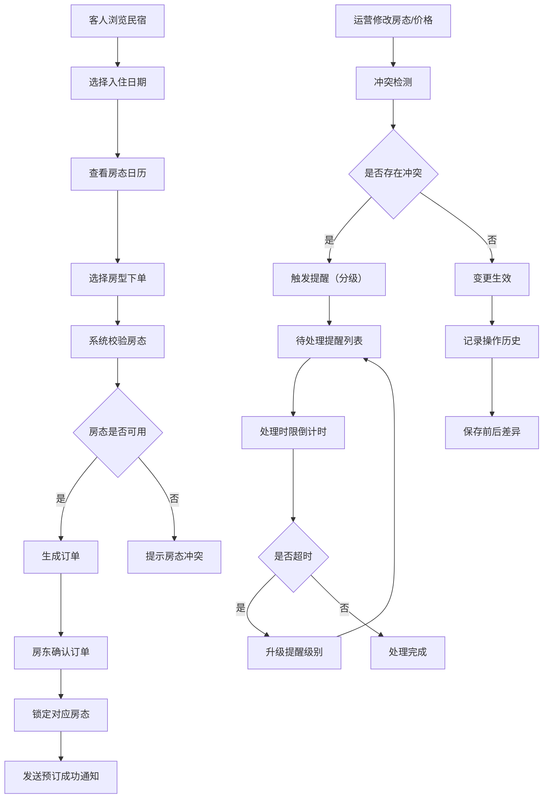

## 1. 产品概述

青禾房态行程台是面向精品民宿房东的一体化预订管理平台，集成房态管理、订单处理、运营配置和智能提醒为一体的综合管理系统。解决民宿运营中房态冲突、订单转化追踪、服务配置追溯等核心痛点。

- **目标用户**：精品民宿房东、运营管理人员、前台接待人员
- **核心价值**：通过可视化房态日历、智能提醒规则、配置历史追溯，提升民宿运营效率和订单转化率
- **市场定位**：中高端精品民宿运营管理 SaaS 平台

## 2. 核心功能

### 2.1 用户角色

| 角色 | 注册方式 | 核心权限 |
|------|----------|----------|
| 超级管理员 | 后台创建 | 系统配置、用户管理、规则配置、所有数据查看与操作 |
| 民宿房东 | 后台创建/邀请 | 房态管理、价格维护、订单处理、配置管理 |
| 运营人员 | 后台创建 | 房态维护、订单处理、入住转化追踪 |
| 前台接待 | 后台创建 | 房态查询、订单查看、提醒处理 |

### 2.2 功能模块

1. **前台预订门户**：民宿展示、房态日历查询、在线下单、订单确认
2. **房态管理中心**：可视化房态日历、批量操作、价格维护、房态冲突检测
3. **订单管理系统**：订单列表、筛选查询、状态流转、入住转化追踪
4. **运营配置中心**：导览路线管理、清洁任务配置、行程版本管理
5. **智能提醒系统**：提醒规则配置、分级提醒、冲突检测、处理时限
6. **操作历史审计**：配置变更记录、差异对比、操作人追溯

### 2.3 页面详情

| 页面名称 | 模块名称 | 功能描述 |
|-----------|----------|----------|
| 预订首页 | 民宿展示 | 精品民宿列表、特色介绍、图片轮播 |
| | 房态日历 | 月视图日历、日期选择、房价展示、可订状态 |
| | 预订下单 | 房型选择、日期选择、人数填写、订单提交 |
| 运营后台登录 | 登录认证 | 账号密码登录、权限校验 |
| 房态管理页 | 房态日历 | 多房型日历视图、房态色块、拖拽操作 |
| | 价格管理 | 批量设置价格、节假日定价、特殊价格策略 |
| | 房态维护 | 房态修改、批量操作、冲突检测 |
| 订单管理页 | 订单列表 | 多条件筛选、分页、状态标签 |
| | 订单详情 | 客人信息、房型信息、价格明细 |
| | 入住转化 | 转化漏斗、状态追踪、提醒标记 |
| 配置管理页 | 导览路线 | 路线列表、增删改查、版本管理 |
| | 清洁任务 | 任务模板、分配规则、时间配置 |
| | 行程版本 | 版本列表、版本对比、发布管理 |
| 提醒规则页 | 规则列表 | 规则配置、级别设置、颜色标记 |
| | 冲突检测 | 房态冲突检测、自动触发提醒 |
| | 提醒中心 | 待处理提醒列表、处理时限倒计时 |
| 操作历史页 | 历史记录 | 变更列表、操作人、时间戳 |
| | 差异对比 | 变更前后字段对比、高亮显示差异 |

## 3. 核心流程

### 3.1 客人预订流程
客人选择日期和房型，系统实时校验房态，生成订单，房东确认后锁定房态，发送预订成功通知。

### 3.2 房态维护流程
运营人员在后台修改房态或价格，系统检测冲突，如存在冲突则触发对应级别提醒，处理后生效。

### 3.3 配置变更流程
管理员修改导览路线、清洁任务或行程版本，系统自动记录操作人、时间戳及变更前后差异，存入历史记录。

### 3.4 提醒处理流程
系统按规则检测房态冲突，生成对应级别提醒（不同颜色标识），在规定时限内处理，超时升级提醒级别。

## 4. 用户界面设计

### 4.1 设计风格

- **主色调**：青禾绿（#2D5A4B）作为品牌主色，搭配暖木色（#8B7355）作为辅助色
- **提醒级别颜色**：
  - 一级提醒（紧急）：#E53935 红色
  - 二级提醒（重要）：#FB8C00 橙色
  - 三级提醒（一般）：#FDD835 黄色
  - 四级提醒（通知）：#43A047 绿色
- **按钮风格**：圆角 8px，悬停微动画，主按钮采用青禾绿填充
- **字体**：标题使用 Noto Serif SC 彰显精品感，正文使用 PingFang SC 保证可读性
- **布局风格**：卡片式布局，充足留白，顶部导航 + 左侧菜单的后台典型布局
- **图标风格**：线性图标为主，关键操作使用填充图标区分

### 4.2 页面设计概览

| 页面名称 | 模块名称 | UI 元素 |
|-----------|----------|----------|
| 预订首页 | Hero 区域 | 全屏民宿图片背景、渐变色叠加、优雅的标题排版 |
| | 房态日历 | 月视图网格、可订/已订/不可用三色块标识、悬浮日期信息卡片 |
| | 预订表单 | 卡片式表单、分步引导、平滑过渡动画 |
| 房态管理页 | 日历视图 | 多房型纵向排列、日期横向排列、色块拖拽交互 |
| | 价格面板 | 价格输入、快捷价格模板、批量应用按钮 |
| | 操作工具栏 | 筛选条件、批量操作、导出功能 |
| 订单管理页 | 订单列表 | 卡片式列表、状态标签、快速操作按钮 |
| | 转化漏斗 | 可视化图表、阶段数据、转化率指标 |
| | 提醒标记 | 不同颜色圆点、处理时限倒计时 |
| 配置管理页 | 配置卡片 | 分组展示、版本标签、操作按钮组 |
| | 版本对比 | 双栏布局、差异高亮、翻转动画 |
| 提醒中心 | 提醒列表 | 按级别分组、颜色标识、倒计时显示 |
| | 规则配置 | 级别选择器、颜色预览、时限设置 |
| 操作历史页 | 历史列表 | 时间轴布局、操作人头像、变更类型标签 |
| | 差异详情 | 前后对比、字段高亮、变更说明 |

### 4.3 响应式设计

- 采用桌面优先设计，后台管理页适配 1280px 及以上
- 前台预订页适配移动端，支持平板和手机浏览
- 触摸交互优化：增大点击区域，手势滑动切换日历月份

### 4.4 交互动效

- 页面加载采用渐入动画，元素按层级依次出现
- 日历切换采用平滑滑动过渡
- 提醒弹出采用轻微缩放弹性动画
- 悬停状态采用背景色渐变和微上浮效果
- 配置变更保存时差异字段采用高亮闪烁提示
