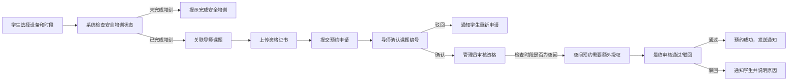

## 1. 产品概述

高校实验室大型仪器预约平台，整合设备排期、培训资格审核与故障停机管理于一套流程。解决传统预约系统分散、效率低下、信息不透明的问题，为学生、导师、管理员提供统一的数字化管理平台。

- 目标用户：高校学生、导师、实验室管理员、设备维护人员
- 核心价值：简化预约流程、确保资格合规、减少设备闲置、提升实验室管理效率

## 2. 核心 Features

### 2.1 User Roles

| 角色 | 注册方式 | 核心权限 |
|------|----------|----------|
| 学生 | 校园账号统一认证 | 申请设备预约、上传培训证书、查看个人预约记录、接收通知 |
| 导师 | 校园账号统一认证 | 审批学生课题、查看团队成员预约、课题信息管理 |
| 管理员 | 系统分配 | 审核用户资格、设备管理、停机维护、数据报表导出、系统配置 |
| 维护人员 | 系统分配 | 上报设备故障、更新维修状态、查看维修记录 |

### 2.2 Feature Module

1. **首页仪表板**：设备概览、待办事项、快速预约入口、通知中心
2. **设备列表与详情**：设备分类浏览、设备信息展示、当前状态显示
3. **预约管理**：日历视图、时段选择、冲突检测、预约申请与取消
4. **资格审核**：培训证书上传、安全培训记录、资格有效期管理
5. **审批流程**：导师课题确认、管理员资格审核、夜间预约特殊授权
6. **故障与维护**：故障上报、维修状态追踪、自动取消受影响预约、影响范围展示
7. **报表中心**：使用统计、设备利用率、预约趋势、数据导出
8. **用户中心**：个人信息、预约记录、补偿记录、消息通知

### 2.3 Page Details

| 页面名称 | 模块名称 | 功能描述 |
|----------|----------|----------|
| 首页仪表板 | 设备概览卡片 | 展示设备总数、在线设备、使用率统计 |
| 首页仪表板 | 待办事项列表 | 显示待审批、待审核、待确认事项 |
| 首页仪表板 | 快速预约 | 快捷选择设备和时段进行预约 |
| 设备列表页 | 设备筛选 | 按类型、状态、实验室进行筛选 |
| 设备列表页 | 设备卡片 | 展示设备图片、名称、状态、当前占用情况 |
| 设备详情页 | 设备信息 | 详细参数、使用说明、注意事项 |
| 设备详情页 | 预约日历 | 周/月视图展示预约情况，支持时段选择 |
| 预约申请页 | 时段选择 | 精确到分钟的时段选择器 |
| 预约申请页 | 课题选择 | 关联导师课题，填写预约用途 |
| 预约申请页 | 证书上传 | 上传培训资格证书附件 |
| 审批中心页 | 导师审批 | 课题编号确认、同意/驳回操作 |
| 审批中心页 | 管理员审核 | 资格验证、夜间授权、最终确认 |
| 故障管理页 | 故障上报 | 选择设备、描述故障、上传图片 |
| 故障管理页 | 维修追踪 | 状态更新、维修日志、预计完成时间 |
| 报表中心页 | 数据统计 | 设备利用率、预约趋势、用户活跃度图表 |
| 报表中心页 | 数据导出 | 支持 Excel/PDF 格式导出 |
| 用户中心页 | 预约记录 | 历史预约、当前预约、取消记录 |
| 用户中心页 | 补偿记录 | 被取消预约的补偿信息追踪 |

## 3. Core Process

### 3.1 正常预约流程

### 3.2 故障处理流程

## 4. User Interface Design

### 4.1 设计风格

- **主色调**：深蓝色 (#1e3a5f) - 代表专业、科技、可信赖
- **辅助色**：青色 (#0d9488) - 用于成功状态、确认按钮
- **警示色**：橙色 (#f59e0b) - 用于待处理、警告
- **危险色**：红色 (#ef4444) - 用于错误、取消操作
- **背景色**：浅灰渐变 (#f8fafc → #f1f5f9) - 清爽的实验室氛围
- **按钮风格**：圆角 8px，微阴影，悬停时有轻微上浮动画
- **字体**：
  - 标题：Noto Sans SC Bold - 清晰有力
  - 正文：Noto Sans SC Regular - 易读性强
  - 数字/代码：JetBrains Mono - 专业感
- **布局风格**：卡片式布局，清晰的信息层级，充足的留白
- **图标风格**：线性图标，统一 24px 尺寸，符合实验室科技感

### 4.2 Page Design Overview

| 页面名称 | 模块名称 | UI Elements |
|----------|----------|-------------|
| 首页仪表板 | 设备概览 | 渐变统计卡片，数字动画，状态指示灯 |
| 首页仪表板 | 日历视图 | 周视图日历，彩色时间块，拖拽交互 |
| 设备详情页 | 预约时间轴 | 时间轴展示，冲突高亮，悬停预览 |
| 审批中心页 | 审批卡片 | 左右分栏，左侧列表右侧详情，快捷操作按钮 |
| 故障管理页 | 维修看板 | 看板视图，拖拽更新状态，时间线记录 |
| 报表中心页 | 数据可视化 | ECharts 图表，交互式筛选，下载按钮 |

### 4.3 Responsiveness

- **桌面优先设计**：优化 1440px 及以上分辨率显示
- **平板适配**：1024px 时侧边栏收起，卡片重新排列
- **手机适配**：768px 以下采用单列布局，底部导航栏
- **触控优化**：按钮最小尺寸 44px，手势支持缩放日历

### 4.4 动效设计

- 页面加载：元素错落出现（staggered reveal）
- 日历切换：平滑滑动过渡
- 状态变化：颜色渐变 + 轻微缩放
- 通知弹窗：从右侧滑入，背景模糊
- 按钮交互：悬停上浮 2px，点击下沉 1px
