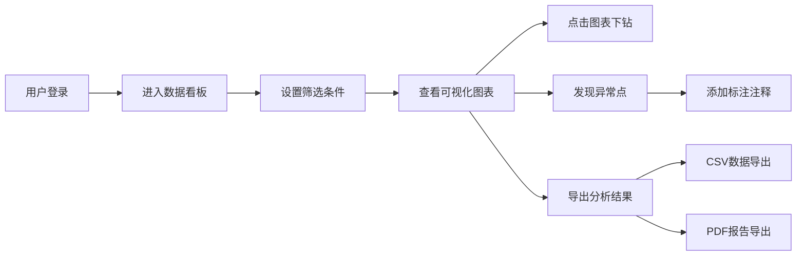

## 1. 产品概述

医院门诊等待时间分析可视化平台，帮助运营改善小组从多维度分析门诊流程效率瓶颈，支持数据驱动的流程优化决策。

- **核心目标**：整合分散在挂号、签到、分诊、叫号、缴费、取药等环节的时间戳数据，通过多维度可视化分析揭示门诊等待时间的规律和瓶颈
- **目标用户**：医院运营改善小组、门诊管理部门、流程优化专员
- **市场价值**：提升门诊运营效率、减少患者等待时间、优化医疗资源配置

## 2. 核心功能

### 2.1 用户角色
| 角色 | 注册方式 | 核心权限 |
|------|----------|----------|
| 系统管理员 | 后台创建 | 用户管理、权限配置、数据字典维护、全量数据访问 |
| 运营分析员 | 管理员创建 | 数据导入、可视化分析、异常标注、报表导出、科室数据访问 |
| 科室主任 | 管理员创建 | 本科室数据查看、报表导出、本科室异常标注 |

### 2.2 功能模块
1. **数据看板主页**：全局概览指标、多维度筛选器、核心可视化图表
2. **流程瓶颈分析**：桑基图展示全流程流转、瓶颈节点识别、等待时间分布
3. **多维度对比分析**：科室对比、医生对比、时段对比、患者类型对比
4. **趋势分析**：日内趋势、周内趋势、月度趋势、异常点检测与标注
5. **数据管理**：批量数据导入、数据字典维护、缺失值处理、数据脱敏
6. **报表导出**：CSV数据导出、PDF分析报告导出

### 2.3 页面详情
| 页面名称 | 模块名称 | 功能描述 |
|----------|----------|----------|
| 数据看板 | 全局筛选器 | 支持科室、医生、时段、患者类型、日期范围的联动筛选 |
| 数据看板 | 核心指标卡 | 展示平均等待时间、最长等待、患者流量、瓶颈节点等KPI |
| 数据看板 | 流程桑基图 | 可视化患者从挂号到取药的全流程流转及各节点等待时间 |
| 数据看板 | 等待分布图 | 等待时间直方图、箱线图展示分布特征 |
| 科室对比 | 科室排名表 | 各科室等待时间指标排名与对比 |
| 科室对比 | 对比柱状图 | 多科室多指标并行对比可视化 |
| 趋势分析 | 日内趋势图 | 24小时时段等待时间热力图与折线图 |
| 趋势分析 | 异常标注面板 | 人工标注异常点、添加注释说明、历史注释查看 |
| 数据管理 | 批量导入 | CSV批量数据导入、格式校验、导入进度展示 |
| 数据管理 | 数据字典 | 科室、医生、患者类型等维度数据维护 |
| 数据管理 | 数据质量 | 缺失值统计、异常值检测、数据脱敏预览 |
| 报表导出 | 导出中心 | 自定义导出维度、CSV/PDF格式选择、导出历史 |

## 3. 核心流程

### 3.1 数据分析主流程
用户登录后进入数据看板，通过全局筛选器选择分析范围，系统联动更新所有可视化图表；用户可点击图表元素进行下钻分析，发现异常时可添加标注注释；分析完成后可导出CSV数据或PDF报告。

### 3.2 数据导入流程
管理员或分析员上传CSV数据文件，系统进行格式校验和数据清洗，处理缺失值和异常值，完成数据脱敏后入库，用户可查看导入日志和数据质量报告。

## 4. 用户界面设计

### 4.1 设计风格
- **设计方向**：专业医疗数据风格，清爽简约，强调数据可读性和专业性
- **主色调**：医疗蓝 `#165DFF` 作为主色，搭配深灰 `#1D2129` 和浅灰背景 `#F2F3F5`
- **辅助色**：成功绿 `#00B42A`、警告橙 `#FF7D00`、危险红 `#F53F3F`
- **字体**：使用系统无衬线字体栈，数字使用等宽字体提升可读性
- **布局风格**：卡片式布局，顶部导航+侧边筛选+主内容区的经典BI仪表盘布局
- **按钮风格**：圆角4px，主按钮实心填充，次要按钮描边样式
- **图标风格**：线性图标，简洁专业

### 4.2 页面设计概览
| 页面名称 | 模块名称 | UI元素 |
|----------|----------|--------|
| 数据看板 | 顶部导航 | Logo、用户信息、全局时间范围选择器、主题切换 |
| 数据看板 | 左侧筛选栏 | 科室多选、医生多选、时段选择、患者类型筛选、日期范围 |
| 数据看板 | KPI指标区 | 4-6个指标卡片，带同比环比趋势箭头 |
| 数据看板 | 桑基图区域 | 宽幅桑基图，支持节点hover详情、点击下钻 |
| 数据看板 | 图表网格 | 2x2网格布局：等待分布、科室对比、日内趋势、异常点列表 |
| 趋势分析 | 时间序列区 | 大图折线图，支持缩放、hover tooltip |
| 趋势分析 | 标注面板 | 右侧抽屉式面板，标注列表、新增标注表单 |
| 数据管理 | 导入区 | 拖拽上传区域、导入进度条、历史导入记录表格 |
| 数据管理 | 数据字典 | Tab切换各维度字典表格、增删改查操作 |

### 4.3 响应式设计
- **设计原则**：桌面端优先，适配1440px及以上宽屏
- **平板适配**：筛选栏收起为可展开侧边栏，图表网格调整为单列
- **移动端**：简化为核心指标+关键图表，筛选功能折叠为顶部下拉菜单
- **触摸优化**：图表交互区域增大，按钮最小高度44px

### 4.4 数据可视化设计
- **桑基图**：节点宽度表示流量，颜色区分流程节点，连线颜色表示等待时长梯度
- **等待分布**：直方图+核密度估计曲线，异常区间红色高亮
- **日内趋势**：热力图矩阵，行表示星期，列表示小时，颜色深度表示等待时间
- **科室对比**：分组柱状图，支持多指标切换，hover显示详细对比数据
