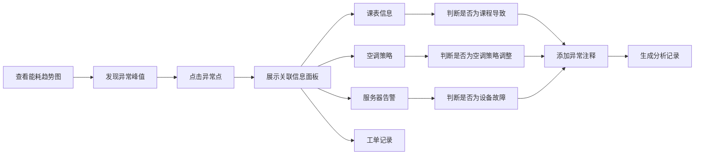

# 高校机房能耗与故障看板 - 产品需求文档

## 1. 产品概述

高校机房能耗与故障看板是为信息中心运维人员设计的数据可视化平台，整合电表、空调、服务器告警、工单和课表等多源数据，帮助运维团队快速定位能耗异常原因，优化机房运行效率。

- **核心价值**：解释能耗峰值来源（课程安排/设备故障/空调策略），提升故障响应效率
- **目标用户**：高校信息中心运维管理人员、机房值班人员

## 2. 核心功能

### 2.1 用户角色

| 角色 | 登录方式 | 核心权限 |
|------|----------|----------|
| 运维管理员 | 账号密码登录 | 查看所有看板、导出报表、配置筛选条件 |
| 值班人员 | 账号密码登录 | 查看实时监控、查看工单详情 |

### 2.2 功能模块

1. **总览看板**：能耗趋势、故障统计、核心指标卡片
2. **能耗分析**：多维度能耗对比、考试周vs普通周对比、能耗分解图表
3. **故障监控**：实时告警列表、工单关联分析、异常点详情
4. **报表导出**：PDF报表生成、自定义时间范围导出

### 2.3 页面详情

| 页面名称 | 模块名称 | 功能描述 |
|----------|----------|----------|
| 总览看板 | 指标卡片 | 实时显示总能耗、PUE、在线设备数、未处理工单 |
| 总览看板 | 能耗趋势图 | 24小时能耗曲线，支持时间窗口切换（日/周/月） |
| 总览看板 | 故障分布图 | 按设备类型统计告警数量和处理状态 |
| 总览看板 | 课表能耗关联 | 显示课程安排与能耗的对应关系 |
| 能耗分析 | 能耗分解图表 | 区分空调、服务器、照明等分类能耗占比 |
| 能耗分析 | 周对比分析 | 考试周与普通周的能耗对比图表 |
| 能耗分析 | 异常能耗标注 | 自动标注异常能耗点，支持人工注释 |
| 故障监控 | 告警时间线 | 按时间展示服务器告警与工单处理进度 |
| 故障监控 | 设备状态面板 | 显示设备在线/离线状态，离线数据不纳入能耗统计 |
| 报表中心 | PDF导出 | 生成包含图表和分析的完整PDF报表 |
| 全局筛选器 | 上下文保留 | 机房选择、时间范围、维护窗口筛选，切换图表时保留条件 |

## 3. 核心流程

### 3.1 异常排查流程

用户在能耗趋势图中发现峰值 → 点击异常点 → 系统展示关联的课表信息、空调运行策略、服务器告警记录、工单处理记录 → 用户确认异常原因 → 添加注释备注

### 3.2 数据处理流程

多源数据采集 → ETL清洗 → 缺失值处理（设备离线标记）→ 数据关联（工单-告警-时间）→ 存储到PostgreSQL → API服务 → 前端可视化

## 4. 用户界面设计

### 4.1 设计风格

- **主色调**：科技蓝 (#165DFF) 作为主色，搭配深灰 (#1D2129) 背景，营造专业数据看板氛围
- **辅助色**：绿色 (#00B42A) 表示正常，橙色 (#FF7D00) 表示警告，红色 (#F53F3F) 表示严重告警
- **字体**：使用 JetBrains Mono 作为数字字体，Source Han Sans 作为中文字体
- **布局风格**：卡片式布局，深色主题，玻璃态效果，数据密度高但层次清晰
- **视觉元素**：细边框、微妙渐变、数据点发光效果

### 4.2 页面设计概述

| 页面名称 | 模块名称 | UI 元素 |
|----------|----------|---------|
| 总览看板 | 顶部导航 | Logo、用户信息、时间选择器、导出按钮 |
| 总览看板 | 指标卡片区 | 4个大数字卡片，带趋势箭头和同比环比 |
| 总览看板 | 主图表区 | 大面积能耗趋势ECharts图表，带缩放和 tooltip |
| 总览看板 | 侧边面板 | 实时告警列表，滚动显示最新告警 |
| 能耗分析 | 筛选器栏 | 机房选择、周类型选择、维护窗口开关 |
| 能耗分析 | 对比图表 | 双轴对比图，考试周与普通周左右排列 |
| 故障监控 | 详情弹窗 | 点击异常点弹出，包含多标签页信息 |

### 4.3 响应式设计

- **桌面优先**：针对1920×1080及以上分辨率优化
- **自适应**：使用Flex和Grid布局，支持1280px到2560px宽度适配
- **交互优化**：图表区域支持鼠标悬停、框选缩放、点击交互

### 4.4 动效设计

- 页面加载：卡片按序淡入，数字滚动动画
- 图表交互：数据点悬停放大，tooltip平滑出现
- 状态变化：告警级别变化时有颜色闪烁提示
- 面板切换：侧边栏滑入滑出，内容区域淡入淡出
