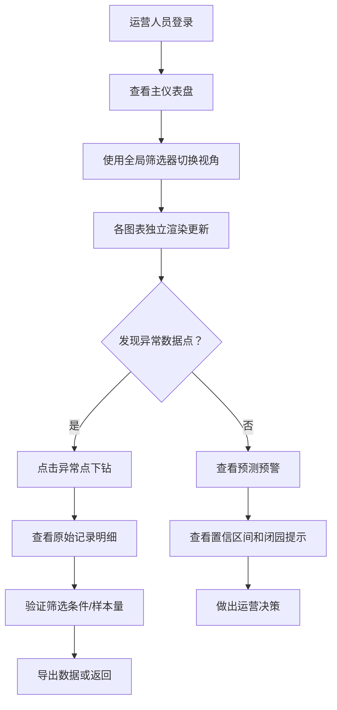

## 1. 产品概述
景区客流与排队预测智能看板，面向景区运营管理人员，整合多源运营数据（门票、闸机、停车场、天气、演出、餐饮），提供统一数据口径、多维度分析视图和预测预警能力，辅助运营决策。

核心价值：解决数据口径混乱问题，实现从宏观监控到微观下钻的全链路分析，通过预测模型提前感知客流高峰，优化资源调配。

## 2. 核心功能

### 2.1 用户角色
| 角色 | 登录方式 | 核心权限 |
|------|----------|----------|
| 景区运营管理员 | 账号密码登录 | 查看所有看板、下钻原始数据、配置数据口径、导出报表 |
| 运营值班人员 | 账号密码登录 | 查看实时看板、接收预警、查看基础统计 |

### 2.2 功能模块
1. **统一仪表盘**：客流热力地图、排队预测趋势、票种对比分析、消费转化漏斗
2. **联动筛选系统**：入口、区域、时间段、票种、活动维度筛选，各视图独立状态管理
3. **数据下钻功能**：异常点可追溯至原始记录，显示筛选条件、时间窗口、样本量
4. **预测预警系统**：排队时长预测带置信区间，临时闭园区域容量自动扣除并提示
5. **数据质量监控**：缺失值检测、异常点识别、样本量统计显示
6. **数据导出**：支持 CSV/Excel 导出，包含更新时间标记

### 2.3 页面详情
| 页面名称 | 模块名称 | 功能描述 |
|----------|----------|----------|
| 主仪表盘 | 全局筛选栏 | 多维度筛选器（入口、区域、时间段、票种、活动），状态独立管理 |
| 主仪表盘 | 客流热力地图 | D3 绘制景区地图，按区域热力着色，支持点击下钻 |
| 主仪表盘 | 排队预测图表 | 折线图展示排队时长预测，标注置信区间，异常点高亮 |
| 主仪表盘 | 票种对比分析 | 柱状图+饼图组合，对比各票种销量、入园率、客单价 |
| 主仪表盘 | 消费转化漏斗 | 展示门票→入园→餐饮→二次消费的转化路径 |
| 主仪表盘 | 数据质量面板 | 显示缺失值比例、异常点数量、样本量、数据更新时间 |
| 原始记录弹窗 | 下钻详情表 | 展示筛选后的原始数据，支持分页、排序、导出 |
| 口径配置面板 | 数据口径管理 | 配置各指标计算规则、数据源映射、清洗规则 |

## 3. 核心流程

## 4. 用户界面设计

### 4.1 设计风格
- **主色调**：深青蓝（#0F766E）作为主色，代表专业与信任；琥珀橙（#F59E0B）作为预警色
- **辅助色**：冷灰（#64748B）系作为中性色，确保数据可读性
- **按钮风格**：圆角 8px，悬浮时微阴影 + 背景加深
- **字体**：标题使用 Noto Sans SC Bold，正文使用 Noto Sans SC Regular
- **布局风格**：卡片式网格布局，24px 间距，卡片带 1px 边框和轻微阴影
- **图标风格**：Lucide 线性图标，统一 20px 尺寸

### 4.2 页面设计概述
| 页面名称 | 模块名称 | UI 元素 |
|----------|----------|----------|
| 主仪表盘 | 顶部导航栏 | Logo、系统名称、用户信息、数据更新时间标记 |
| 主仪表盘 | 筛选栏 | 下拉选择器、日期范围选择器、重置按钮，各筛选项独立状态 |
| 主仪表盘 | KPI 卡片行 | 4 个核心指标卡片（实时客流、平均排队、今日入园、餐饮营收） |
| 主仪表盘 | 图表网格 | 2×2 网格布局：客流地图（左上方大）、排队预测（右上方）、票种对比（左下方）、消费转化（右下方） |
| 主仪表盘 | 数据质量条 | 底部固定条，显示缺失值%、异常点数、样本量、清洗规则版本 |
| 弹窗 | 原始记录 | 模态框，顶部显示筛选摘要，表格展示明细，底部导出按钮 |
| 弹窗 | 闭园提示 | 右上角通知条，黄色背景，列出闭园区域及容量扣除说明 |

### 4.3 响应式
- 桌面端优先（1440px+），2×2 图表网格
- 平板端（1024px）：图表改为单列堆叠
- 移动端（768px以下）：简化为 KPI + 核心排队预测图表

### 4.4 交互细节
- 图表悬浮：显示 Tooltip，包含数据值、置信区间、样本量
- 点击图表数据点：高亮并弹出下钻入口
- 筛选变更：各图表独立加载动画，不互相阻塞
- 预测线：虚线表示，置信区间用半透明填充
- 临时闭园：地图上对应区域灰色遮罩，右上角悬浮提示
