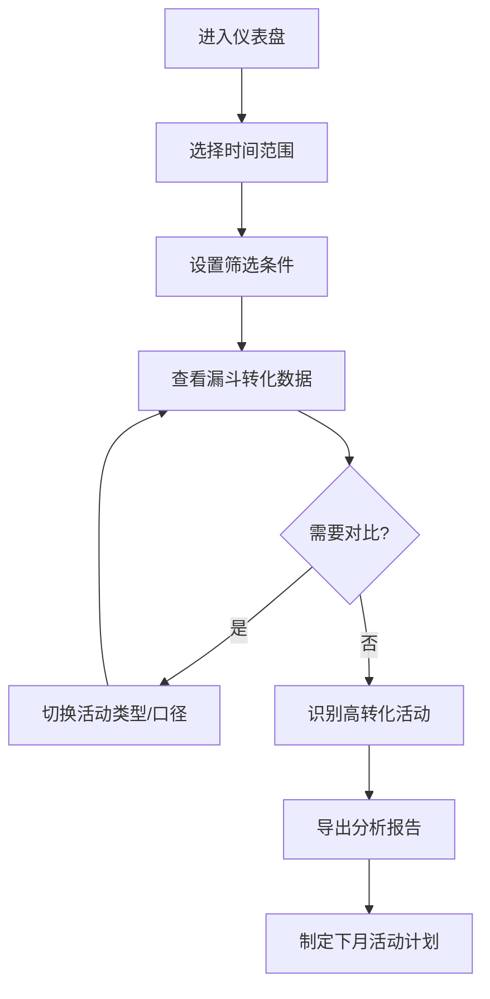
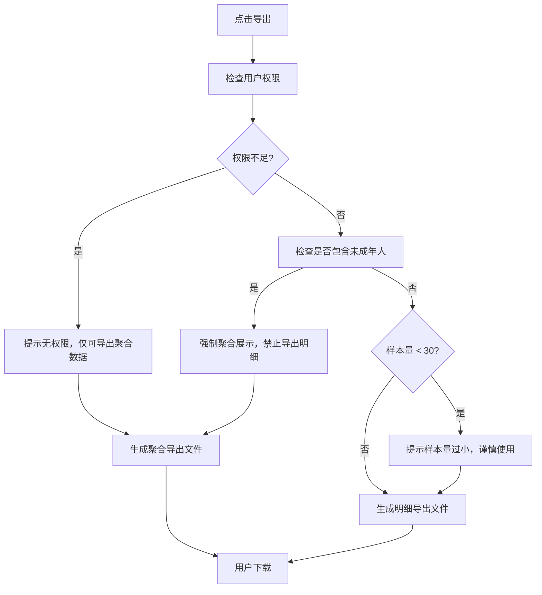

## 1. 产品概述

社区活动报名转化分析平台，帮助运营团队通过漏斗分析优化下月活动选题。平台展示从浏览、报名、签到、取消到反馈的完整转化漏斗，支持多维度筛选，并严格保护未成年人数据隐私。

- 核心目标：通过数据驱动的方式提升社区活动报名转化率和用户满意度
- 目标用户：社区运营人员、数据分析人员、活动策划人员

## 2. 核心功能

### 2.1 用户角色

| 角色 | 登录方式 | 核心权限 |
|------|---------|---------|
| 运营人员 | 账号密码登录 | 查看漏斗分析、筛选数据、导出聚合数据、配置活动口径 |
| 管理员 | 账号密码登录 | 全部运营权限 + 导出报名明细 + 用户权限管理 |

### 2.2 功能模块

1. **漏斗分析仪表盘**：核心转化漏斗展示、关键指标卡片、趋势对比
2. **多维筛选器**：活动类型、社区、年龄段、渠道、天气筛选
3. **活动口径管理**：活动分类配置、历史口径切换、版本管理
4. **数据导出**：带筛选条件的导出、权限控制、样本量提示
5. **取消与反馈分析**：取消原因标签、反馈主题提取、词云展示

### 2.3 页面详情

| 页面名称 | 模块名称 | 功能描述 |
|---------|---------|---------|
| 分析仪表盘 | 漏斗图区域 | 浏览→报名→签到→取消→反馈的五层漏斗，展示各层转化人数和转化率 |
| 分析仪表盘 | 筛选器面板 | 活动类型、社区、年龄段、渠道、天气的多选筛选，支持口径切换 |
| 分析仪表盘 | 指标卡片 | 总浏览量、报名数、签到率、取消率、反馈率等核心KPI |
| 分析仪表盘 | 明细表格 | 活动维度的明细数据，支持排序和分页 |
| 口径配置页 | 分类管理 | 新增/编辑/删除活动分类，配置分类规则 |
| 口径配置页 | 历史版本 | 查看口径变更历史，支持切换旧口径查看数据 |
| 导出中心 | 导出配置 | 选择导出维度、时间范围、筛选条件，预览样本量 |

## 3. 核心流程

### 3.1 数据分析流程

运营人员进入仪表盘 → 选择分析时间范围 → 通过筛选器过滤维度 → 查看漏斗转化情况 → 对比不同活动类型表现 → 选择表现好的活动类型作为下月重点 → 导出分析报告

### 3.2 数据导出流程

用户选择导出 → 系统检查用户权限 → 如包含未成年人数据，强制聚合 → 如样本量过小，给出风险提示 → 生成导出文件 → 用户下载

## 4. 用户界面设计

### 4.1 设计风格

- **主色调**：深蓝 #1e3a5f（专业、可信），辅助色：青蓝 #3b82f6（数据高亮）
- **按钮风格**：圆角 8px，轻微阴影，hover 时有颜色加深和上浮动效
- **字体**：标题使用 Inter SemiBold，正文使用 Inter Regular，数据使用等宽字体 JetBrains Mono
- **布局风格**：侧边栏导航 + 主内容区，卡片式布局，充足留白
- **图标风格**：使用 Lucide 线性图标，统一 20px 尺寸

### 4.2 页面设计概述

| 页面名称 | 模块名称 | UI 元素 |
|---------|---------|---------|
| 分析仪表盘 | 顶部导航 | Logo、用户信息、时间选择器、全局搜索 |
| 分析仪表盘 | 左侧筛选 | 折叠式筛选面板，多组复选框，口径切换下拉 |
| 分析仪表盘 | 主内容区 | 漏斗图（占 60% 宽度），指标卡片区（4 列网格），明细表格 |
| 分析仪表盘 | 底部操作 | 导出按钮、重置筛选、保存视图 |
| 口径配置页 | 分类列表 | 表格展示分类，支持拖拽排序，每行有编辑/删除操作 |
| 口径配置页 | 历史版本 | 时间线展示变更记录，可点击切换查看 |

### 4.3 响应式

- 桌面端优先设计，支持 1280px 及以上分辨率
- 平板端：筛选器折叠为顶部下拉菜单
- 移动端：卡片单列展示，表格横向滚动

### 4.4 动效设计

- 页面加载：指标卡片淡入，漏斗图从底部向上渐显
- 筛选变化：数据更新时有 300ms 的平滑过渡动画
- 悬停效果：卡片轻微上浮（translateY(-2px)），阴影加深
- 漏斗交互：hover 时高亮对应层级，显示详细数据 tooltip
