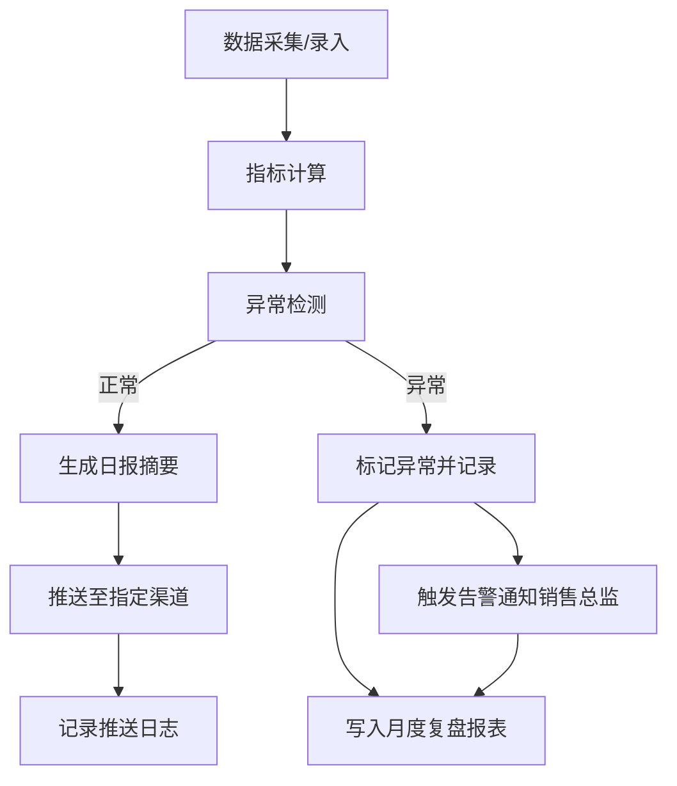

## 1. 产品概述

用户增长日报生成器是一套面向运营负责人的数据看板系统，实现每日用户增长指标的自动汇总、异常检测、摘要生成和推送分发。系统支持数据的查询、筛选、追踪与导出，并提供完整的操作溯源能力，确保负责人交接时指标口径、异常原因、推送记录均可追溯到原始数据和备注。

## 2. 核心功能

### 2.1 用户角色

| 角色 | 说明 | 核心权限 |
|------|------|----------|
| 运营负责人 | 日常查看日报、追踪异常、导出数据 | 看板浏览、异常查询、数据导出、指标口径查看 |
| 运营管理员 | 后台配置、摘要生成、推送管理 | 数据维护、摘要编辑、推送配置、口径管理、日志查询 |
| 销售总监 | 接收异常告警、查看月报 | 异常告警接收、月报浏览 |

### 2.2 功能模块

1. **指标看板页**：核心指标卡片、趋势图表、异常列表、数据筛选
2. **异常详情页**：异常原因追溯、原始记录查看、历史备注、关联指标
3. **后台 - 数据管理**：指标数据录入/导入、口径维护、分页查询
4. **后台 - 摘要推送**：日报摘要生成、推送渠道配置、推送记录追踪
5. **后台 - 日志中心**：操作日志、导出任务、接口错误日志
6. **月报复盘页**：月度异常波动汇总、指标趋势分析

### 2.3 页面详情

| 页面名称 | 模块名称 | 功能描述 |
|----------|----------|----------|
| 指标看板 | 指标卡片区 | 展示日活、新增、留存、转化率等核心指标，支持环比同比 |
| 指标看板 | 趋势图表区 | 折线图展示近7/30天指标走势，支持多指标对比 |
| 指标看板 | 异常列表区 | 展示当日检测到的异常波动，可点击查看详情 |
| 指标看板 | 筛选工具栏 | 按日期范围、指标类型、渠道维度筛选数据 |
| 异常详情 | 异常概览 | 异常指标、波动幅度、发生时间、影响范围 |
| 异常详情 | 原因追溯 | 关联原始数据记录、历史备注、指标口径说明 |
| 异常详情 | 备注记录 | 运营人员可添加备注，记录处理过程和结论 |
| 数据管理 | 指标列表 | 分页展示所有指标数据，支持多条件筛选 |
| 数据管理 | 口径维护 | 维护每个指标的计算口径、数据源、更新频率 |
| 摘要推送 | 摘要生成 | 自动生成日报摘要文本，支持人工编辑 |
| 摘要推送 | 推送配置 | 配置推送渠道（邮件/企业微信）、接收人、推送时间 |
| 日志中心 | 操作日志 | 所有数据修改、配置变更的操作记录 |
| 日志中心 | 导出任务 | 历史导出任务列表，支持下载和状态查看 |
| 日志中心 | 错误日志 | 接口调用错误记录，含告警状态 |
| 月报复盘 | 月度汇总 | 当月指标趋势、异常波动汇总、关键事件时间线 |

## 3. 核心流程

### 3.1 日常查看流程
运营负责人登录系统 → 查看当日指标看板 → 发现异常 → 点击进入异常详情 → 追溯原始数据和历史备注 → 添加处理备注 → 导出相关数据

### 3.2 后台维护流程
运营管理员登录后台 → 录入/导入指标数据 → 系统自动检测异常 → 生成日报摘要 → 人工审核编辑 → 配置推送任务 → 定时推送 → 记录推送日志

### 3.3 异常告警流程
接口调用出错 → 记录错误日志 → 触发告警规则 → 发送告警通知给销售总监 → 异常波动写入月度报表 → 月底复盘分析

## 4. 用户界面设计

### 4.1 设计风格

- **主色调**：深蓝主色（#1e3a5f）+ 青绿辅助色（#10b981），体现数据专业感
- **强调色**：橙色（#f59e0b）用于异常告警，红色（#ef4444）用于严重错误
- **中性色**：以 slate 色系为基础，确保长时间阅读舒适度
- **卡片风格**：轻微圆角（8px）、柔和阴影、悬浮微动效
- **字体**：现代无衬线字体，数字使用等宽字体提升可读性
- **布局**：顶部导航 + 左侧侧边栏 + 主内容区的经典后台布局
- **图标**：线性风格图标，与文字保持一致视觉重量

### 4.2 页面设计概览

| 页面名称 | 模块名称 | UI 元素 |
|----------|----------|----------|
| 指标看板 | 顶部筛选栏 | 日期选择器、指标下拉、渠道筛选、导出按钮 |
| 指标看板 | KPI 卡片网格 | 4列卡片，含指标值、环比、趋势小图 |
| 指标看板 | 趋势图表 | 面积图，支持切换时间范围和指标 |
| 指标看板 | 异常列表 | 表格形式，含指标名、波动值、异常等级、操作 |
| 异常详情 | 头部信息 | 大标题展示异常指标，状态标签，时间范围 |
| 异常详情 | 数据对比 | 左右分栏对比正常值与异常值 |
| 异常详情 | 时间线 | 垂直时间线展示处理记录和备注 |
| 异常详情 | 溯源面板 | 可折叠的原始数据和口径说明 |
| 后台管理 | 侧边导航 | 分组菜单项，激活态高亮 |
| 后台管理 | 数据表格 | 斑马纹、行悬浮高亮、分页器 |

### 4.3 响应式

- 桌面端优先设计（≥1280px）
- 平板端（768-1279px）：侧边栏收起为图标模式，卡片自动换行
- 移动端（<768px）：顶部导航折叠为汉堡菜单，卡片单列布局
- 数据表格在小屏设备支持横向滚动

### 4.4 动效与交互

- 页面加载：卡片依次淡入上移，营造节奏感
- 数据更新：数字滚动动画，图表平滑过渡
- 悬浮反馈：卡片轻微上浮 + 阴影加深
- 异常状态：呼吸灯效果吸引注意力
- 侧边栏：展开收起带平滑过渡
