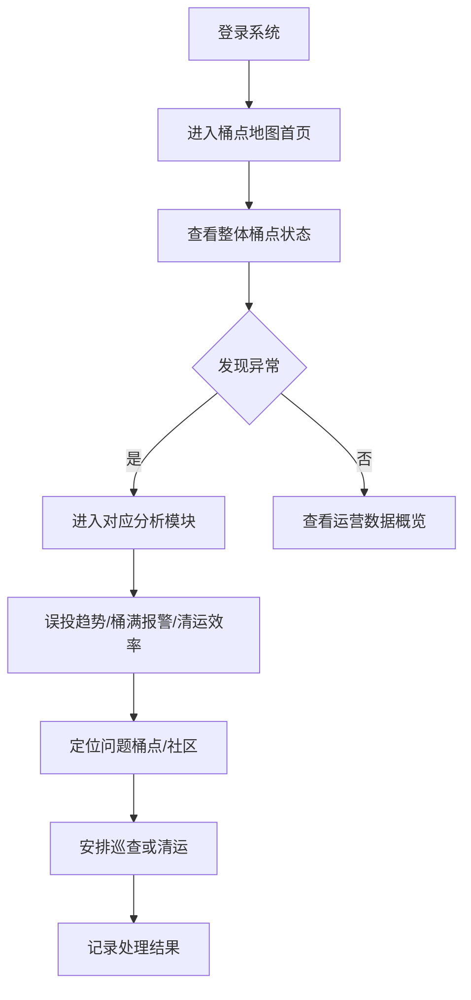
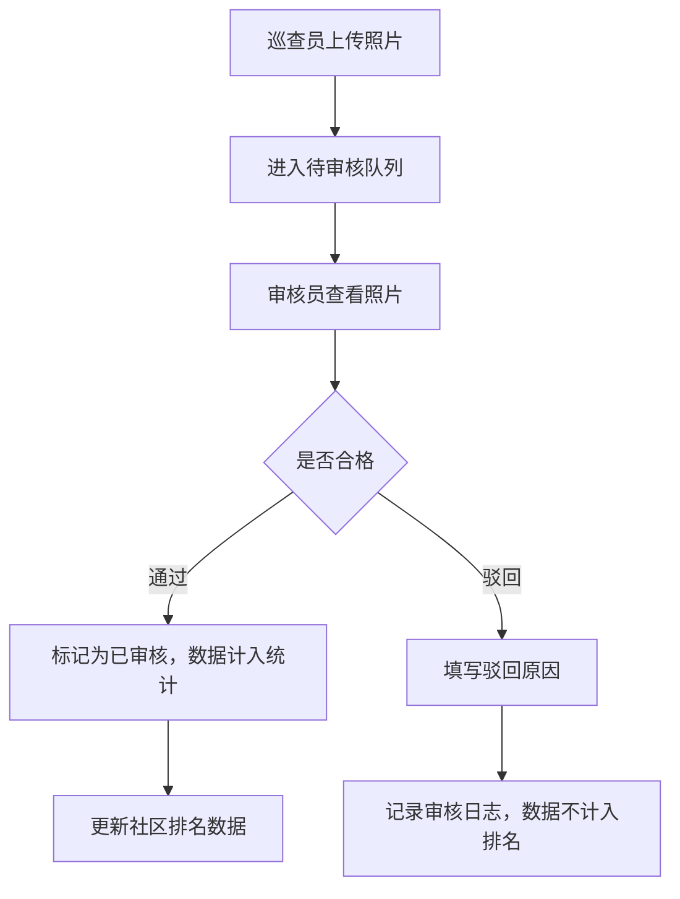
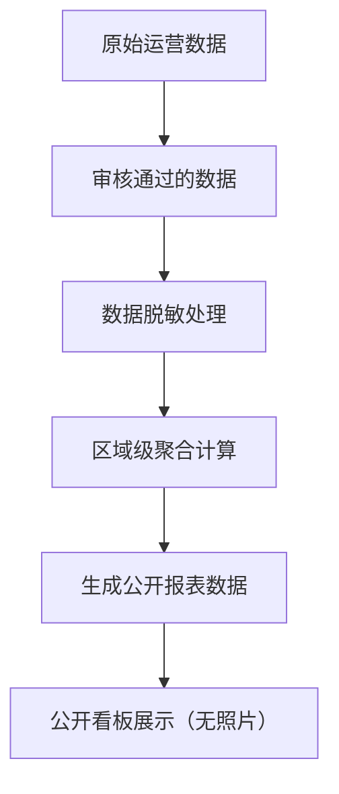

## 1. 产品概述

城市垃圾分类投放分析系统是面向环卫管理部门的数字化平台，通过桶点地图可视化、数据智能分析和权限分级管理，帮助环卫项目经理实时监控垃圾分类质量、优化清运效率、提升社区管理水平。系统支持内部精细化管理与公开数据透明展示的分离，保障数据安全与公众知情权的平衡。

## 2. 核心功能

### 2.1 用户角色

| 角色 | 登录方式 | 核心权限 |
|------|---------|---------|
| 环卫项目经理 | 账号密码登录 | 查看完整数据分析、桶点地图、误投趋势、桶满报警、清运效率、巡查覆盖、社区对比、照片审核、回访记录管理 |
| 内部审核员 | 账号密码登录 | 巡查照片审核、驳回原因记录、数据质量把控 |
| 公众用户 | 无需登录 | 查看脱敏聚合数据、公开报表、社区排名（无照片） |

### 2.2 功能模块

1. **桶点地图首页**: D3 地图可视化、空间索引搜索、桶点状态展示、快速导航
2. **项目经理工作台**: 误投趋势分析、桶满报警监控、清运效率统计、巡查覆盖管理、社区对比排名
3. **内部审核中心**: 巡查照片审核、驳回原因记录、审核数据追溯
4. **公开数据看板**: 脱敏聚合数据展示、公开报表生成、社区排名（无照片）
5. **系统管理**: 节假日清运计划配置、异常点回访记录、权限管理

### 2.3 页面详情

| 页面名称 | 模块名称 | 功能描述 |
|---------|---------|---------|
| 桶点地图 | 地图可视化 | D3 绘制城市区域地图，桶点按状态着色，支持缩放平移 |
| 桶点地图 | 空间索引 | 按区域/社区/网格快速搜索定位桶点，支持矩形框选查询 |
| 桶点地图 | 状态展示 | 正常/告警/满溢/异常 四种状态实时显示，点击查看详情 |
| 误投趋势 | 趋势图表 | 按日/周/月展示误投率变化曲线，支持多维度筛选 |
| 误投趋势 | 分类统计 | 按可回收/有害/厨余/其他分类统计误投情况 |
| 桶满报警 | 实时报警 | 展示当前满溢桶点列表，支持派单处理 |
| 桶满报警 | 历史报警 | 报警处理时效统计，平均响应时间分析 |
| 清运效率 | 时间窗分析 | 清运车辆在时间窗内完成率统计 |
| 清运效率 | 节假日筛选 | 支持排除节假日停运数据，准确计算效率 |
| 巡查覆盖 | 覆盖率统计 | 各社区巡查完成率、巡查频次展示 |
| 巡查覆盖 | 异常点回访 | 异常桶点回访记录，整改情况跟踪 |
| 社区对比 | 排名看板 | 多维度社区排名，仅使用审核通过的数据 |
| 社区对比 | 对比分析 | 多社区横向对比图表 |
| 照片审核 | 待审列表 | 待审核巡查照片展示，支持批量操作 |
| 照片审核 | 驳回记录 | 驳回原因记录，审核日志追溯 |
| 公开看板 | 聚合数据 | 脱敏后的区域级聚合数据，无具体桶点信息 |
| 公开看板 | 公开报表 | 可下载的公开数据报表，定期更新 |

## 3. 核心流程

### 3.1 项目经理工作流程

### 3.2 照片审核流程

### 3.3 公开数据生成流程

## 4. 用户界面设计

### 4.1 设计风格

- **主色调**: 深绿色系（#0F766E）作为主色，体现环保主题
- **辅助色**: 橙色（#F59E0B）用于告警，蓝色（#3B82F6）用于正常状态，红色（#EF4444）用于紧急
- **中性色**: 深灰（#1F2937）背景，浅灰（#F9FAFB）卡片，白色内容区
- **按钮风格**: 圆角 6px，轻微阴影，悬停时上移 1px 效果
- **字体**: 标题使用 Noto Sans SC Bold，正文使用 Noto Sans SC Regular
- **布局风格**: 卡片式布局，顶部导航 + 侧边栏 + 内容区三段式
- **图标风格**: Lucide 线性图标，统一 20px 尺寸

### 4.2 页面设计概览

| 页面名称 | 模块名称 | UI 元素 |
|---------|---------|--------|
| 桶点地图 | 主视觉 | 全屏 D3 地图，左侧面板搜索筛选，右侧图例说明 |
| 桶点地图 | 动画效果 | 桶点点位脉冲动画，告警点闪烁效果 |
| 数据看板 | 卡片布局 | 圆角卡片，数据指标大号字体，趋势迷你图 |
| 数据看板 | 图表样式 | D3 图表，平滑曲线，渐变色填充 |
| 审核中心 | 列表布局 | 图片网格布局，审核操作浮层 |
| 公开看板 | 简洁风格 | 去除敏感信息，大字号聚合数据，适合大屏展示 |

### 4.3 响应式设计

- 桌面端优先设计（1440px 基准）
- 平板端自适应（1024px 以上保持完整功能）
- 移动端简化（768px 以下保留核心数据查看功能）
- 触控操作优化，按钮最小尺寸 44px

### 4.4 动效设计

- 页面切换：淡入淡出 + 轻微位移
- 数据加载：骨架屏脉冲动画
- 图表展示：数据渐入动画
- 告警提示：呼吸灯闪烁效果
- 卡片悬停：上移 2px + 阴影加深
