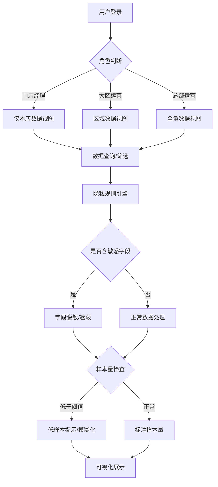

## 1. 产品概述

连锁药店会员复购分析系统是一款面向医药零售行业的数据智能分析平台，旨在帮助运营团队在严格遵守数据隐私法规的前提下，深入分析会员复购行为、优化营销策略、提升门店运营效率。

- 核心目标：在保护会员隐私的基础上，提供精准的会员复购洞察，支持运营决策
- 目标用户：门店经理、大区运营、总部运营分析师
- 核心价值：兼顾经营分析与数据隐私，实现合规前提下的数据驱动决策

## 2. 核心功能

### 2.1 用户角色

| 角色 | 注册方式 | 核心权限 |
|------|----------|----------|
| 门店经理 | 企业账号分配 | 查看本店数据、基础报表、低样本数据提示 |
| 大区运营 | 企业账号分配 | 查看区域内多店对比、完整报表、导出权限（受限） |
| 总部运营 | 企业账号分配 | 全量数据查看、药品分类维护、活动配置、完整导出权限 |

### 2.2 功能模块

1. **仪表盘首页**：核心指标概览、复购趋势、客单价趋势、门店排名
2. **会员复购分析**：Cohort 分析、会员分层、慢病标签聚合筛选
3. **活动效果分析**：优惠券漏斗、活动对比、同类药品带动效应
4. **药品分类管理**：分类映射表维护、药品维度配置
5. **系统设置**：权限管理、隐私规则配置、门店缓存管理

### 2.3 页面详情

| 页面名称 | 模块名称 | 功能描述 |
|----------|----------|----------|
| 仪表盘首页 | 核心指标卡片 | 展示会员总数、复购率、客单价、活动触达人数等核心KPI |
| 仪表盘首页 | 客单价趋势图 | 按时间维度展示客单价变化趋势，标注样本量 |
| 仪表盘首页 | 门店排名表 | 按复购率、销售额等指标排名，支持区域筛选 |
| 会员复购分析 | Cohort 分析图 | 展示不同入群周期的会员留存复购情况，标注各单元格样本量 |
| 会员复购分析 | 会员分层 | 基于消费频次、金额等维度进行会员分层，支持慢病标签筛选 |
| 会员复购分析 | 隐私字段遮蔽 | 个人敏感信息脱敏显示，仅支持聚合统计 |
| 活动效果分析 | 优惠券漏斗 | 展示领取→使用→复购的转化漏斗，各环节标注样本量 |
| 活动效果分析 | 活动对比 | 活动结束后对比同类药品销售变化，评估优惠券带动效应 |
| 活动效果分析 | 处方统计 | 处方相关字段仅展示区间统计，不暴露个体数据 |
| 药品分类管理 | 分类映射表 | 支持运营维护药品分类维度的映射关系 |
| 系统设置 | 权限控制 | 基于角色的数据访问控制、导出权限管理 |
| 系统设置 | 低样本提示 | 样本量低于阈值时自动提示，防止数据识别 |

## 3. 核心流程

用户登录后根据角色自动获得对应数据权限。运营人员通过慢病标签进行聚合筛选，系统自动遮蔽个人隐私字段，所有图表展示时标注样本量。当样本量低于阈值时，系统显示模糊提示或隐藏具体数值。处方相关数据仅支持区间统计，不允许下钻到个体。

## 4. 用户界面设计

### 4.1 设计风格

- **主色调**：医疗蓝 (#165DFF) 为主色调，体现专业、可信的医疗行业属性
- **辅助色**：绿色 (#00B42A) 表示正向指标，橙色 (#FF7D00) 表示预警，红色 (#F53F3F) 表示负向
- **中性色**：深灰 (#1D2129) 用于正文，中灰 (#4E5969) 用于辅助文字，浅灰 (#C9CDD4) 用于边框
- **按钮风格**：圆角 6px，主按钮使用医疗蓝填充，次要按钮使用描边样式
- **字体**：标题使用 Noto Sans SC Bold，正文使用 Noto Sans SC Regular，保证中文可读性
- **布局风格**：卡片式布局，顶部导航 + 侧边栏 + 内容区的经典后台布局
- **图标风格**：线性图标为主，简洁清晰，符合医疗行业专业气质

### 4.2 页面设计概述

| 页面名称 | 模块名称 | UI元素 |
|----------|----------|--------|
| 仪表盘首页 | 核心指标卡片 | 大字号数字、趋势箭头、样本量标注、微动效 |
| 仪表盘首页 | 趋势图表 | D3 折线图/柱状图、交互 Tooltip、样本量标签 |
| 仪表盘首页 | 门店排名 | 数据表格、排序箭头、区域筛选器、权限标记 |
| 会员复购分析 | Cohort 热力图 | 颜色渐变矩阵、单元格样本量、时间轴选择器 |
| 会员复购分析 | 会员分层 | 饼图/玫瑰图、分层标签说明、筛选器面板 |
| 活动效果分析 | 转化漏斗 | D3 漏斗图、各层转化率标注、样本量显示 |
| 活动效果分析 | 活动对比 | 分组柱状图、显著性标记、时间范围选择 |
| 药品分类管理 | 映射表 | 可编辑表格、拖拽排序、搜索过滤、批量操作 |

### 4.3 响应式设计

- 采用 Desktop-first 设计，优先保证 1920×1080 分辨率的最佳体验
- 侧边栏支持折叠，适配 1366×768 等较小屏幕
- 表格支持横向滚动，保证数据完整性
- 图表自适应容器宽度，重排时保持比例

### 4.4 数据可视化特殊要求

- 所有统计图表必须在显著位置标注样本量（n=xxx）
- 低样本数据使用半透明 + 问号提示，或合并到"其他"类别
- 隐私字段显示为 **\*\*\*** 或脱敏格式（如张\*三、138\*\*\*\*1234）
- 处方数据仅展示区间（如 0-10次、10-20次），不显示具体数值
